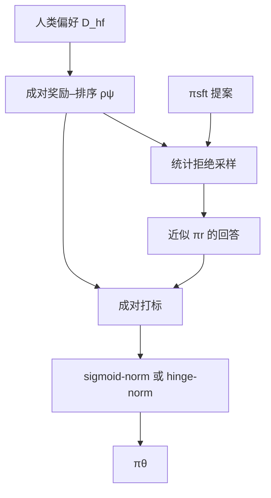

# RSO

    
最优策略的最大似然需要从该策略抽出的成对样本；DPO 用别人的对、SLiC 用 SFT 的对，都不是这个分布。先估计 π* 再在上面采对，才是对准了估计目标。

    <footer>—— Liu 等，Statistical Rejection Sampling Improves Preference Optimization，ICLR 2024</footer>

DPO 把 KL 正则最优策略 $\pi^*$ 写成 BT 似然里的未知密度，再用人类成对数据做最大似然。统计上，MLE 要求成对样本来自被估计的那个密度。公开偏好集通常来自混合策略或旧模型，SLiC 则从 SFT 政策采样再排序。Liu 等人把这条分布缺口单独提出来，给出 Statistical Rejection Sampling Optimization（RSO）：先在人类偏好上拟合成对奖励–排序模型，再用统计拒绝采样从该奖励诱导的 $\pi_{r_\psi}$ 抽回答，由同一模型打成对，最后用分类损失拟合策略。损失可以是 DPO 式的 sigmoid-norm，也可以是把 SLiC 铰链接到归一化对数似然上的 hinge-norm。本篇写这条「采对 + 拟合」流水线；拒绝采样本身的接受率与 $\beta$ 极限见 [统计拒绝采样](/llm/stats-rs)。

## 问题

目标密度是

$$
\pi_r(y\mid x)\propto\pi_{\mathrm{sft}}(y\mid x)\exp\bigl(r(x,y)/\beta\bigr).
$$

人类对 $\mathcal{D}_{\mathrm{hf}}$ 不是从这个 $\pi_r$ 抽出的独立同分布成对。直接在 $\mathcal{D}_{\mathrm{hf}}$ 上做 DPO，拟合的是错误测度上的 BT 似然。SLiC 从 $\pi_{\mathrm{sft}}$ 采样，比「任意旧模型」近一点，仍不是 $\pi_r$：SFT 会过多贡献高先验、低奖励的字符串。没有奖励模型，DPO 无法按 $\pi_r$ 再采样——这是作者认为 DPO「语言模型暗含奖励」在估计上吃亏的地方：比较两条回答（奖励）比生成高分回答（策略）容易学，显式成对 RM 值得先训。

他们还把 DPO 与 SLiC 放进同一分类视角：DPO 是归一化对数似然上的 logistic 回归；SLiC 的铰链几乎是 SVM，只是原文常不归一化、并带一条 SFT 正则。RSO 把 $\gamma$ 从 DPO 的 $\beta$ 里拆出来当温度，hinge-norm 成为「DPO 的 SVM 对应物」。数据分布与损失是两个正交旋钮。

### 三种成对来源

论文比较 direct（人类原对）、sft-sample-rank（SFT 采样再由 RM 排序）、rso-sample-rank（拒绝采样逼近 $\pi_r$ 再排序）。在 TL;DR 与 Anthropic HH 上，同一损失下 rso-sample-rank 高于另外两种。RAFT 只保留组内最好做新 SFT，ReST 按阈值过滤再 SFT，都是上尾模仿；RSO 保留成对分类，输家仍在损失里。这与后来的在线组相对方法不同：RSO 是离线造对，造完再拟合，训练环里不再查询 RM。

RSO 这个缩写在别处还表示随机子空间优化、群体智能等，与本篇无关。本篇专指 Liu 等人 ICLR 2024 的偏好优化流水线。Llama 2 文中的「rejection sampling + PPO」是 Best-of-N，是这篇统计拒绝采样在 $\beta\to 0$ 的特例，不是同一条流水线。

## 方法

成对奖励–排序模型 $\rho_\psi(x,y_1,y_2)$ 吃文本对，拟合 $\mathbb{P}(y_1\succ y_2\mid x)$。作者用 T5-XXL 文本格式，在摘要验证集上报告约 73% 准确率，HH 约 70%。由 $\rho_\psi$ 诱导点奖励 $r_\psi$，再诱导 $\pi_{r_\psi}$。对 SFT 提示：从 $\pi_{\mathrm{sft}}$ 提案，按统计拒绝采样接受/拒绝，得到近似来自 $\pi_{r_\psi}$ 的集合；再用 $\rho_\psi$ 两两打标，构成 $\mathcal{D}_p$。策略损失二选一：

$$
\mathcal{L}_{\mathrm{sigmoid\text{-}norm}}=-\mathbb{E}\log\sigma\bigl(\gamma\log\pi_\theta(y_w\mid x)-\gamma\log\pi_\theta(y_l\mid x)\bigr),
$$

$$
\mathcal{L}_{\mathrm{hinge\text{-}norm}}=\mathbb{E}\bigl[\max\bigl(0,\,1-\gamma(\log\pi_\theta(y_w\mid x)-\log\pi_\theta(y_l\mid x))\bigr)\bigr].
$$

DPO 原文取 $\gamma=\beta$ 且分母含参考策略；这里可以把参考归一化与温度拆开。作者实验里 $\beta=0.5$、$\gamma=0.05$ 是一套工作点，不是普适常数。造对时先从 SFT 温度采样 64 条，再子采样 8 条进入拒绝采样过程。拟合阶段相对 RAFT / ReST / DPO / SLiC，RSO 变体在黄金奖励、LLM 裁判与人类评估上更高；sigmoid-norm 与 hinge-norm 接近，hinge-norm 略优于未归一化的 SLiC 铰链。

### 损失与分布正交

direct + sigmoid-norm 就是常见的离线 DPO。sft-sample-rank + hinge 接近 SLiC（论文还去掉了 SLiC 的 SFT 正则项，因验证增益不显著）。RSO 的贡献是把第二列换成 rso-sample-rank，而不是发明第三种 logistic。因此「RSO 打败 DPO」在表格里应读成「同一分类损失下，对的来源换成近似 $\pi^*$」。把 DPO 损失接到 RSO 对上，叫 $\mathrm{RSO}_{sigmoid\text{-}norm}$；把 hinge-norm 接到 RSO 对上，叫 $\mathrm{RSO}_{hinge\text{-}norm}$。不要把缩写理解成一种不可改的损失。

## 机制

### 为什么显式 RM 有助于采对

DPO 说策略暗含奖励，那是最优解的一一对应，不是说中间不该有奖励模型。要从 $\pi^*$ 采样，必须查询 $r$ 或等价的成对 $\rho$。成对 RM 只做二选一，比生成容易拟合，用它当过滤器把 SFT 提案扭向 $\pi_r$，等于用便宜模型给贵的策略准备对的训练集。策略阶段仍然可以不再出现 RM——这是离线方法相对 PPO 的省。RM 错了，拒绝采样会系统性地接受错误上尾，后续分类把错误写成策略；$\beta$ 较大时更信 SFT、较少信 RM，这是对 RM 质量的旋钮，细节在统计拒绝采样篇。

归一化对数似然让 hinge 与 logistic 在同一 logit 空间里比。不归一化时长度操纵铰链间隔，SLiC 原始设定吃过这个亏。RSO 的 hinge-norm 把间隔设在 $\gamma$ 缩放的对数差上，与 DPO 的温度角色对称。$\gamma$ 大则更惩罚边界附近的错分，更信成对标签；标签来自 $\rho_\psi$ 而非人类时，$\gamma$ 过大等于过信 RM。

黄金奖励评估用的是训练 RM 之外的更好奖励，用来缓解「用同一 RM 既造对又打分」的循环。即便如此，若黄金 RM 与 $\rho_\psi$ 同族，提升仍可能部分是奖励 hacking。人类评估在论文里是必要的第三列。

### 与 RAFT、ReST 的差别不只是「用不用负例」

RAFT / [RFT](/llm/rejection-sampling-rft) 把最高分写成新 SFT 目标，梯度永远非负。RSO 的输家提供负方向，能压低高先验低奖励的套话。ReST 的 grow/improve 是多轮过滤 SFT；RSO 也可以多轮，但单轮比较时作者已报告优势。多轮会让 $\pi_\theta$ 离开当初提案的 $\pi_{\mathrm{sft}}$，拒绝采样的提案分布过时，需重新从当前策略提案——论文讨论了这一点，主表仍是单轮。

## 边界与工程取舍

RSO 要先训一个大成对 RM（文中 11B T5），再 64 候选生成，再拟合策略，离线墙钟时间明显长于直接 DPO。收益来自对的分布，不是来自更花哨的损失。RM 与策略若共享同一批人类数据且没有持有，会泄漏。候选数太少，拒绝采样对 $\pi_r$ 的近似差，退化为 SFT 采样。$\beta\to 0$ 退化为 Best-of-N，只留极上尾，成对多样性不足。

它不是在线 RL，造对之后策略更新看不到新的 RM 查询。分布缺口若已经用在策略迭代 DPO 补上，RSO 的离线造对优势缩小。统计拒绝采样的实现细节（不显式算 $M$，用 64 条估计接受率）必须按附录，否则接受集不是 $\pi_r$。

作者在 CNN/DailyMail 上做过从 TL;DR 的跨任务迁移。那是附加实验，不能当成「任意跨任务都该先 RSO」。主结论绑定摘要与 HH 对话。

### 何时不必上 RSO

人类对已经来自接近当前策略的模型，direct DPO 的测度误差小。负担不起大 RM 与 64 候选时，先 SFT 采样排序（SLiC 设定）往往是次优但可及的折中。奖励可验证、能在线组采样时，[GRPO](/llm/grpo) 把对照放进梯度，不必离线造完对再分类。

## 小结

- RSO 是离线偏好优化流水线：成对 RM → 从估计的 $\pi^*$ 拒绝采样 → 分类损失拟合策略。
- 要解决的是 MLE 样本必须来自目标密度；DPO 的人类对与 SLiC 的 SFT 对都不满足。
- 损失与 DPO / SLiC 同族（sigmoid-norm / hinge-norm），与造对分布正交。
- 相对 RAFT/ReST，成对损失保留负例；相对直接 DPO，对的来源更接近 $\pi^*$。
- 成本在大 RM 与多候选生成；RM 偏差会写入策略。
- 拒绝采样算法本身见统计拒绝采样专文。
- 出处：Liu, Zhao, Joshi, Khalman, Saleh, Liu, Liu，*Statistical Rejection Sampling Improves Preference Optimization*，ICLR 2024，arXiv:2309.06657。
