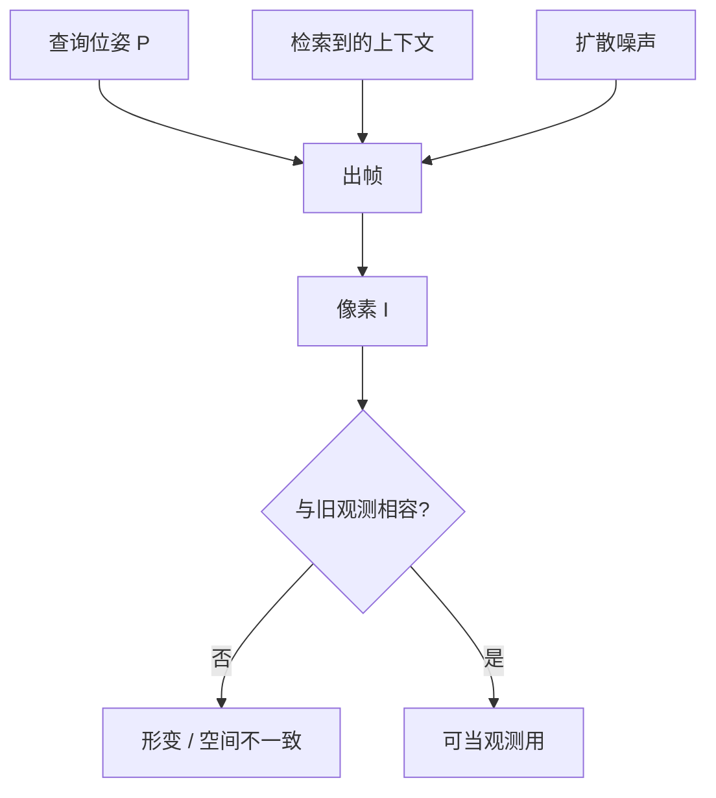

# 实时世界模型的形变与不一致性

没有钉在三维里的表面时，像素只对当前上下文负责；回头再看，物体可以换拓扑，墙可以软掉，这不是渲染噪声，而是隐式世界的失败模式。

<footer>—— 由 RTFM 的无显式几何设定推得的失败模式，而非一份公开消融表</footer>

[RTFM](/llm/worldlabs-rtfm) 把世界存在带位姿的帧和 Transformer 激活里，探索时再出帧。好处是反射、高光可以跟着视频数据学，也不必为整座迷宫实例化 splat。代价同样结构性地出现：没有一份与视点无关的表面，模型没有「这块几何必须还在」的硬约束。形变（morphing）与不一致性因此不是调坏了超参的偶然花絮，而是实时帧模型在约束不足时的默认行为。本篇把失败模式写清楚，避免把 demo 运镜当成几何保证。

## 问题

显式三维（网格、3DGS）里，同一高斯或同一三角形在所有视点共享参数。你走开再回来，只要渲染器还在，投影可以变、物体不该换拓扑。帧模型的世界是条件分布 $p(I\mid \mathrm{context}, P)$。context 若换了——近邻帧检索不同、旧帧被挤出、噪声种子不同——同一位姿 $P$ 可以画出不相容的 $I$。用户看到的是：桌子腿数量变了、海报字重写了、建筑轮廓在两段探索之间对不上。

这与视频生成里的「身份漂移」同类，但交互放大了它。视频模型沿一条固定时间轴生成，漂移表现为人物脸在第 10 秒换人；世界模型允许用户自己选 $P_t$，等价于在空间里任意点查询，未约束的自由度变成空间上的形变。实时又限制了扩散步数与上下文长度，使本可靠多步去噪钉住的结构，在交互预算里钉不住。

### 两种不一致

时间不一致：相邻帧之间表面流动，本应随相机运动的光流里掺了非刚体残差。空间不一致：两条不同路径到达邻近位姿，画出的场景对不上，无法拼成一张地图。形变常是二者的可见症状：物体在插值视之间「融化」成另一种形状，以维持局部帧间光滑，牺牲的是全局三维恒等。

World Labs 强调 persistence 与空间记忆，意思是系统设计在追求「走回去还在」，不是证明已经消除形变。把博客里的 persistence 写成「已解决不一致」，是产品语言误读。

## 方法

分析这类系统时，应把失败写成条件缺失，而不是只写「生成质量不够」。一份最小检查单：

1. 查询位姿 $P$ 是否以数值形式进入网络，还是被说成「向左转」。后者会把同一几何运动映射到含糊文本，形变更频。RTFM 用显式位姿，比纯视频续写好一截，但仍可能量化过粗。
2. 上下文是否包含能看到同一表面的旧帧。Context juggling 只取近邻：若「近」按相机中心距离，掠过同一面墙的擦线视可能被丢掉，回来时墙被重新想象。
3. 输入视的数量。视少时官方也承认任务偏向生成；生成区没有像素级锚定，形变是允许的想象，直到用户以为那是重建。
4. 随机性。扩散采样的噪声使同一 $( \mathrm{context}, P)$ 仍可多样。交互若每帧独立采样，墙会抖；若把噪声锁成场景种子，多样性下降，稳定性上升。

$$
I=G_\theta(\varepsilon;\mathrm{context},P),\qquad
\varepsilon\sim\mathcal{N}(0,I).
$$

$\varepsilon$ 每帧重抽，就是闪与微形变的来源之一。这与 Ho 等人 DDPM 里「同一条件不同噪声出不同样本」是一件事，只是交互把样本序列误当成同一物理世界的观测。

### 重建—生成交界

RTFM 故意模糊插值与外推。交界处最容易骗过眼睛：模型把两个锚点之间的物体「平均」成第三种形状，帧间还光滑。这不是渲染器抗锯齿，而是分布在多峰外观之间抄近路。显式 3DGS 拟合会把冲突表现为糊或鬼影；帧模型则表现为拓扑可变的中间态，因为没有共享的 splat 索引去投票。

### 像素损失为何鼓励融化

训练若主要最小化 $\mathbb{E}\|I-\hat I\|$ 或潜空间上的同类项，两个锚点外观冲突时，中间视的最优像素往往是二者的混合，而不是「选一个刚体、让另一侧变遮挡」。融化在二维损失里更便宜。要抑制它，需要与视点无关的对应（深度、光流、或显式 3D 元素）进损失，或在推理时把锚点帧强制留在上下文且降低 $\varepsilon$ 的自由度。实时预算下这两条都贵，所以形变会先出现在交互产品里，而不是出现在离线长视频的精修档里。

机器人或测绘不能把形变区当深度真值。若下游要几何，应把帧模型的输出视为外观假说，再交由多视立体或 Atlas 一类能写点云/splat 的模型固化，而不是在形变视频上跑单目深度装成真值。

## 机制

形变发生，是因为损失几乎总在像素（或潜空间）上，而不是在与视点无关的三维元素上。自回归扩散优化的是「这一帧像不像」，至多加相邻帧的时间损失。没有项去惩罚「同一 3D 点在两次查询中投影颜色冲突」，模型就可以用形变去消化冲突：改形状比同时满足所有旧帧更省损失。Context juggling 降低了计算，也降低了「所有旧约束同时在场」的概率，冲突被推迟到检索集切换的那一帧，于是出现突然换壁纸、门洞移位。

CFG（Ho & Salimans）提高条件服从时，会让画面更跟文本或更跟参考图，但不创造三维元素。引导越强，越可能把当前参考的局部外观糊到不该变的结构上。实时蒸馏减少去噪步数，轨迹更直、更便宜，也更少机会在中间步用多视一致性把表面拉回去。这些都是机制上的压力，不是调皮的 bug 列表。

Marble 的 splat 世界也会有生成伪影，但那是一份冻结资产上的误差；逛的时候误差不该再演化。RTFM 的误差可以随探索继续写。两种「不真」不要写成同一种 bug。

## 边界与工程取舍

缓解而不假装消失的做法包括：把关键视冻结为不可覆盖的锚点；位姿附近强制检索覆盖同一表面的旧帧；对刚体区域加深度或光流一致性；需要持久资产时改走 3DGS 导出。Atlas 后来把图像钉在三维位姿上做成共享空间上下文，并允许写出点云与 splat，可以看成对「只有帧、没有钉」的补课，但 RTFM 博客没有把 Atlas 的模块声明为 RTFM 的补丁。不要用未公开的内部指标宣称形变已消除。

评测上，单段第一人称视频的 FID/FVD 几乎看不见空间不一致：一条路径内部可以自洽，地图却拼不上。应测闭环：随机游走后再回到起点，比外观，比能提取的稀疏三维点是否还在。没有公开的 World Labs 形变基准；本篇不编造百分比。

## 小结

- 实时帧模型没有与视点共享的表面参数，形变与多视不一致是缺约束时的默认行为。
- 时间流动、空间对不上、锚点间「融化」，是同一问题在不同查询模式上的表现。
- 噪声每帧重抽、上下文检索切换、视少外推、蒸馏少步，都会加重形变。
- Persistence 是设计目标；是否达到要用「走回去」来测，不能用单段运镜代替。
- 需要可碰撞、可测绘的世界时，应落到 splat/网格，而不是在形变帧上当几何。
- 出处：由 World Labs RTFM 的无显式三维设定推得；对照 Kerbl 3DGS 的共享高斯。无 RTFM 形变 arXiv。
