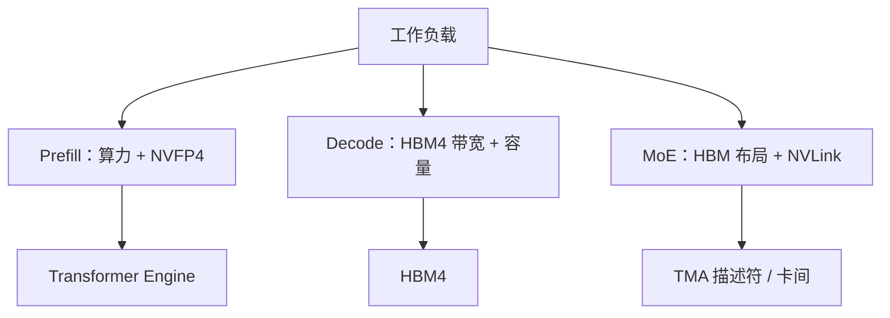

# Rubin GPU：HBM4、Transformer Engine、NVFP4

    
推理 decode 的墙钟由搬多重与算多快共同决定；只涨 Tensor Core 峰值、带宽原地踏步，吐词速度几乎不动。

    <footer>—— 对照 Rubin 公开规格：HBM4 容量与带宽、第三代 Transformer Engine、NVFP4 算术密度</footer>

Rubin 是 Vera Rubin 平台里的执行引擎。[六芯片](/llm/rubin-six-chips) 里它负责把电变成 token；CPU、交换与网卡负责别的层。NVIDIA 公开技术博客把这颗 GPU 的要点收成三条：**HBM4**（容量与带宽）、**Transformer Engine**（第三代，自适应压缩与窄精度）、**NVFP4**（低精度算术，使更多有效计算落在每瓦里）。晶体管数、SM 数、封装上的双计算裸片等细节以产品页为准。本篇讲这三条如何对上大模型的 prefill / decode / MoE，不把「相对 Blackwell 的吞吐倍数」写成一般定律。

## 问题

现代 LLM 不是单一 GEMM。Prefill 靠近计算屋顶；decode 靠近 [显存墙](/llm/decode-memory-wall)；MoE 还要在专家权重与 token 路由之间来回搬。只加 FLOPS，decode 每步仍要扫权重与 KV；只加容量，带宽不够则 TPOT 不降；精度乱降，质量先崩。Rubin 要同时动三块：近端存储（HBM4）、注意力与矩阵路径上的引擎（Transformer Engine）、以及能被引擎吃下去的数值格式（NVFP4）。

HBM3e 一代已经把单卡容量推到百 GB 量级，但长上下文、高并发、不卸载 KV 的 agent 推理仍会先撞容量再撞带宽。HBM4 公开写成相对 HBM3e **接口宽度加倍**，再配合新的内存控制器与更紧的计算–存储集成。NVIDIA 给出单卡「高达 288 GB HBM4、高达 22 TB/s」的规格——这是厂商峰值，用来理解数量级，不是任意 kernel 的达成带宽。

### 三条轴不要合成一个「更快」

容量决定模型是否常驻、KV 是否必须卸载到 CPU 或存储。带宽决定 decode 一步能扫多少权重与 KV。算术密度（NVFP4 相对 FP8 / BF16）决定同一套 Tensor Core 在 prefill 和大 batch 上能吐多少 FLOPS。三者在屋顶线上是不同轴：decode 小 batch 几乎只看见带宽；prefill 长序列才看见 NVFP4 的峰值。把 50 PFLOPS 量级的 NVFP4 推理规格直接除进 TPOT，会得到一张从不出现的延迟表。

NVIDIA 表格把 NVFP4 推理与训练峰值分开标注（Transformer Engine 计算 vs 稠密计算）。规划时应读表注，不要把推理栏抄到预训练 MFU 里。本篇引用的是公开表的存在与分栏，不把某一栏 PFLOPS 当成本站基准。

## 方法

把 Rubin 的公开能力映射到工作负载，而不是映射到「卡型升级清单」。

- **HBM4**：优先服务 decode 与 KV。能把更大的上下文、更多并发留在卡上，少走 [NVLink-C2C](/llm/nvlink-c2c-superchip) 卸载或柜外存储。权重若已量化到 NVFP4 / FP8，容量压力转到 KV；这时带宽比再加几个 SM 更对症。
- **Transformer Engine**：第三代公开强调面向 NVFP4 的硬件自适应压缩，并保持与 Blackwell 的编程模型兼容。注意力路径上还有稀疏中间结果与更高的指数吞吐，用来缓解 softmax 跟不上 Tensor Core 的问题。这些是架构能力，落地仍取决于 cuDNN / FlashInfer / 框架是否打开对应路径。
- **NVFP4**：把更多有效 MAC 塞进同一能量包络。训练与推理都能用窄精度，但缩放、校准、以及和 FP8 混合的策略是配方，不是芯片开关。LUT 式更窄权重是公开提到的又一个推理选项，质量以你的评测集为准。

本地化访存与 [TMA](/llm/rubin-tma) 决定「22 TB/s」有多少能被核用到。规格表上的峰值乘不上描述符乱、跨步别扭、专家权重东一块西一块的 MoE。

### 与机柜的关系

单卡再快，MoE 专家一旦铺开，墙就变成 [NVLink 6](/llm/nvlink-6) 的卡间。Rubin 把每 GPU 的 Scale-Up 带宽公开写成相对上一代翻倍，与 HBM4 是两条屋顶线：一条在封装内，一条在机柜脊上。规划宽 EP 时两张表都要看。PCIe Gen6 仍在，但那是主机与设备集成，不是 72 卡域的主路。

科学计算路径（FP32 / FP64）NVIDIA 也给了对照表，部分矩阵性能来自低精度 Tensor Core 上的模拟算法。大模型主线仍是 NVFP4 / FP8；不要用 HPC 栏的 TFLOPS 去估算 LLM decode。

## 机制

HBM4 加宽接口，使同一堆叠高度下可提供更高带宽；12-Hi 堆叠与专用控制器是公开描述的封装选择。对软件，这表现为更大的 `cudaMalloc` 预算和更高的理论搬移速率。真正达成带宽取决于访问是否能被内存控制器批成行命中：[TMA](/llm/rubin-tma) 的块拷贝、共享内存布局、以及避免把 KV 打成随机离散页，决定你离 22 TB/s 有多远。

Transformer Engine 把窄精度从「核里手写量化」收成硬件路径：缩放、压缩、与 Tensor Core 输入对齐。NVFP4 提高算术密度，softmax 与非线性若仍停在较慢的指数吞吐上，注意力会先变成引擎墙。Rubin 公开提高每 SM 的指数吞吐，意图让 softmax 跟上更快的矩阵路径。稀疏注意力中间结果是另一条减流量的路，输出仍保持稠密接口，以免改模型。

双裸片经 NV-HBI 收成一颗 GPU，对 CUDA 仍是一个 device。不要把「两个计算裸片」写成两个可单独调度的推理副本，除非 MIG 明确切分。MIG 与 MPS 的语义是上一代就有的，Rubin 没把它们取消。

### 精度是配方，不是免费加速

NVFP4 的「高达若干 PFLOPS」是峰值算术。权重、激活、KV 是否都用同一格式，决定质量与字节。只量化权重、KV 仍用 BF16，容量墙几乎不降；KV 也降精度，长上下文后半段要回归。训练用 NVFP4 还要看损失缩放与通信 dtype。引擎能算，不代表你的检查点已经按这种格式存。

## 边界与工程取舍

不要用 prefill 的 MFU 考核 decode 服务。不要把未出现在 NVIDIA 文档里的单通道 HBM 速率、未发布的堆叠供应商良率写进正文。不要假设所有模型都能无损落到 NVFP4——公开材料强调与软件栈共设计，落地质检仍是评测集。端侧与小卡没有 HBM4，公式相同，屋顶线数字不能搬。

相对 Blackwell 的「2.8× 带宽」「agentic 吞吐每瓦 10×」是厂商对照，依赖指定工作负载。容量规划用：你的权重字节、KV 字节、并发、以及自己在目标精度下测到的达成带宽。芯片故事到此为止；卡间故事见 NVLink，CPU 故事见 Vera。

出处：NVIDIA 技术博客 *Inside NVIDIA Rubin GPU Architecture* 与 *Inside the NVIDIA Vera Rubin Platform* 中的 HBM4、Transformer Engine、NVFP4 表。峰值以官方表注为准。

## 小结

- Rubin GPU 的三条公开主轴是 HBM4、第三代 Transformer Engine、NVFP4。
- 容量与带宽服务 decode / KV；NVFP4 主要服务算力屋顶上的 prefill 与大 batch。
- 厂商 PFLOPS 与 TB/s 是峰值规格，达成取决于布局、TMA 与精度配方。
- 机柜级 MoE 还要看 NVLink，不能只看单卡 HBM。
- 质量以评测集为准，窄精度不是免费的无损开关。
- 出处：NVIDIA Rubin GPU 公开技术博客；decode 屋顶线见 [显存墙](/llm/decode-memory-wall)。
