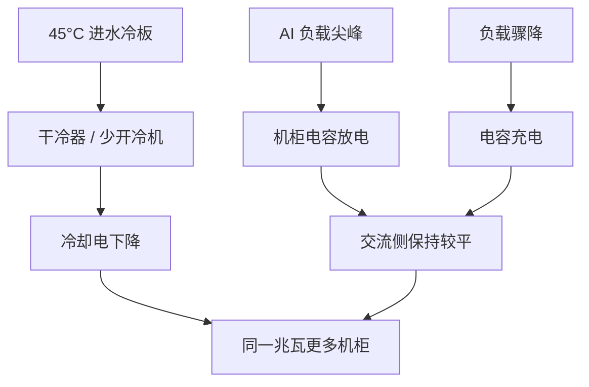

# 45°C 温水液冷与 Intelligent Power Smoothing

芯片不需要机房像冰柜；把进水提到 45°C，许多气候里就可以用干冷器把热甩掉，把电留给出 token。

<footer>—— NVIDIA 对 Rubin 代基础设施的公开冷却叙事：100% 液冷、无风扇，进水最高 45°C</footer>

Rubin 这一代把机柜功率密度推到风冷不再是选项。NVIDIA 公开称 Rubin 代 AI 基础设施首次做到 100% 液冷：计算与网络器件都走封闭液冷回路，系统内无风扇，方法写进 DSX AI 工厂参考设计。与之配套的是机柜级 **Intelligent Power Smoothing**：用储能吸收训练/推理的功率尖峰，让电网侧看到更平的负荷。第三代 MGX 还把动态功率导向（CPU / GPU / NVLink 交换托盘之间调电）写进同一张机柜图。本篇只引用官方已经给出的温度、工质配比与平滑效果口径，不编造未公开的冷板流道或电容化学。

## 问题

两件事同时发生。一是单柜功率高到必须液冷，但若进水仍按传统 20–30°C 低温水设计，机房就要为冷却厂付出大量电和水：冷水机组、冷却塔、蒸发。NVIDIA 给出过对照：常规冷却塔方案每年每兆瓦大约 260 万加仑设施冷却水；45°C 架构在有利气候下用干冷器可把用水降到接近零。二是 AI 负载不是恒定电阻：一步 GEMM、一步通信、一步空等，功率在亚秒级大幅摆动。供电与变压器必须按峰值来预留，于是出现**搁浅功率**——平均用不到，峰值却把额度占满，同样的兆瓦装不下更多 GPU。

若只做液冷不做平滑，机房仍按尖峰买电。若只做电容不做温水，冷却厂仍吃掉本可用来出 token 的电。Rubin 把两件事写成同一套 MGX 机柜的约束。

### 进水热，不等于结温失控

常见误解是：机房越冷越高效。公开解释是：冷却液在 45°C 进冷板，吸热后大约 55°C 出柜，器件仍被维持在已验证的结温范围内，性能不按「进水热了就降频」来讲。工质公开写成约 75% 水 + 25% 丙二醇（也有材料允许去离子水或 PG25，闭式寿命可达约十年）。设施侧示意可以是向 CDU 提供约 41°C 水，再由 CDU 向机柜供 45°C 冷却液。地理条件重要：苏格兰高地与菲尼克斯不是同一条免冷机曲线；官方也承认极端高温日仍可能短暂开冷机，有利气候下约 1% 的时间。

「100% 液冷」指 IT 机柜内不再靠风扇排热，不是指数据中心户外永远没有散热风机。干冷器就是把热交给室外空气的大型盘管。不要把无风扇托盘理解成整座园区静音、无任何转动件。

## 方法

冷却规划按 45°C 进水来选址与选 CDU，而不是按「我们一直有低温冷冻水」把 Rubin 当上一代液冷柜插进去了事。官方称这一进水温度让许多已为液冷设计的机房可以无缝过渡，并在不少气候里用环境空气 + 闭式干冷器，少开压缩机，降低 PUE，把电预算从冷却转给计算。MGX 博文给出过量级：相对更低进水，同等电力预算下可多部署约 10% 的 NVL72 机柜。托盘级是新的内歧管、机柜 UQD08、液冷母线（公开写过支持高达 5000 A 的母线能力）——这些是设施接口，不是模型超参。

功率规划把 Intelligent Power Smoothing 当成供电合同的一部分。公开机制：机柜级电容在负载突增时放电、突降时充电，让交流侧保持平坦或缓慢爬升/下降。Vera Rubin NVL72 把储能写成相对前代约 6 倍，并给出每 GPU 约 400 J 的机柜储能口径；闭环让 GPU 持续监视电容荷电状态（SoC）以更有效地削平功率曲线。效果口径在不同文档里有几套，都应标成厂商规格：例如峰值电流需求可降约 25%、相对前代平滑技术平均功耗约低 10%、50 ms 峰值功率约低 20%。工厂级还有 DSX MaxLPS：在能效工作点下、对负载影响很小的前提下，同一电力预算最多可多装约 40% GPU（另一处动态 Max-Q 叙述为约 30%）。规划时钉文档版本，不要把 25%、30%、40% 加成一次。

### 动态 Max-Q 与「按峰值买电」相反

静态按 Max-P 给每柜预留峰值，等于假设所有机柜永远同时满功率。真实工厂是训练、推理、空闲、不同模型的混合物。动态把机柜供在更低的 Max-Q，再按负载把电导向正在算的 GPU / CPU / 交换托盘，才能把搁浅功率变成更多在线加速器。这要求调度器、功率帽与作业类型可见——只插电容、调度仍按峰值抢柜，平滑救的是电网波形，救不了你把所有柜同时打满。

废热回收被官方写成额外收益：出柜约 55°C 的温水比低温冷冻水更接近供热网的可用温度。这是园区规划，不是芯片功能。

## 机制

温水能效来自热力学而不是营销形容词。冷机的 COP 对蒸发温度极度敏感；进水每提高一截，冷机少开或不开，冷却电占比下降。行业经验有「冷机水温升 1°C，冷却电大约降 4%」的量级说法，NVIDIA 博客转述过；45°C 的目标是在许多气候里把冷机从「常开」变成「极端日备用」。封闭回路灌一次水，运行期不以蒸发塔为代价补水，所以才能把每兆瓦百万加仑级的水账打到接近零。

功率平滑来自储能的低通滤波。AI 步的功率谱含有大量亚秒分量；变压器与馈线若按这些分量的峰值来定容，容量因子很差。电容提供焦耳级缓冲（官方 400 J/GPU 量级），把亚秒尖峰留在柜内。SoC 闭环的意义是：GPU 知道电容还能吐多少，因而可以在算法上配合——这与只在电源侧盲目放电不同。具体哪些内核会主动限流，以 NVIDIA 电源管理文档为准，不要假设用户 CUDA 核里有一个可调的「平滑旋钮」。

液冷解决的是热，平滑解决的是电的时间形状。两者一起才能把「同一兆瓦」变成「更多 NVL72」。只抄 45°C、仍按未平滑峰值向电网要电，10% 额外机柜的口径不会自动出现。

### 与无风扇托盘的耦合

[第三代 MGX](/llm/mgx-nvl72-tray) 取消托盘风扇，是因为热路径已经全部交给冷板。进水 45°C 时，空气不再是器件的冷却介质，热通道/冷通道的摆位失去意义。机柜正面从多孔面板变成封闭面板，噪声从风扇主导变成泵与户外干冷器。运维要从「听风扇辨故障」改成「看漏液与进回水温差」。

## 边界与工程取舍

不要在未验证 CDU 与水质的机房把进水直接拉到 45°C「为了对齐官方」。不要把 40% 更多 GPU 当成任何负载、任何电网的保证——那是 DSX MaxLPS 在能效工作点下的上限口径。不要用本篇代替电气与消防规范。不要编造未公开的泵功率、未发布的冷板压降。

气候是硬边界：干冷器依赖室外湿球/干球；湿热地区冷机小时数会上升，节水与节电的幅度要以当地气象年计算，不能抄北欧案例。功率平滑不消除平均能耗：它削峰、填谷、可能降低需量电费与变压器配置，训练总焦耳仍大致由有效算力决定。

出处：NVIDIA《45°C Breakthrough》冷却博客、Vera Rubin POD / MGX 技术博文中的 45°C、400 J/GPU、6 倍储能与峰值电流约 25% 口径，以及 Rubin GPU 架构文中的 SoC 平滑与 DSX MaxLPS 叙述。

## 小结

- Rubin 代公开为 100% 液冷、无风扇；进水最高 45°C，出柜约 55°C，工质为水/丙二醇类闭式回路。
- 有利气候下可用干冷器接近零耗水，把冷却电还给计算；官方有约 10% 额外 NVL72 的电力预算口径。
- Intelligent Power Smoothing 用机柜电容与 SoC 闭环削亚秒尖峰，公开效果含峰值电流与短时峰值功率的下降。
- 动态 Max-Q 把搁浅功率变成更多在线 GPU；调度必须看见功率帽。
- 冷却与平滑是设施约束，不是注意力算法的超参。
- 出处：NVIDIA DSX / MGX / Rubin 冷却与电源公开文档。
