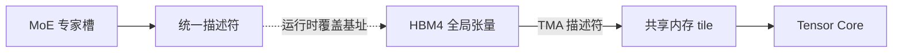

# Tensor Memory Accelerator 与本地化访存

    
峰值 HBM 带宽写在规格表上；核真正吃到的，是描述符能表达、异步拷贝能覆盖、布局还算规整的那一段。

    <footer>—— TMA：Tensor Memory Accelerator，用硬件描述符做批量异步张量搬移</footer>

[Rubin GPU](/llm/rubin-gpu-hbm4) 把 HBM4 的峰值带宽抬到公开的 22 TB/s 量级。若每个 warp 仍用标量地址去扫专家权重或 KV 块，控制器看不到连续的张量足迹，达成带宽会远低于峰值。**Tensor Memory Accelerator（TMA）** 是 Hopper 一代引入、Rubin 继续增强的硬件机制：用描述符描述张量布局，由专用引擎做全局内存与共享内存之间的批量异步拷贝，把地址生成从 SIMT 线程上卸下来。Rubin 公开强调：对「布局相同、基址不同」的张量，可以保留一份统一描述符，在指令里覆盖指针与步幅——这对 MoE 专家权重尤其有用。

## 问题

GEMM 与注意力要的数据很少是一维连续数组。权重有通道与分片，KV 有层、头、序列，MoE 有「同一形状、散落在不同专家槽」的许多块。传统 CUDA 拷贝要么靠线程协作把全局内存搬进共享内存，要么靠 `memcpy` 式的一维 DMA。前者占用大量线程做地址算术，后者表达不了多维张量与边界填充。结果是：HBM 很宽，核却在等不规则 load。

本地化访存要解决的是：让计算用的字节尽量来自近端（寄存器、共享内存、命中的 HBM 行），让远程（另一 SM、另一 GPU、CPU 侧 LPDDR）只出现在描述符明确允许的路径上。TMA 是这条链上的搬运工，不是缓存本身。没有好的 tiling，TMA 只是把乱布局搬得稍快一点。

### 描述符比指针更接近张量

TMA 把「这块数据的形状、步幅、边界」收成描述符，拷贝引擎按描述符走路。线程发出一条批量拷贝，然后去做计算或等 mbarrier。这与 CPU 上的 DMA 描述符同类，只是对象是 GPU 的全局与共享内存。Hopper 文档把 TMA 写成低线程开销的批量异步拷贝；NVSHMEM 后来也允许在 NVLink 可达的 GPU 之间用 TMA 做点对点，前提是走 GPU load/store 路径而不是网卡。

TMA 不能把 PCIe 网卡路径变成「描述符一发就直达对端 HBM」。跨节点仍是 GPUDirect / RDMA 的事，见 [InfiniBand 与 GPUDirect](/llm/infiniband-gpudirect)。把 TMA 写成通用互连，会在柜外通信上规划出不存在的带宽。

## 方法

核的写法从「每个线程算地址」改成「CTA 准备描述符，TMA 搬砖，线程做 MMA」。共享内存成为暂存：TMA 把下一 tile 的 A/B 搬进来，Tensor Core 消费当前 tile。这与软件流水线是同一思想，只是搬移不再烧 warp。Rubin 的增强针对 MoE：许多专家块形状相同，若每个块都在内存里改描述符，元数据流量会跟着专家数涨。公开材料写的是**指令内联覆盖**基址与步幅，内核保留一份统一描述符。专家路由变成「换指针，不换布局」。

本地化策略按距离分层：

1. 寄存器 / Tensor Memory：当前 MMA 操作数。
2. 共享内存：TMA 的近端暂存。
3. 本 GPU HBM4：权重、KV、激活的主副本。
4. 同柜其他 GPU：经 NVLink，延迟高于 HBM，仍远快于柜外。
5. Vera 侧 LPDDR：经 [C2C](/llm/nvlink-c2c-superchip) 一致性卸载。

decode 应尽量把热权重与热 KV 留在 3 以内。TMA 帮助 3→2 的搬移效率，不把 5 变成 3。

### 与融合通信的衔接

当通信融进计算核，一部分 CTA 资源要留给搬移。TMA 的卖点是：少量发指令的线程就能驱动较大块的 NVLink 或 HBM 流量，把其余线程留给 MMA。NVSHMEM 公开文档把这写成「大块点对点、又不能把 CTA 都送给通信」时的路径。Rubin 的 [counted writes](/llm/nvlink-counted-writes) 解决的是「对端何时能读」，TMA 解决的是「本端如何低开销地发」。两者叠在同一核里，才是「核内融合通信」，而不是先 `cudaMemcpy` 再 launch 下一个核。

## 机制

硬件上，TMA 是独立于 SIMT 流水线的拷贝引擎。描述符驻在内存或常量侧，指令引用它。异步完成靠 barrier：计算 warp 在 mbarrier 上等「这一 tile 到齐」，拷贝与计算重叠。布局约束是真实的：步幅、对齐、维数必须是引擎能表达的子集。任意间接 gather（例如完全随机的 KV 页表）仍要走普通 load，或先整理成 TMA 能吃的块——这正是分页 KV 与块级注意力要保持块对齐的原因之一。

Rubin 的内联更新减少「为每个专家写描述符」的往返。机制上，这是把描述符当成微指令模板：opcode 不变，立即数换成新基址。专家数增大时，元数据管理从 $O(\text{experts})$ 次内存描述符写入，变成核内覆盖。公开材料没有给出「覆盖一次多少周期」的独立测量，本篇也不编造。收益应理解为：MoE 路由侧的软件开销下降，更多时间留给有效 GEMM。

本地化不是「全部放进共享内存」。共享内存容量按 CTA 计，tile 太大反而少占用 SM。TMA 让你选择更大、更规整的 tile 而不把地址算术变成瓶颈，但 tiling 仍是算法问题。FlashAttention 一类分块注意力与 TMA 是同一本地化哲学的不同实现层。

### 达成带宽为什么总低于峰值

峰值假设行命中、双向打满、没有银行冲突。TMA 改善的是请求的规整程度，不能消除：跨步过大导致的行冲突、多 CTA 争用同一 HBM 通道、以及通信与计算抢同一控制器。decode 一步若只扫一遍巨大权重，TMA 能提高利用率，但分子仍是权重字节，分母仍是 HBM 带宽，见显存墙。把 TMA 写成「等效于再加一倍 HBM」没有公开依据。

## 边界与工程取舍

不要在 Ampere 及更早的卡上假设有同样的 TMA 指令集。不要把 CPU 侧 memcpy 或 `cudaMemcpyAsync` 叫做 TMA。不要为尚未公开的 Rubin 描述符字段宽度、队列深度编造数字。框架若仍用旧的全局 load 核，换 Rubin 不会自动吃到内联覆盖；需要 CUTLASS / cuDNN / 推理引擎的版本跟上。

跨 GPU 的 TMA 只在 NVLink 可达、且编程模型允许 GPU 直达时成立。柜外专家并行仍走 NCCL / RDMA。混合精度下，描述符的元素宽度必须与 Tensor Core 输入一致，否则会出现「搬得很快、算的是错的布局」。调试达成带宽，应用 profiler 看 HBM 吞吐与 TMA 发出的拷贝体积，而不是只看核函数名字里有没有 `cp.async`。

出处：Hopper 以来的 CUDA TMA 编程模型；Rubin 增强见 NVIDIA *Inside NVIDIA Rubin GPU Architecture* 中 MoE 描述符与本地化内存子系统。NVSHMEM 文档说明 TMA 用于 NVLink 可达的点对点。

## 小结

- TMA 是用硬件描述符做批量异步张量搬移的引擎，把地址生成从 warp 上卸下。
- 本地化访存按寄存器 → 共享内存 → HBM → NVLink → CPU 内存分层；TMA 主要加速近端批量搬移。
- Rubin 公开的内联描述符覆盖，针对「同布局、不同基址」的 MoE 专家槽。
- 峰值 HBM 带宽仍受布局与争用限制；TMA 不是加倍规格表。
- 跨节点通信不是 TMA 的对象。
- 出处：NVIDIA CUDA / Rubin GPU 公开材料；单卡屋顶线见 [HBM4](/llm/rubin-gpu-hbm4)。
