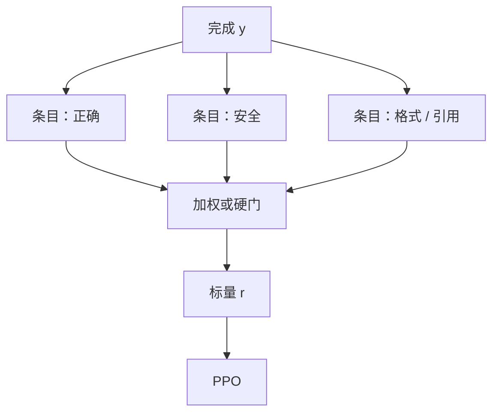

# 评分细则奖励

先把「好」拆成可独立打分的条目，再加权；印象分里的冗长与客气就不再独占标量。

<footer>—— 对照细粒度 RLHF（Wu 等）把偏好拆成维度；产品侧的书面规范则把条目写成可执行检查单</footer>

[上一课](/llm/llm-judge-reward)的裁判给出整体胜负，位置与冗长偏爱直接进 $r$。缺口是：**一个标量无法说出「事实对但语气差」还是「语气好但编造」。** 评分细则（rubric）把质量写成若干条可判定或可打分的检查项，再合成奖励。Llama 2 已经把有用与安全拆成两个 [RM](/llm/reward-model)；本课把拆分推进到条目级。后课代码 / 数学验证器是细则里「可程序化」的极限。

## 问题

开放域的「好」是多维的：正确、完整、安全、格式、引用。整体比较强迫标注员当场权衡，残差进 BT。细则要求事先写权衡：每条独立标，合成规则由产品定，而不是由标注员的即时口味定。Wu 等人的细粒度 RLHF 把人类反馈对准密度更高的片段与类型（相关性、事实、信息量），而不是整段一个分。

条目若仍由 LLM 裁判打，只是把偏差从一维拆到多维：每条仍可能爱长。条目若可程序化（是否含引用、是否拒答、单测是否过），那一部分离开裁判。本课的对象是混合：能写进检查单的写进检查单，剩下的才用模型打。

### 细则是合同，不是提示装饰

同一套条目必须用于标注指南、裁判提示、合成公式与评测报告。训练用「正确 0.7 + 文风 0.3」，评测却只报整体 Arena，细则没有约束力。权重改动等于改任务，要版本号。

条目过多则标注员与裁判都不稳。宁可 5 条定义清楚，不要 20 条互相包含。

## 方法

设计：列出互斥尽量干净的条目 $c_1,\ldots,c_m$，每条取值 $\{0,1\}$ 或有限李克特。合成

$$
r(x,y)=\sum_{m} w_m\, c_m(x,y),\qquad \sum_m w_m=1
$$

或先硬约束（安全 $c_{\mathrm{safe}}=0$ 则 $r$ 封顶为负）再对有用加权。$c_m$ 的实现可以是：程序、专用分类头、或带条目定义的 LLM 裁判。接到 [PPO](/llm/ppo-llm) 的仍是标量；差别是标量的构成可审计。多目标 Pareto 留到后课加权。

与 [过程监督](/llm/process-supervision) 的差别：PRM 按推理步骤切；细则按质量轴切。一道数学题可以同时有步骤对错与「解释是否可读」两条，不要合成一个头。

## 机制

拆分改变梯度来源：策略不能再用单一捷径同时抬所有 $c_m$。拉长可以抬「完整」，同时被「简洁」条目扣分，冲突被显式化。硬门把安全从权衡里拿出去，避免有用 RM 把拒答当成低分。这正是 Llama 2 分头的理由，细则是同一逻辑的更细网格。

权重 $w$ 是产品决策。数据科学家在验证集上扫 $w$，等于在扫任务，应与业务一起锁，而不是当超参默默改。

## 边界与工程取舍

条目之间的相关会让加权双重计数。先看条目相关矩阵，合并共线项。可程序化条目应尽快变成下一课的验证器，减少裁判噪声。开放轴（幽默、品味）细则写不清，仍会退回整体比较。合成后的 $r$ 仍会过优化，只是黑客要从多条同时骗。

## 小结

- 细则把「好」拆成条目再加权或硬门，减少整体印象分的捷径垄断。
- 同一合同要贯穿标注、裁判、训练与评测。
- 可程序化条目应交给验证器；模型只打剩下的轴。
- 加权是改任务，必须版本化。
- 出处：Wu 等 Fine-Grained RLHF；Llama 2 有用/安全分头；裁判偏差见 Zheng 等。
