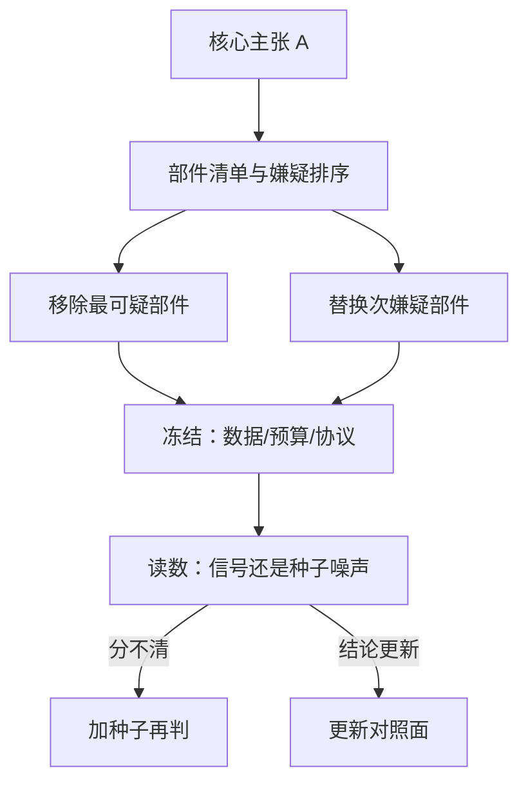

# 消融设计的工程学

比较的全部秘密在于：除了你在问的那个问题，其余一切保持相同。

<footer>—— 据 Lucic 等, Are GANs Created Equal? A Large-Scale Study, ICML 2018 整理</footer>

[上一课](/llm/rw-experiment-config)把跑变成账：单一配置入口、哈希贯穿三处、种子分立。有了账，才能做受控的比较。本课设计受控比较里最重要的一类——消融：回答「论文的结论靠哪个部件撑着」。注意方向：复现的消融不是重跑作者的消融表，而是从你自己的目标线倒推，问清哪些部件的差异足以解释对不上的数字。

## 问题

论文的消融表是作者的取舍留下的，不是为你的复现设计的：它常缺与基线同预算的对照，常只有单种子，常只消融作者自己认为创新的部分。直接照抄这份清单，会花算力回答别人的问题。复现要的回答是条件式的：如果方法复现对不上，差异最可能藏在哪个部件；如果结论线已对上，哪个部件的差异可以放过。缺口是把「部件贡献」从作者的叙述变成你自己账本上的受控实验。

## 方法

消融从主张倒推。写出论文的核心主张 A，列出它依赖的部件集合：数据配比、损失项、架构改动、日程、稳定件。对每个嫌疑部件设计移除或替换实验，其余一切冻结——数据快照、预算、评测协议三件套冻结是底线。实验次序按信息量排：先动最可疑的部件，它的消融无论结果如何都压缩最多的假设空间；最不可能出问题的部件放最后，或者不跑。

对照必须同预算。参数匹配与计算匹配给出不同的答案：加一倍数据能赢的消融，赢的是预算不是设计。报告消融时写清匹配口径——同 FLOPs、同 token 数、还是同参数量。部件之间有交互时，逐个移除会低估冗余：两个部件互相补位，各删一个都看不出差别。此时用累积式设计——从裸基线起逐个加上部件，与逐个移除互为印证。

## 机制

为什么同预算对照是底线：训练结果对预算的敏感度常高于对设计的敏感度，预算不齐的消融测到的是预算效应。为什么单种子不够：上一课说过，0.3 分的差可能小于种子间方差；消融读到差异先查它是否超出你测过的噪声带，超出才叫信号。复现消融与论文消融冲突时的读法也不同：论文的消融支持「这个部件有贡献」，你的消融回答「这个部件的差异能否解释我对不上的部分」——前者是科学陈述，后者是归因证据，混用会把相关当因果。

Musgrave 等 2020 的度量学习复查是个干净的标本：把基线训练与调参做到位后，多篇论文声称的损失函数优势缩到与种子噪声同量级。消融前先问基线的最好努力在哪，否则消融出来的「部件贡献」里混着基线的欠账。

## 边界

消融不做无穷递归：停在能支撑目标线为止。结果复现通常不需要部件级消融——环境对齐后数字能对上，部件问题不存在；方法复现才需要关键消融，而且只做与目标线相关的子集。消融结果与论文冲突，不直接判「复现失败」：先回到坐标系检查（数据版本、评测协议），排除后再把冲突记档，交给下一课的归因次序处理。消融清单本身要进报告的决策表，注明每个实验的匹配口径与种子数——没有口径的消融数字与没有坐标系的分数一样，不可比。

## 小结

- 消融从目标线倒推，不照抄论文的消融表；实验次序按信息量排。
- 三件套冻结：同数据快照、同预算、同评测协议；报告必须写清预算匹配口径。
- 单种子消融先过噪声带；部件有交互时用累积式与移除式互证。
- 复现消融回答「差异能否解释对不上」，与论文的「部件有贡献」是两种证据。
- 出处：Lucic 等, 2018；Musgrave 等, A Metric Learning Reality Check, ECCV 2020。
