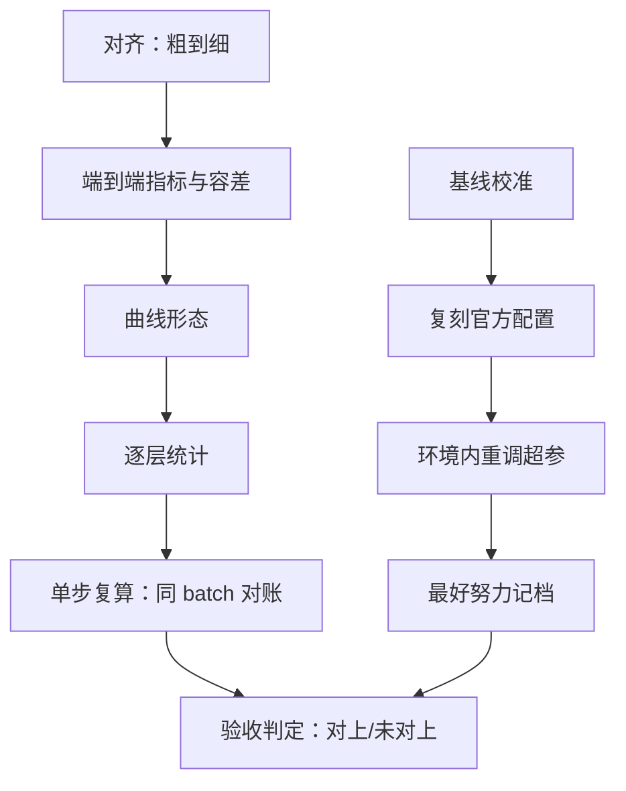

# 数值对齐与基线校准

在一个调平了的基线面前，大多数「突破」安静地退回到噪声里；这不是领域的不幸，是度量开始诚实。

<footer>—— 据 Ferrari Dacrema 等, Are We Really Making Much Progress?, RecSys 2019 整理</footer>

[上一课](/llm/rw-compute-budgeting)的阶梯走到了 full 级，该问两个收官问题：你的数字与论文「对上了」吗？你的方法「赢」了吗？两个词都必须先有定义才能回答。「对上」是复现的验收——数字落在约定的容差里；「赢」是对比的资格——基线在同等预算下调到自己的最好努力。本课写这两个定义如何落成可执行的检查。

## 问题

「对不上」是一个症状，不是判定；没有容差定义的对齐检查会永无止境：差 0.5 分时你不知道该继续归因还是宣布成功。更隐蔽的是基线资格问题：复现方法复现时，你的实现往往要和基线比——但基线是谁调的、调了多久、在什么预算下，决定了「赢」字有没有语义。两个失败模式相对：对齐容差没定，验收拖成持久战；基线没校准，赢来的结论被基线欠账一笔勾销。

## 方法

对齐锚点从粗到细四层。第一层端到端指标：benchmark 分数，容差在声明（第一课）里定，通常给相对容差而不是绝对容差——小数点后第三位的绝对差在大基准上无意义。第二层曲线形态：loss 曲线的斜率、拐点位置、退火尾部的落差与[loss 曲线的解读](/llm/ti-loss-curve-reading)的形态学对照。第三层中间统计：逐层激活均值与方差、梯度范数，口径见[数值健康检查](/llm/ti-numerical-health)。第四层单步复算：走读一课定位的那「一步」，在完全相同的 batch 上与参考实现逐项对账——loss 与梯度分量的相对误差。先粗后细的次序是纪律：粗层没对齐时细层的差异不可解释（数据都不同，逐层统计本来就不同），先细后粗会误导归因。

基线校准三步：复刻官方基线配置，确认能跑出官方数字；在你的环境里为基线重调关键超参（学习率、权重衰减的小网格）；把「基线的最好努力」连同调参空间一起记档。校准费用在上一课的预算表里有一成份额，不是白送的善意，是对比的资格费。

## 机制

为什么单步复算是最强锚点：它把训练动力学与规模全部冻结，差异只剩前向数值、反向数值与初始化——归因空间被压到最小。它也是最贵的锚点（要求参考实现可运行），所以放在最细层按需使用。为什么容差从坐标系来：相同数据加相同种子，期望接近逐位一致；相同数据不同实现，期望同分布（统计容差）；数据近似同源，只求排序一致。容差写错档位，对齐判定就失去含义——拿逐位标准去要求独立实现，永远「失败」；拿排序标准去验收数字线，永远「成功」。跨硬件的逐位一致不可得，那是[跨硬件的数值一致性](/llm/num-crosshardware-consistency)的专题，本课的容差默认在统计档。

赢了基线之后还有一问：效应量与种子方差的关系——差距小于噪声带，结论只能写「未观察到差异」，不能写「相当」或「持平」。「没赢」同样要写判因：基线欠账、预算不足、还是方法确实无效，三者进报告的档位不同。

Ferrari Dacrema 等 2019 复查推荐系统的 18 篇「突破」论文：仅 7 篇可复现，而这 7 篇里有 6 篇被调好的简单基线（如 TopPop）盖过。「赢的资格」不是 LLM 特有的洁癖，是所有基准学科的共同教训。

## 边界

对齐不是逼近到荒谬：为追 0.1 分烧掉归因预算，是把验收当成了目的——判定一到就停，余下的差异写进未排除项。基线校准也不做无限网格：重调空间要在报告里写明，空间大得离谱的「基线最好努力」本身不可信。基准分数的公信力有独立的一套问题（污染、判卷漂移），见[社区基准的公信力](/llm/eco-community-benchmark-credibility)，本课只负责「对上与赢」的内部账。最后，对齐账与基线账是复现报告的核心两节，格式在产出单元展开；本课的纪律是：每个判定都能点回一个 run 与一份容差声明。

## 小结

- 「对上」四层锚点：端到端、曲线形态、逐层统计、单步复算；先粗后细，判定一到即停。
- 「赢」的资格：基线必须复刻官方、环境内重调、最好努力记档；校准费占预算约一成。
- 容差分档与坐标系绑定：逐位、同分布、排序一致，写错档位判定失义。
- 效应量小于种子噪声带时只能写「未观察到差异」。
- 出处：Ferrari Dacrema 等, 2019；Melis 等, 2018；Musgrave 等, 2020；数值口径见[数值健康检查](/llm/ti-numerical-health)。
