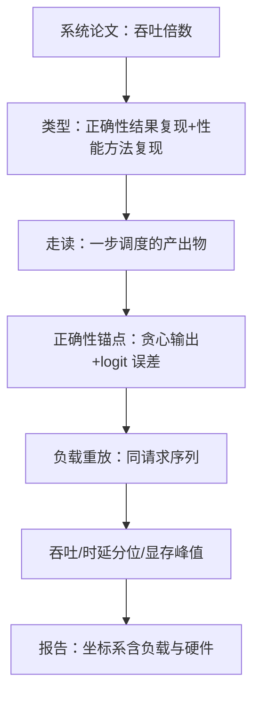

# 复现案例：推理引擎

系统论文要证明的常常不是想法可行，而是想法在大规模下仍然可行；所以它的每个数字都绑着一份负载。

<footer>—— 据 Kwon 等, Efficient Memory Management for LLM Serving with PagedAttention, SOSP 2023 整理</footer>

[上一课](/llm/rw-report-writing)给了报告骨架，本课把它放进第一个完整案例：把一篇推理系统论文复现成引擎里可验证的特性。以 PagedAttention 一系的口径为锚——分页 KV 管理、连续批处理、吞吐倍数声称。框架走读课（[fw-vllm-walkthrough](/llm/fw-vllm-walkthrough)）已经解剖过这类引擎的骨架，本课不复读架构，只走复现工作流在这类论文上的特殊形态。

## 问题

系统论文的复现与训练论文不同，坐标系里多出三个维度：负载（请求长度分布、到达间隔）、调度（批组合与时机）、硬件（卡型与互联）。论文声称的吞吐倍数绑定在这三个维度上——换了负载分布，「3 倍吞吐」没有语义。更麻烦的是锚点换型：训练论文有 loss 可对账，推理论文没有；正确的锚点从「一步的训练」换成「一步的调度」——引擎在一个调度决策里做了什么选择、写下了哪些分配。找不到这个锚点，性能对比会退化成跑分：你的实现输给参考实现时，无法区分是想法错了还是工程差了。

## 方法

按第一课定类型：系统论文常是混合型——正确性走结果复现（同代码同负载重放出同曲线），性能结论走方法复现（独立实现复出相对基线的倍数）。走读按三步法找锚点：入口、一步调度的产出物（这步接了哪些请求、分配了哪些块、抢占了谁）、沿块表到内核。正确性锚点分层：第一层是贪心解码下的输出对齐——温度取零，请求级对比参考实现的 token 序列；第二层是 logit 级相对误差——批大小与内核不同会改变浮点求和次序，逐 token 完全一致不是可靠判据（见边界）。性能锚点是负载重放：记录请求序列（长度、到达时间戳），在两个实现上重放同一条序列；吞吐、时延分位数、显存峰值都从重放读出，而不是从各自独立压测读出。

## 机制

为什么负载重放是性能对齐的核心：压测吞吐的方差来源——请求长度分布、到达突发、缓存冷热——全部由序列决定；序列相同，两个实现的差异才只剩调度与内核本身。这也是「3 倍」这类倍数声称的正确读法：倍数绑定在论文的重放序列上，你用自己的负载测出的倍数不同，不是复现失败，是坐标系不同（判读一课的口径）。为什么微基准补位端到端：显存碎片率、块利用率这类量在端到端曲线里不可见，用固定请求序列的受控微基准（页大小扫描、并发度扫描）把机制量单独读出来，才能归因到「分页省了显存」而不是「实现了别的什么也省了」。性能回归的防漂移纪律——同机同时段 A/B、多次重复取分布——沿用[性能回归的方法](/llm/fw-perf-regression)。

贪心解码的「逐 token 完全一致」会误报：批大小改变 GEMM 形状，浮点归约次序随之改变，两个并列概率的 token 可能交换 argmax。稳定判据是 top-2 概率差加阈值，或者只比高置信段的序列——把浮点次序效应排除在「错误」之外。

## 边界

案例不覆盖服务级语义：SLO 分层、抢占公平性、多租户隔离是调度与多租户课程的主题，复现到「机制量对齐」即止。硬件坐标要诚实：不同卡型的吞吐绝对值不可比，跨硬件只报告相对基线的倍数并附绝对值坐标；内核差异（专用实现与通用实现）与算法差异（调度策略）要在报告里拆开，混写会让「复现了想法」变成「复现了某个工程组合」。最后一，复现产物按上一课骨架落档，性能判定同样挂 run——负载序列的哈希是坐标系的一部分，与数据指纹同级。

## 小结

- 系统论文复现的坐标系多三维：负载、调度、硬件；倍数声称绑定负载重放。
- 锚点从 loss 换成一步调度的产出物；正确性用贪心输出加 logit 误差，不用逐 token 完全一致。
- 负载重放隔离实现差异：同序列之下，差异只剩调度与内核。
- 微基准读机制量（碎片率、块利用率），端到端只出验收判定。
- 出处：Kwon 等, SOSP 2023；走读见[fw-vllm-walkthrough](/llm/fw-vllm-walkthrough)；防漂移见[性能回归的方法](/llm/fw-perf-regression)。
