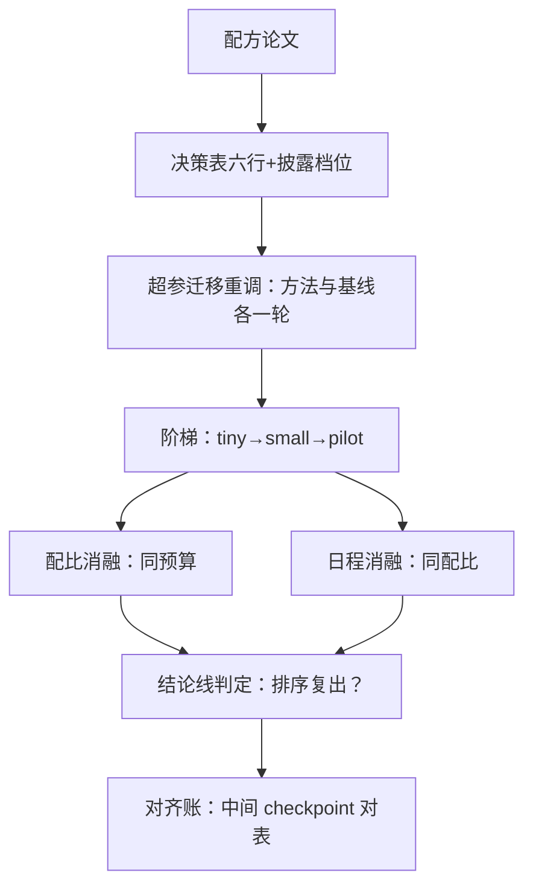

# 复现案例：训练配方

配方可信的标志，是它的每个数字都能指回一次可重算的实验；做不到这条的配方，只是很好的故事。

<footer>—— 据 Groeneveld 等, OLMo: Accelerating the Science of Language Models, 2024 整理</footer>

[上一课](/llm/rw-case-inference)的案例在推理侧，锚点是便宜的单步调度；本课走到另一端：训练配方的复现，以 OLMo 一系的开放全流程配方为锚。单步便宜、全量极贵、失败在几周后才暴露——预算结构与失败节奏与推理案例相反。预训练配方的判读底稿在[开源配方对照](/llm/pf2-opensource-recipes)：规模分割、配比管线、超参迁移、日程退火、稳定件、评估声明六行；本课把这六行变成一条执行路径。

## 问题

配方复现的难点在「组合」：配方声称的不是单个部件的效果，而是配比、日程、稳定件三者的组合效应。逐件消融覆盖不了组合——数据配比的贡献依赖退火日程，退火的贡献依赖数据配比；单独对齐任何一件都可能「对上」，组合起来仍对不上。另一个难点是开销曲线：全量一次的成本让穷举不可能，所以配方复现注定是阶梯上的抽样艺术——在哪一级阶梯上问哪一个问题，问错了问题，预算就变成了学费。

## 方法

按第一课声明：目标线选结论线——在缩小的规模上复现配比与日程的排序；数字线只对 pilot 级及以下承诺。执行四步。第一步，判读出决策表：六行逐项填，披露档位标注；开放配方（OLMo 口径）多数行显式，封闭报告按缺失档降级预期。第二步，超参迁移重调：论文的学习率与权重衰减在其规模调出，先在你的目标规模上为「他们的方法」与「基线方法」各重调一轮优化超参，再谈配比——这步服务两个目的：外推修正与基线资格（[数值对齐与基线校准](/llm/rw-baseline-alignment)）。第三步，阶梯执行：tiny 通管线、small 看趋势、pilot 定关键判断；配比消融在 pilot 级做同预算对照（[消融设计的工程学](/llm/rw-ablation-design)），日程与退火单独消融。第四步，对齐账收口：同数据快照上重算 loss 曲线形态，与配方公开的中间 checkpoint 对表。

## 机制

为什么「超参迁移」行是枢纽：配比的比较只有在优化超参各自调平后才有语义；直接照搬论文超参到缩小规模，优化器欠账会冒充配比效应——两个配比谁对谁错，判给了一个没人测过的学习率。这就是配方复现里最常见的假阴性：论文的配比没错，你的迁移错了。为什么日程要单独消融：学习率退火的尾部贡献最终 loss 的一大块，配比效应必须在同一日程下比较；反过来，日程的效应也要在同一配比下比较。组合层的验证靠正交小网格：在 pilot 级取配比两档乘日程两档的最小网格，四格读出交互项的方向——不追全网格，只判「组合是否可分」。开放配方的独特优势在账本公开：中间 checkpoint 的评测分数可查（Groeneveld 等 2024 的口径），你的评测管线先对它的公开 checkpoint 校准，归因空间直接砍半——评测侧的差异与训练侧的差异提前分开。

对表公开 checkpoint 是配方复现独有的免费锚点：不用训练任何东西，先让你的评测栈在他们的中间模型上复出公开分数。对不上时，问题在评测管线而不是训练——归因六步直接跳过整个训练侧。

## 边界

案例边界有三。数据的地域与时效漂移使「同一份配比」不可得时，声明近似档位，结论线自动降级。分词器不同则全部数字换坐标系，连结论线都要重估——粒度变化会改变配比的相对含义。最后，组合的边界诚实：pilot 级的四格网格只验证「可分性」的方向，不验证全量规模下的组合值；配方复现的结论通常停在「排序与方向」，把它写成「复现了配方」就是越档引用。产物按报告骨架落档，配比消融的每个格子挂 run，死路（比如某配比在 small 级已发散）入档案。

## 小结

- 配方复现的目标线默认结论线；数字线只对 pilot 及以下承诺。
- 六行决策表先行；超参迁移重调是枢纽——优化器欠账会冒充配比效应。
- 配比与日程互相消融：配比在同日程下比，日程在同配比下比；交互用最小四格网格判方向。
- 对表公开 checkpoint 是免费锚点：先校准评测栈，再谈训练侧归因。
- 出处：Groeneveld 等, 2024；判读口径见[开源配方对照](/llm/pf2-opensource-recipes)；管理口径见[训练配方管理](/llm/ti-recipe-management)。
