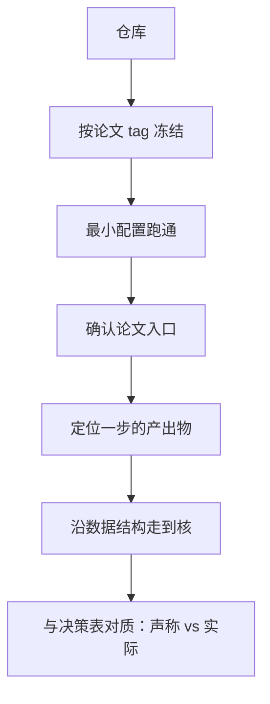
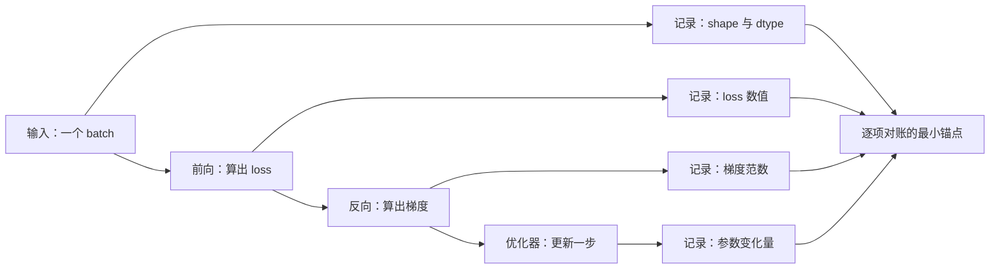

# 开源代码库的阅读法

调试的难度是写代码的两倍。因此，你写代码时用尽了全部机巧，就没有余力去调试它。

<footer>—— 据 Kernighan 与 Plauger, The Elements of Programming Style, 1978</footer>

[上一课](/llm/rw-report-reading)从报告抽出决策表，得到「作者声称做了什么」。判读的结论必须与代码对质，本课写怎么进开源仓库，得到「代码实际做了什么」。推理框架的走读课[fw-vllm-walkthrough](/llm/fw-vllm-walkthrough)已经立了方法：找入口、找一步的产出物、沿数据结构走到核；本课把这套走读法装进复现工作流，重点是选对冻结点、跑通最小配置、把一步变成可复算的锚点。

## 问题

仓库不是论文的忠实翻译。研究代码带着多代路径：被推翻的分支还在、为赶 deadline 的硬编码还在、论文时刻与仓库 HEAD 早已分叉。阅读者面对的缺口不是「代码做什么」，而是三个具体问题：论文数字出自哪条入口（研究脚本还是库的 happy path）、一次训练步的边界在哪里、哪些模块是骨架哪些是死代码。入口选错，你复现的是工程产品的默认行为，不是论文实验；边界找不到，就没有可以与参考实现逐项对账的位置。

「HEAD」是 git 术语，指仓库当前所在的最新提交。研究项目发完论文通常还在继续开发：今天克隆到的最新代码，可能已经过了几轮重构，和产生论文数字的那一版早就不是同一份——所以正文要求按论文对应的 tag 冻结版本。

## 方法

走读前先冻结：按论文对应的 tag 或提交检出版本，环境用锁文件装好；不是最新版，是论文时刻的版本。然后跑最小配置——tiny 模型、小数据子集、最小步数，目标是让「一步」在断点或日志里可见。这三件事都完成后才谈阅读，顺序颠倒会浪费整个下午在环境上。

跑最小配置就像新打印机先打测试页：tiny 模型加几十步训练，目的不是出结果，而是确认管线每一环都通、断点里能看到「一步」长什么样。等跑完几百亿 token 的全量实验才发现管线漏气，学费就贵了。

阅读按三步法。第一步找入口：从 README 的快速开始与论文的实验脚本两头夹，确认论文数字出自哪条路径。第二步找一步的产出物：一个训练步写下了什么——batch 的形状与来源、loss 的值、梯度范数、优化器状态的变化；把它变成可打印、可断点的位置。第三步沿数据结构走到核：函数名会说谎（沿袭旧架构的名字常见），数据结构的形状不说谎——shape 与 dtype 是物理事实。全程用 git blame 追「神秘常数」的来历：那行代码多半指向一个修复某 bug 的提交，提交里常有 issue 链接，是仓库里最诚实的隐性文档。

## 机制

为什么「一步的产出物」是复现的枢纽：论文的曲线是无数次训练步的累积，能复算一步，才能复算全程。数值对齐一课会把它作为最强锚点——同一 batch 上与参考实现逐项对账；走读的任务就是把这一步的边界、输入与全部中间量定位出来。为什么从数据结构入手而不是从类图入手：研究代码的继承关系常常是历史层积，读类图会走进死胡同；顺着张量的流动走，每一步都有形状可验证，走错会立刻暴露。

常见误区：看到函数叫 merge_attention 就以为它真在做注意力合并——研究代码的命名常沿袭被推翻的旧架构。真正可靠的是张量的 shape 与 dtype：名字可以过时，形状过不了假，所以正文说「函数名会说谎，数据结构不说谎」。

框架走读课验证过这套方法的耐用性：vLLM 从 V0 到 V1 重写了调度与 KV 层，但「核心进程单线程决策、worker 只执行」的骨架与块表数据结构不变，模型与核全部复用——找到一步的产出物，大重构也能跟踪，论文复现同理。

## 边界

走读不重写：读到「看不懂但能跑」的模块，先记档，不深挖；复现的目标线决定要读的子图范围，结果复现常常只需要数据与评测路径，方法复现才需要读训练主体。不做全仓库的地图：入口选对后，与目标线无关的分支直接跳过。仓库与决策表冲突时不当场修代码——记录冲突，等配置工程一课用受控的 diff 去验证；在走读阶段顺手改代码，会破坏「声称与实际」这张对照面的证据资格。闭源或半开源的仓库没有这条退路，披露档位的缺失行直接升级为风险，走读改为按报告盲复，代价记入预算。

## 小结

- 走读三步：找入口、找一步的产出物、沿数据结构走到核；函数名会说谎，张量形状不会。
- 先冻结（tag 与锁文件）再跑最小配置，最后阅读，顺序不可颠倒。
- 一步的产出物是复现的锚点：能复算一步，才能复算全程。
- git blame 与 issue 链接是仓库的隐性文档，神秘常数多能追到修复动机。
- 走读阶段不改代码，只产出「声称 vs 实际」的对照面。
- 出处：Kernighan 与 Plauger, 1978；走读方法见[fw-vllm-walkthrough](/llm/fw-vllm-walkthrough)，源出 Kwon 等, SOSP 2023。
