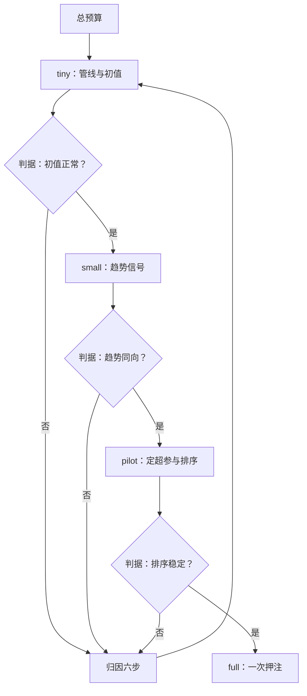
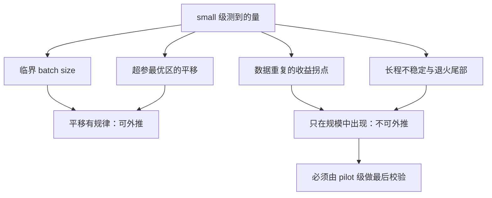

# 算力预算的分配

先问需要多少证据才能下结论，再问这些证据值多少卡；顺序反过来，预算永远不够。

<footer>—— 据 Dodge 等, Show Your Work: Improved Reporting of Experimental Results, 2019 整理</footer>

[上一课](/llm/rw-failure-attribution)给了排查次序，但次序的每一步都要花钱：归因要做实验，消融要做实验，最后的对齐复算最贵。本课写钱怎么分。复现最贵的错误只有一种：把全部预算押在一次全量复跑上——它失败一次，项目归零，而且死因查不动，因为已经没有预算做归因了。

## 问题

复现预算与自研训练预算的失败模式不同。自研训练容易在探索上失血，复现容易在「最后一公里」上失血：复现者被目标线（第一课的声明）锚定，把全量复跑当成唯一的验收，于是归因、消融、基线校准全都没有预算。等全量跑完对不上，回到上一课的六步次序，第一步就卡住——没有算力做对照实验。缺口是把「复现」从一个大实验拆成一组有依赖的小实验，按证据价值分配。

阶梯式花钱像新药的分期临床试验：一期（tiny）只验证「安全」——管线通不通；二期（small）看有没有疗效信号——趋势在不在；三期（pilot）扩大范围确认排序稳不稳；最后才上 full 这场大实验。跳过全部分期直接全量押注，赌输时连死因都查不了。

## 方法

阶梯式执行，四级。tiny 级：分钟到小时，单卡或单机，验证管线通、初值锚点正常——这是归因次序前四步的主场。small 级：小时到天，验证趋势信号：配比的方向、日程的形态在小规模上是否与论文一致。pilot 级：预算的百分之十到二十，规模已接近可外推区，用来定关键超参与确认排序稳定性，多种子从此开始。full 级：余下预算的一次性押注，只在 pilot 的判据全过之后。级与级之间是闸门不是自动扶梯：每一级出口写下判据（初值正常、趋势同向、排序稳定），判据不过就回上一级或进归因，不带着坏信号升级。

预算分配的口径：归因与消融合计预留三到四成，基线校准一成上下，主复跑五到六成。这个比例不是定理，是防「全押」的结构件。多 run 并发与排队成本按[多实验的资源调度](/llm/ti-multiexp-scheduling)的口径计入：等待与抢占是真实成本，预算表要有排队余量。

数字实例：总预算若值 100 万卡时，按口径就是归因与消融 30–40 万、基线校准 10 万、主复跑 50–60 万。别觉得那 40 万「没花在复现上」是浪费——全量对不上的那天，只有它们能告诉你为什么。

## 机制

为什么小规模的趋势可以外推（有时）：超参的最优区随规模平移，但平移有规律。临界 batch size 是最实用的一件：低于它，加大 batch 几乎不浪费样本；高于它，样本效率加速衰减。McCandlish 等 2018 给出用梯度噪声尺度估计它的方法——在 small 级测出临界 batch，full 级的 batch 与学习率搭配就不必猜。参数与学习率的联合缩放有更系统的框架（Yang 与 Hu 的 $\mu$P 一族），但对复现而言，先做临界 batch 的测量性价比最高。

为什么外推会失效：有些现象只在规模中出现——数据重复次数的收益拐点、长程不稳定、退火尾部的行为，小规模上不存在或形态不同。这就是 pilot 级不能省的原因：它处在可外推区的边缘，是「小实验的结论」与「大实验的赌注」之间的最后一道校验。省掉 pilot 直接 full，等于把外推失效的风险全部带进不可撤回的一次押注。

数字实例：若 small 级测出临界 batch 是 100 万 token，full 级把 batch 拉到 500 万就已深陷样本效率衰减区——要么退回临界值附近配更高学习率，要么接受每 token 更贵。先测再定，比拍脑袋定超参便宜一个数量级。

预算表里常漏三笔：检查点存储（单点全状态约每参数 16 字节，长训的存储预算可超数据集，见[checkpoint 工程深入](/llm/ti-checkpoint-engineering)）、断点续训的重跑成本、以及失败归因的实验费。三笔都来自 full 级失败的概率，乘上概率才是期望成本。

## 边界

阶梯不是免费的保险：每升一级都有工程损耗，tiny 与 small 的结论必须当成「可被推翻的信号」而不是「小型化的定理」，否则阶梯会退化成在低层级反复内卷。也有些复现无法走完整阶梯：论文只给了全量配置、缩小规模行为不可比（如涌现能力），此时声明里就要写「采用缩小规模替代验收」，目标线降档，而不是硬跑全量。算力约束是硬边界时，宁可缩小范围（只复主表、只复结论线）也不压缩每级的判据——砍判据省下的算力，会在归因时加倍还回去。

## 小结

- 四级阶梯：tiny 通管线、small 看趋势、pilot 定超参、full 一次押注；级间是判据闸门。
- 归因与消融预留三到四成预算；全押 full 是复现的头号死法。
- 临界 batch size 用小实验测量、向大 run 外推；$\mu$P 一族是系统化的后盾。
- 外推有边界：重复拐点、长程不稳定不外推，pilot 是最后的校验。
- 预算表含检查点存储、续训重跑与归因实验的期望成本。
- 出处：Dodge 等, 2019；McCandlish 等, An Empirical Model of Large-Batch Training, 2018；Yang 与 Hu, Tensor Programs V, 2022；Hoffmann 等, 2022。
