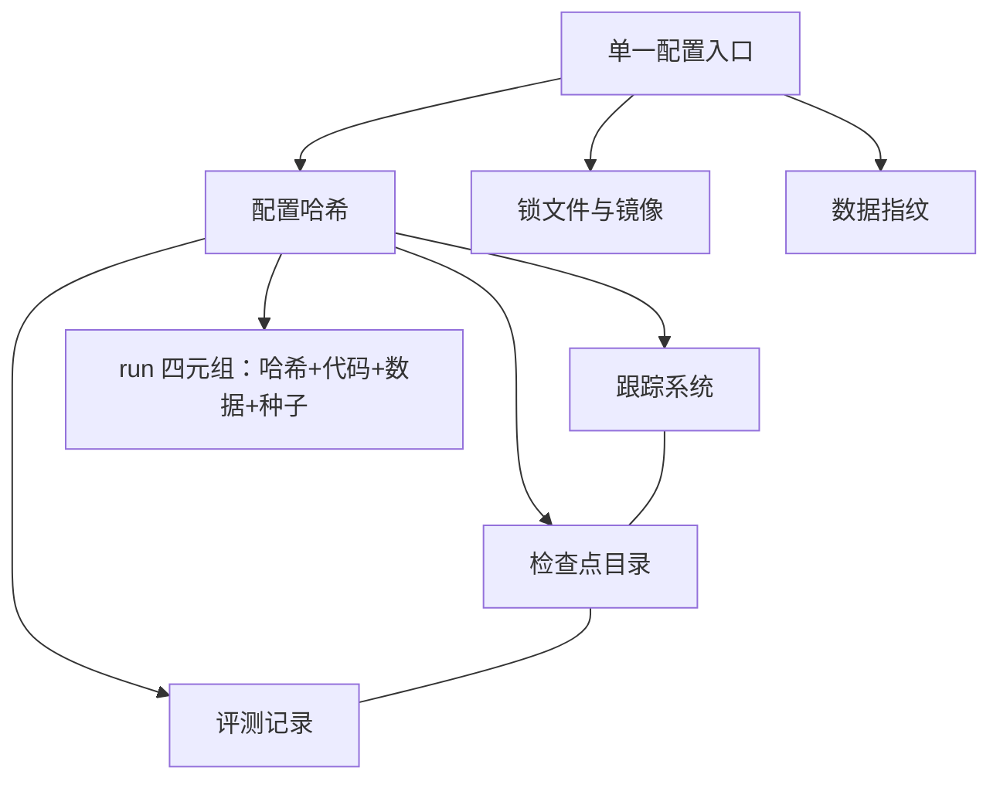

# 实验管理与配置工程

不可重复测量的量不是量，不可追溯来源的实验不算实验；账目先于结论。

<footer>—— 据 Bouthillier 等, Accounting for Variance in Machine Learning Benchmarks, MLSys 2021 整理</footer>

[上一课](/llm/rw-codebase-reading)把走读停在一步的产出物上。复现从这里开始变成「跑很多次」，而跑很多次的失败大多不是模型失败，是账目失败：两天后看着一条异常曲线，答不出「这个 run 用的是哪份配置、哪个数据快照、哪版代码」。训练基础设施课已经把账目工程讲透——run 身份四元组、配置哈希全链路同一、工件存指针不存副本，见[实验跟踪](/llm/ti-experiment-tracking)与[训练配方管理](/llm/ti-recipe-management)。本课只补复现场景特有的增量：账目要同时服务两边——你的实现与参考实现。

## 问题

复现实验的账比自研训练多一层义务：每个 run 不仅要能向自己解释，还要能与参考实现对质。缺口有三。其一，配置散落：脚本参数、环境变量、命令行历史各存一份，复现时「改了一点」没有记录，曲线从此无法解释。其二，环境漂移：两台机器、两次安装，库的次版本不同，行为差异被误判为方法差异。其三，数据无指纹：参考实现用的数据快照与自己重新下载的数据，清洗与去重细节不同，所有下游对比失真。

## 方法

配置即代码：所有实验参数收敛到单一入口（一份 YAML），从命令行历史与散落的 argparse 默认值里收权。配方字段按[训练配方管理](/llm/ti-recipe-management)的六组组织——模型、数据、优化、数值、观测、治理；配方是指针的集合，指向数据快照、代码版本与评测脚本的具体版本。配置哈希是 run 的名字：跟踪、检查点、评测三处的哈希必须同一，这条在基础设施课是可比性地基，在复现里还是「与参考实现对照」的凭证——对账时先比哈希，哈希不同的一切比较作废。

环境冻结用锁文件加容器镜像，镜像哈希记入 run。数据不重新清洗：能拿到原快照就用原快照，拿不到就记指纹差异档位。种子分开管：初始化种子、数据顺序种子、dropout 种子各自独立，复现的方差测量（同配置多种子）依赖这种分离。实验矩阵由编排脚本生成——列出配置差分、程序化展开成 run，禁止手改单个 run 的配置；手改必漏记。

## 机制

为什么哈希全链路同一在复现里更严格：自研训练里哈希断裂只是自己麻烦，复现里它是证据链——「我复现的对象就是这个哈希对应的配置」这句话断了，后面所有数字失去资格。继承要显式：与基线的差异写成 diff，评审者几分钟内能说出你改了什么；复现报告一课的对齐账直接引用这份 diff。

为什么种子要分立与重复：Bouthillier 等 2021 把基准方差拆解成数据顺序、初始化、dropout 等成分，发现数据顺序一项的方差常不小于初始化——只锁初始化种子的「同配置重复」测不到主要噪声。复现要判断 0.3 分的差是信号还是噪声，先得有噪声的测量；种子数按目标容差与测得方差定，不是固定三个或五个。

工件存指针不存副本：run 里记检查点与数据集的指针与指纹，不复制文件本体；权威在检查点分线目录（[checkpoint 工程深入](/llm/ti-checkpoint-engineering)）。复现报告里贴曲线截图而不贴 run 链接，是最常见的账目倒退。

## 边界

账目不是越全越好：自动采集的部分（哈希、指纹、指标）机器写，人工只填动机与判词——「为什么跑这个配置」「预期对上什么」，这两个字段是三个月后唯一无法从别处恢复的。配置系统不做图灵完备：没有循环没有条件逻辑，表达不了的就写进代码而不是写进 YAML。超参搜索是另一门课的工程（[超参搜索工程](/llm/ti-hparam-search-eng)）：复现里允许的搜索只有两类——环境重适配（让参考配置在你的硬件上跑起来）与基线重调（服务基线校准），都要在报告里单列，不与复现本身混淆。逐位一致不设为目标，跨硬件的数值一致性是独立工程，本课的容差从声明（第一课）继承。

## 小结

- 配置收敛到单一入口，哈希贯穿跟踪、检查点、评测三处；哈希不同的一切比较作废。
- 环境用锁文件与镜像冻结；数据优先用原快照，否则记指纹差异档位。
- 种子分立（初始化、数据顺序、dropout），同配置多种子测噪声，种子数按容差定。
- 实验矩阵由脚本生成，禁止手改单个 run；人工只填动机与判词。
- 出处：Bouthillier 等, 2021；口径见[实验跟踪](/llm/ti-experiment-tracking)与[训练配方管理](/llm/ti-recipe-management)。
