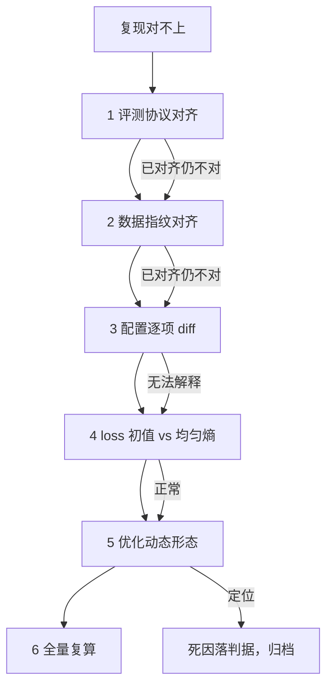

# 失败归因的次序

神经网络的失败大多是沉默的：代码照常运行，只是训练坏了；所以排查必须靠纪律，不靠报错。

<footer>—— 据 Karpathy, A Recipe for Training Neural Networks, 2019 整理</footer>

[上一课](/llm/rw-ablation-design)的消融在部件之间做受控比较；本课处理它的逆问题：复现对不上时，差异到底藏在哪一层。嫌疑空间是一个乘积——数据、分词、初始化、优化器、日程、数值、评测协议，七层任何一层都足以毁掉全部数字。乱枪排查的代价不只是算力：试到第十几枪时，你已经在噪声里「看到」过各种假信号，归因从此失去证据资格。缺的是一个固定的排查次序。

## 问题

归因的困难有两个来源。第一，层的乘积太大：全组合排查是指数的，必须逐步缩小空间。第二，观测不区分层：一条异常 loss 曲线可以是数据坏了，也可以是学习率坏了，也可以是评测脚本坏了——症状相同，病灶不同。所以次序必须按两个原则排：从外向内（先检查离训练最远的层，评测与数据，再进入训练本体），从便宜到贵（分钟级检查排前，天级复算排后）。每个原则单独用都会失败：只按便宜排会先调学习率，只由内向外会烧掉预算才发现问题出在评测脚本。

## 方法

六步次序，每步只验证一个假设，验证失败（该层对齐了仍不对）才进下一步。第一步评测协议对齐：换用对方的评分脚本与提示模板重测自己的输出——最便宜的检查，也截获最多假失败。第二步数据指纹对齐：快照版本、清洗规则、去重阈值、配比，逐项比。第三步配置 diff：把你的配置与参考配置逐项并列，差异清单里没有解释的项逐个消去。第四步 loss 初值检查：小批数据上的初始 loss 应约等于词表上的均匀分布熵；差一位数就是归一化、词表映射或 padding 出错。第五步优化动态：学习率爬坡曲线、梯度范数序列，对照[loss 曲线的解读](/llm/ti-loss-curve-reading)的形态学——上不去查数据与学习率，震荡查数值，后段发散查日程。第六步才全量复算。层与层之间的换件法是二分：把对方的数据喂进你的管线，或反之，一次实验对半切开嫌疑空间。

## 机制

为什么 loss 初值是枢纽锚点：它把优化动力学冻结掉，只剩前向计算与数据管道——第一性检查里信息量最大的单点。语言模型的心算口径：词表 3.2 万，均匀分布熵约为 $\ln(32000) \approx 10.4$，第一步 loss 落在 10 到 11 属正常；一上来就是两位数，基本不用看训练，问题在映射或归一化。为什么评测协议排最前：它决定「对不上」这个症状本身是否成立——模板差一个空格、few-shot 数不同，都能造出几个点的假差距，后面的层根本无病。

归因的终点纪律：找到「足以支撑目标线的差异」就停。复现不追求唯一真因——有些差异作者自己也解释不了（历史上有效的神秘超参），归因到「披露不足」一级就够进报告。每个死因必须落在判据上：「效果不好」不是数据，「换用对方评分脚本后差距从 2.1 缩到 0.2」才是数据。

失败实验要归档而不是删除：死路是团队资产，[失败实验的归档](/llm/ti-failed-exp-archive)要求失败与成功同模板入库、死因落判据。归因台账的价值在半年后——下一个复现同一论文的人，你的排除记录是他跳过的全部算力。

## 边界

归因次序不是教条：第四步的初值检查便宜到近乎免费，可以随第一步一起做；但对数据的怀疑必须按次序升降——数据指纹对齐过一次后，短期内降级为低嫌疑，除非换了快照。不把归因当追责：记录以差异为中心，不以人为中心，否则团队会学会隐瞒失败。也无法归因到零：预算耗尽时，剩余嫌疑写成「未排除项」进入报告的置信度档位，而不是含混地写「基本复现」。有些复现差异最终落在不可归因区（作者环境不可复原），这不是失败，是方法复现这门手艺的常规成本。

## 小结

- 排查次序两原则：从外向内、从便宜到贵；六步是评测、数据、配置、初值、动态、全量。
- 每步只验证一个假设，验证不过关才进下一层；换件法实现二分。
- loss 初值对均匀熵是最便宜的高信息锚点；语言模型口径约 $\ln V$。
- 死因必须落在判据上，失败实验同模板归档，负结果可检索。
- 归因到「足以支撑目标线」即止；剩余嫌疑写成未排除项降档进报告。
- 出处：Karpathy, 2019；曲线形态学见[loss 曲线的解读](/llm/ti-loss-curve-reading)；归档纪律见[失败实验的归档](/llm/ti-failed-exp-archive)。
