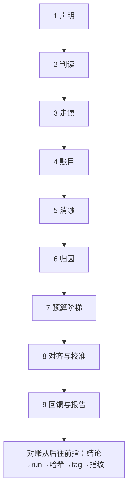
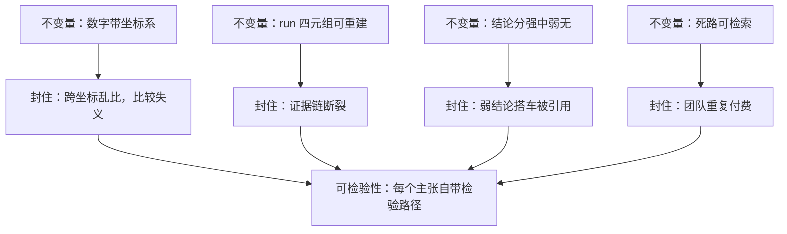

# 复现工作流收束

有组织的怀疑：共同体的每个主张都摆上检验台，不因出处显赫而免检。

<footer>—— 据 Merton, The Normative Structure of Science, 1942 整理</footer>

[上一课](/llm/rw-case-training-recipe)的配方案例走完，方法、实践、产出三个单元的课都已在手：判读与走读给了对照面，配置与预算给了跑道，归因与对齐给了判定，回馈与报告给了出口，两个案例验证了全流程在两类论文上的形态。本课收束：把十二课收成一张可执行的决策单、几条不变量、几件高频拦错事。本课程到此收束。

## 问题

收束的缺口不是新知识，而是次序：十二课的方法若不成单，下次复现仍会从乱枪排查开始——先调学习率再查评测脚本，先押全量再想预算。训练基础设施的收束课立过一个口径：对账从后往前指，每一步的异常都能指回前一步的欠账。复现工作流需要同样的收法：一张按依赖排序的决策单，让「欠账」在花大钱之前就暴露。

「对账从后往前指」就像食品溯源码：货架上的每盒鸡蛋都能查到哪个养殖场、哪批饲料。报告结论是货架，run 是批次号，配置哈希是养殖场——链条任何一环查不到，这盒蛋就不能上架，结论同理降档。

## 方法

决策单九步，按依赖排。一，声明：类型、目标线、容差、范围、约束，一页纸。二，判读：报告抽出六行决策表，标披露档位。三，走读：仓库冻结到论文 tag，定位一步的产出物。四，账目：单一配置入口、哈希贯穿三处、种子分立。五，消融：从目标线倒推，同预算对照，过噪声带再判。六，归因：评测、数据、配置、初值、动态、全量，六步次序不许跳。七，预算：四级阶梯加闸门，归因消融占三到四成。八，对齐：四层锚点先粗后细，基线先校准再比高下。九，出口：回馈分级送上游，报告六节落档。

四条不变量。每个数字带坐标系；每个 run 可由四元组重建（配置哈希、代码、数据指纹、种子）；每个结论分档（强、中、弱、无）；每条死路可检索。对账从后往前指：报告里的结论点回 run，run 点回配置哈希，哈希点回代码 tag 与数据指纹——链条任一环断裂，结论降档，这就是九步互相咬合的意义。

数字实例：四条不变量落到一次汇报上就是四句话——「3 倍是 A100、每秒 8 请求负载下的 3 倍」「run 编号 9f3a 开头的那个哈希」「结论：中档，单种子」「tiny 级发散这条死路见台账第 41 条」。少任何一句，听众就得自己回去猜。

## 机制

为什么不变量是这四条：它们分别封住四类事故。数字不带坐标，比较失义——判读课与案例课都撞见过的「3 倍」与「0.3 分」；run 不可重建，证据链断——账目课的哈希三处同一就是为它立的；结论不分档，弱结论搭车被引用——报告课的分档纪律；死路不可检索，团队重复付费——归档课的老规矩。四条都是「可检验性」在工程层的展开：Merton 的有组织怀疑落到团队里，就是让每个主张都带着自己的检验路径存在。

常见误区：把三件高频拦错事当成「新手才会犯」。定目标线、调平基线、留归因预算，省下的都是现在的时间，代价延期到以后——资深团队犯的频率并不低，区别只在他们开工前有这张清单。

三件高频拦错事，按代价排：没定目标线就开工（全部后续判据悬空）、基线没调平就比高下（结论作废且难察觉）、全量押注不留归因预算（一次失败即归零）。三件事的共同点是事前一分钱的检查，事后十倍的账。

预算的实践起点：两个案例里，tiny 加 small 加 pilot 约占总算力的三到四成，却解决了绝大多数归因问题——比例不是定理，是防全押的结构件；领域方差越大（如强化学习），这个占比越高。

## 边界

收束不等于封闭。新论文形态会给坐标系加维度：长程 agent 实验把负载与轨迹长度带进坐标，多模态训练把模态配比带进决策表——九步的骨架不变，行的内容会换。复现的许可与伦理边界随配方公开程度收紧或放松，回馈时按上游条款走。还有一条常被漏掉的出口：「不复现」也是合法决定——成本超过决策价值时，把它写成显式声明（读了什么、估了什么、为什么停），进同一套台账；沉默的不复现只会让下一个排队的人重新估一遍价。到此，复现工作流收束：类型定靶，判读与走读出对照，账目出跑道，消融与归因出判定，预算出闸门，对齐出验收，回馈与报告出口——本课程到此收束。

## 小结

- 决策单九步按依赖排：声明、判读、走读、账目、消融、归因、预算、对齐、出口。
- 四条不变量：数字带坐标、run 可重建、结论分档、死路可检索；对账从后往前指。
- 三件高频拦错事：没定目标线、基线没调平、全量押注——事前便宜，事后昂贵。
- 「不复现」写成显式决定进台账；新论文形态换决策表的行，不换骨架。
- 出处：Merton, 1942；账目与配方口径见[训练基础设施收束](/llm/ti-map)；按本课程十二课整理。
