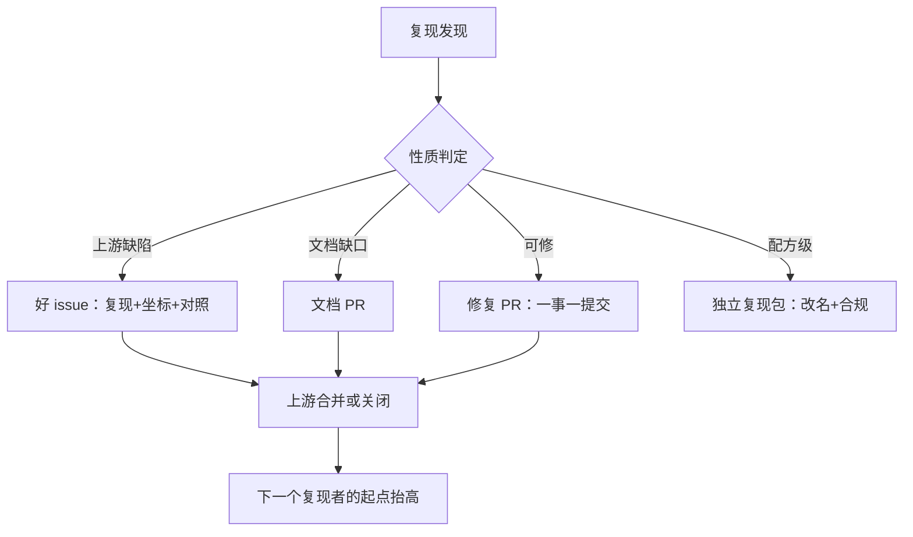

# 开源协作与上游回馈

给了足够的眼睛，所有 bug 都现形——但前提是你的发现让那些眼睛看得见。

<footer>—— Linus 定律，据 Raymond, The Cathedral and the Bazaar, 1999 整理</footer>

[上一课](/llm/rw-baseline-alignment)的判定落定后，复现的副产品开始堆积：修好的 bug、补齐的文档、澄清的配置、可复算的脚本。这些资产留在你的硬盘里，价值随时间衰减；送回上游，价值随每个后来者增长。开源生态课已经讲过发布侧的规范——许可证谱系见[许可证谱系与选择](/llm/eco-license-spectrum)；本课写复现者的回馈路径：从一条好 issue 到一个被合并的修复，回馈如何反过来成为复现工作流的闭环。

## 问题

复现者的回馈有三个典型失败。其一，沉默：发现上游 bug 与披露缺口，只在内部笔记里记档——下一个人在同一处再摔一次，上游永远不知道。其二，噪音：把不完整的观察丢进 issue——「我跑不通」，没有版本、没有最小复现、没有期望与实际，维护者只能关闭。其三，越界：复现分叉里顺手重构了上游代码，diff 无法审，回馈不成反而树敌。三者的共同缺口是把「我的复现发现」翻译成「维护者可以行动的动作」。

## 方法

回馈按表面积由小到大四级，逐级升级。第一级，好 issue：三要素齐全——最小复现（最小到几十行的独立脚本）、环境坐标（版本、硬件、锁文件哈希）、期望与实际的精确对照；最小复现脚本本质上就是第一课「结果复现」的微型化，你在复现工作流里练的正是这件事。第二级，文档 PR：把你走读时补的入口说明、环境坑、决策表里显式化的隐性约定写成文档改动——影响面小、审查快，是建立信誉的入口。第三级，修复 PR：一条提交只做一件事，与仓库现有测试风格对齐，先跑通本地 CI；大改先开讨论贴，让维护者在代码之前同意方向。第四级，复现包独立发布：与原项目名字区分、许可证兼容、数据与模型权重按其许可条款分发。

## 机制

为什么回馈是复现工作流的闭环而不是慈善：你的修复被合并后，上游的下一步使用者从你的终点出发，同领域的复现基线整体抬升；你的 issue 里那几十行最小复现脚本，是整个社区共用的归因捷径。复现者在这条链上有独特优势——你被迫做过单步对账、环境冻结与死因归档，这些恰好是好 issue 的全部原料；回馈的边际成本因此比一般用户低得多。贡献流程的细节（分支约定、CI 门槛、审阅礼仪）见[贡献流程与收束](/llm/fw-contribution-map)，本课不重复。

维护者视角决定可合并性：一个 change 的合并概率取决于它的表面积（动了多少接口）与测试覆盖，不取决于你发现的问题多重要。所以「重要但大」的发现要拆：先发 issue 固定事实，再把可独立合并的最小修复逐个送出。

把复现能力变成别人的一键命令，是性价比最高的回馈：docker 镜像或一条复现脚本加固定种子，让任何人分钟级重放你的关键判定表。审稿、评审与内部决策引用的将是这个命令，而不是你论文里的一行数字。

## 边界

回馈有合规边界：私有数据、内部评测集、许可受限的权重不出门；第三方复现的发布不得使用原项目名称背书，报告里的对比遵守上游的引用要求。回馈有信用边界：复现中发现的原文问题向上游提出时用中性措辞——「报告与仓库在 X 处不一致，最小示例如下」，不做有罪推定；复现社区的长期货币是克制。回馈也有范围边界：大规模实验的完整日志不进 issue，压缩成决策可用的形式；你的分叉与上游的漂移要记账——每季度对一次上游 release，漂移大了就写明分叉的定位是「复现档案」而不是「可用分支」，不诱导下游依赖。

## 小结

- 回馈四级按表面积升序：好 issue、文档 PR、修复 PR、独立复现包；逐级升级不越级。
- 好 issue 三要素：最小复现、环境坐标、期望与实际对照；它就是微型结果复现。
- 可合并性由 change 的表面积与测试覆盖决定；大发现拆小步送出。
- 合规与措辞边界：受限资产不出门，对原文问题做中性陈述。
- 出处：Raymond, 1999；流程细节见[贡献流程与收束](/llm/fw-contribution-map)，许可口径见[许可证谱系与选择](/llm/eco-license-spectrum)。
