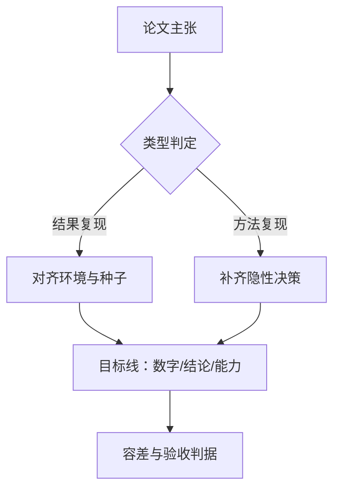
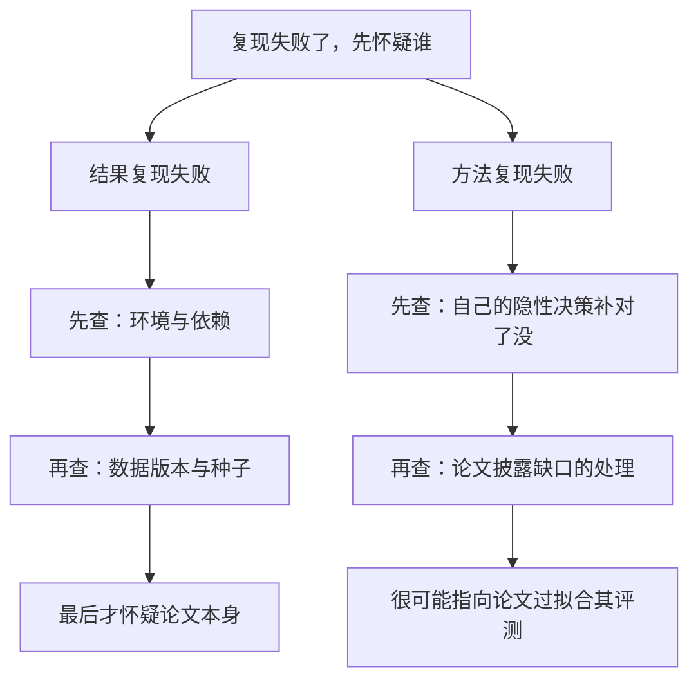

# 复现的类型与目标

主张要成为共同事实，前提是别人也能把它造出来；造不出来的主张，只是某个人的私人经历。

<footer>—— 据 Popper, The Logic of Scientific Discovery, 1959；Claerbout 与 Karrenbach, 1992 整理</footer>

[上一课](/llm/ef-map)把评测前沿收在仪器、卷子、功效与私有评测的决策单上：评测回答「这个模型现在多好」。本课是「论文复现工作流」的第一课，回答它的前置问题：评测表里那个数字，别人能不能重新算出来。评测给出量尺，复现检验量尺上的刻度是否真实；两者的仪器观一脉相承，只是对象从模型换成了论文。后面的报告判读、走读、配置工程、归因与对齐，都默认你开工前已经写下两行字：这是一次什么类型的复现，它停在哪条目标线上。后课默认已经读完本课。

## 问题

「复现」被当成一个词用，底下至少压着两类不同的事。**结果复现**：拿作者的代码、数据与环境重跑，期望得到相同的数字；它的敌人是环境漂移——库版本、硬件、随机种子的路径。**方法复现**：不看作者实现，按论文描述独立实现同一方法，期望得到相同的结论；它的敌人是隐性决策——没写进论文的超参、数据清洗顺序、评测协议细节。两类失败的含义完全不同：前者失败指向披露不足或环境失配，后者失败可能指向论文本身过拟合到了它的评测。社区里 reproducibility 与 replicability 的用词之争，实质就是这两类工作没分开。

一句话分清两类：结果复现是「用原作者的菜谱和厨具，做出同一道菜」；方法复现是「只看菜谱文字、用自己的厨具独立做，要求味道结论一致」。前者考照图施工的能力，后者考对菜谱本身的理解。

目标同样要分线。**数字线**要求对上论文表格里的具体数值；**结论线**只要求复出相同的排序或主张（方法 A 优于方法 B）；**能力线**只要求下游可用水平达到声明。目标没定就开工，会在错误的标准上被审判：追数字的人抱怨实现不同，追结论的人被 0.3 分的差吓住。

## 方法

开工前写一页复现声明，五项：类型（结果复现、方法复现或混合）、目标线（数字、结论、能力）、容差（差多少算对上：绝对差、相对差或置信区间重叠）、范围（只复主表还是全部表格）、约束（可用算力与期限）。这一页是整个课程的靶子，后课的每个锚点、每笔预算都指回它。

数字实例：一页声明写出来就五行——「类型：方法复现；目标线：结论线；容差：排序一致即算对上，分差 1 分内视为持平；范围：只复主表；约束：8 卡两周」。五分钟写完，却决定了后面每一笔算力往哪花、什么算失败。

类型决定读什么。结果复现的重心在代码与环境：种子、锁文件、数据快照，越逐位越好。方法复现的重心在报告与消融：作者声明了什么依赖，缺了什么披露，需要自己补哪些决策。目标线决定算力的花法：数字线最贵，往往绑定全量规模；结论线允许缩小规模，因为排序在小规模上常可保持；能力线以应用验收为准，不必对表格。

## 机制

类型与容差之所以是第一决定，因为它们定义了「失败」这个词。结果复现失败，怀疑次序是环境、依赖、数据版本，最后才是论文错误；方法复现失败，怀疑次序正好倒过来。把两类混在一次实验里（用作者代码加自己的数据，或用自己的实现加作者种子），失败时两头都无法归因——这是复现新手最常见的死法。

常见误区：图省事用作者的代码配自己的数据，或用自己实现配作者的种子——两类实验混在一起，失败时两头都无法归因。省下的是半天拆分工作，赔进去的可能是整个归因预算。

目标线之间有包含关系，判定强度递减：数字对上是强证据，排序对上是中等证据，定性对上只是弱证据。下游引用你的复现时按档位取用，所以声明里必须写清楚停在哪条线，而不是让人误以为你验证了数字。

Henderson 等 2018 在深度强化学习里发现：同一算法、同一环境，五个独立实现之间的最终回报差异，大到能覆盖论文之间声称的差异——方法复现的结论线在方差大的领域里，比数字线更诚实，也更需要多种子。

## 边界

复现不是逐位一致：跨硬件与并行训练下逐位一致本身是一门独立工程，低精度数值的[跨硬件的数值一致性](/llm/num-crosshardware-consistency)另有专门讨论；本课程的「对上」一律指统计意义上的容差。复现也不是抄实现：方法复现的价值恰恰在于独立实现会暴露论文没写的决策。复现更不是重新调参超过原文——那是改进，要另立账本，混进复现报告会让「对上了」三个字失去含金量。刷榜不是复现：榜单只证明存在一组配置能到那个分数，不证明论文的训练路径可重走。

## 小结

- 复现先分类：结果复现（同实现重跑）与方法复现（独立实现同结论），失败含义相反。
- 目标分三线：数字线最强、结论线居中、能力线最弱，判定强度递减。
- 开工前写一页声明：类型、目标线、容差、范围、约束；后课所有锚点与预算指回它。
- 混合两类实验会让失败无法归因；声明先行是第一纪律。
- 出处：Popper, *The Logic of Scientific Discovery*, 1959；Claerbout 与 Karrenbach, 1992；Henderson 等, Deep Reinforcement Learning that Matters, 2018；Gundersen 与 Kjensmo, 2018。
