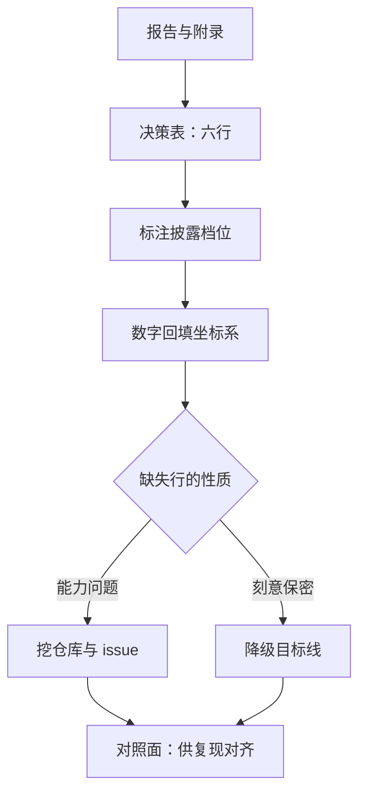

# 技术报告的判读

正文负责说服你结论成立，附录才负责告诉你它怎么被造出来；只读正文的复现，复现的是叙事而不是实验。

<footer>—— 据 Lipton 与 Steinhardt, Troubling Trends in Machine Learning Scholarship, 2019 整理</footer>

[上一课](/llm/rw-replication-types)把复现分成类型与目标线，开工前先写一页声明。声明的类型一旦定了，第一件事不是写代码，而是判读报告：从论文或技术报告里抽出作者的决策清单，并给每一项标上披露档位。预训练配方的对照课[开源配方对照](/llm/pf2-opensource-recipes)已经给了口径——读报告抽决策、不抄数字；本课把它展开成复现工作流里的可操作次序。判读的产出是一张表，后课的走读、消融与对齐都以它为对照面。

## 问题

报告是存档与营销的混合体。主表数字属于一个坐标系：训练数据快照、分词器、评测协议、提示模板、few-shot 数量；离开坐标系，数字没有语义。判读的第一缺口因此不是「结论可信吗」，而是「每个数字绑在哪套坐标系上」。第二缺口是决策与叙事的分离：论文讲因果故事的句子，和真正决定结果的工程选择，往往不在同一段。把叙事当决策抄下来，复现会花算力去验证一个修辞。

判读失败的模式很固定：只读正文、只抄主表、把超参表当成全部超参（表里常只列优化器，不列数据清洗与去重阈值）、忽略「评测用哪一版 checkpoint」的脚注。

## 方法

判读按固定次序走。第一步读声明：数据来源与许可、规模、计算预算、评测协议的披露位置。第二步抽决策表，按[开源配方对照](/llm/pf2-opensource-recipes)的六行：规模分割、配比管线、超参迁移、日程退火、稳定件、评估声明；每行标披露档位——显式给出、隐式可推、完全缺失。缺失要分性质：能力问题（作者没做记录）与刻意保密（数据或配方不公开），两者对复现策略的含义不同，前者可以从仓库与 issue 里挖，后者只能换目标线。第三步对每个主表数字回填坐标系：哪份数据、哪个 checkpoint、哪个协议；回填不上坐标系的数字记为「不可对齐」，不进入验收判据。

超参表按「在全量规模调出、向小模型外推」判读：直接照搬到缩小规模会先误判配比再误判方法，这条在算力预算一课处理。附录里的清洗、去重与评测脚本引用，比正文的公式更常决定成败。

## 机制

为什么报告不能当代码的可靠描述：报告写作滞后于最后一次实验。经过多轮迭代后，作者汇报的是最后一代配置，中间被推翻的尝试不写，仓库里却留着死代码与多代路径；所以判读的结论必须与仓库对质，这正是下一课走读的任务。判读与走读的分工是：判读产出「作者声称做了什么」，走读产出「代码实际做了什么」，两张表的 diff 就是风险清单。

数字回填坐标系还有一层机制含义：相同 loss 的两个模型，分词器不同则不可比；相同基准的两个分数，提示模板不同可以差出好几个点。坐标系不齐就做比较，是复现对不上时的头号假线索——失败归因一课把它排在所有嫌疑之首。

Melis 等 2018 在字符级语言建模上重审多个「新架构」：把基线 LSTM 的规模与正则调平后，多数新方法的增益消失。判读时先问「基线调到什么程度」，再看主表的领先幅度，顺序不能反。

## 边界

判读不是审稿：目标是支撑复现，不是给论文打分；发现的披露缺口写成风险行即可，不必展开成批评。也不要把博客补丁与后见之明混进判读：论文发布后仓库继续变化，已修复的 bug 会让「现在的代码」偏离「论文时刻的代码」，一切以与论文对应的 tag 或提交为冻结点，报告与仓库冲突时记录冲突而不是各信一半。第三方转述（新闻、知乎、推文）不进决策表；同一信息必须追到一手来源才落档。

## 小结

- 判读产出决策表：六行对照，每行标显式、隐式、缺失三档。
- 每个主表数字必须回填坐标系，回填不上的记为不可对齐，不进验收判据。
- 缺失分性质：能力问题可挖仓库，刻意保密要降级目标线。
- 判读与走读分工：声称与实际的 diff 就是复现的风险清单。
- 出处：Lipton 与 Steinhardt, 2019；Melis 等, 2018；对照口径见[开源配方对照](/llm/pf2-opensource-recipes)。
