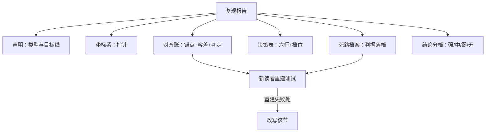

# 复现报告的写作

复现研究的产物不是数字，是一份能让别人重新得到那些数字的记录；没有这份记录，数字只是传闻。

<footer>—— 据 Peng, Reproducible Research and Biostatistics, 2011 整理</footer>

[上一课](/llm/rw-open-source-upstream)把可送出的部分送回了上游；剩下不能送出的部分——对内的判定、置信度、死路档案——需要另一种载体。本课写复现报告。开源生态课有一篇同名课[复现报告的写作](/llm/eco-repro-report-writing)，讲的是对外发布的可复现包规范；本课写它的对内对应物：一份回答「我们信什么、不信什么、为什么」的团队档案，让半年后的同事（以及忘记细节的你）能在十分钟内重建结论。

## 问题

复现做完不写，等于没做一半：判定散在会话记录、notebook 与聊天记录里，三个月后连自己都无法区分「验证过的主张」与「模糊的印象」。对内报告的缺口与对外报告不同：对外要说服陌生读者实验可信，对内要支撑团队决策——哪个结论可以引用、引用到哪一档、哪些坑不要再踩。把对外模板直接搬来用，会写出漂亮的废话：流程齐全，唯独没有一个数字能点回 run。

## 方法

报告骨架六节，次序固定。一，声明：复用第一课那一页——类型、目标线、容差、范围、约束，一个字不改地引用，不重写。二，坐标系：代码 tag、配置哈希、数据指纹、硬件与镜像，全部是指针，指向账本而不是复制内容（[实验跟踪](/llm/ti-experiment-tracking)的「指针不存副本」口径）。三，对齐账：四层锚点逐层列出——参考值、复现值、容差、判定，每个判定挂 run 链接；基线校准的最好努力与调参空间同节记档。四，决策表：判读一课的六行对照，标注披露档位与你补齐的决策。五，死路档案：归因六步走到的每条死路，死因落在判据上，同模板入库。六，结论分档：数字对上（强）、排序对上（中）、定性对上（弱）、未触及（无），下游决策按档位取用。

写作纪律三条：数字必带坐标，不出现裸分数；差异必带归因假设，不出现「原因不明」悬空；曲线与表格由权威工件生成后引用，不手抄截图。按决策组织，不按时间组织——「我们试了 A 又试了 B」是日记，「A 在容差内、B 在预算内不可判」才是报告。

## 机制

为什么死路档案是报告的核心资产：成功的对齐只证明「这条路径通」，死路才标记「哪些假设已被排除」。只写成功的报告会诱导团队在同一死路上再花一次算力——负结果可检索是归档课立过的规矩，报告是这条规矩的入口。为什么结论必须分档：下游引用「复现成功」时，实际取用的是不同的东西——强档支撑数值对标，中档支撑选型排序，弱档只支撑方向判断；不分档，最弱的那部分结论会搭着「已复现」三个字一起被引用，这是复现报告最常见的事故。

报告的质量检验不是通读，是重建：找一个未参与的同事，只给报告与仓库，限时重建主表的一个数字。重建卡住的第一个位置，就是报告没写清的第一个位置——这句话对声明、对齐账与死路档案同样成立。

主报告控制在一页纸，证据全部放在附录链接后面。判断标准：评审者两分钟读完能说出「验证了什么、停在哪条线、还欠什么」；超时即报告结构有问题，而不是读者不认真。

## 边界

报告不替代可复现包：对外发布按生态课的规范另做，两者共享坐标系但读者不同。内部报告也有保密边界：私有评测集的名字与细节、受限数据的指纹用代称，不进可外传的版本。报告不写成追责文档：死路档案记录差异与判据，不记录「谁改错了配置」——一旦报告开始指认人，团队会停止记录失败，账本从此失真。最后，报告是活档案：上游 release、数据更新、后续复现者的新证据，都以增补形式追加并升版，不覆盖原文——判定可以翻案，翻案要留痕。

## 小结

- 骨架六节：声明、坐标系、对齐账、决策表、死路档案、结论分档；次序固定。
- 数字带坐标、差异带归因假设、工件用指针不截图；按决策组织不按时间组织。
- 死路档案是核心资产：排除记录是团队跳过重复算力的凭据。
- 结论分四档，下游按档取用；不分档会让弱结论搭车被引用。
- 质检是新读者重建测试：重建失败处即写作失败处。
- 出处：Peng, 2011；对包规范见[复现报告的写作](/llm/eco-repro-report-writing)，归档纪律见[失败实验的归档](/llm/ti-failed-exp-archive)。
