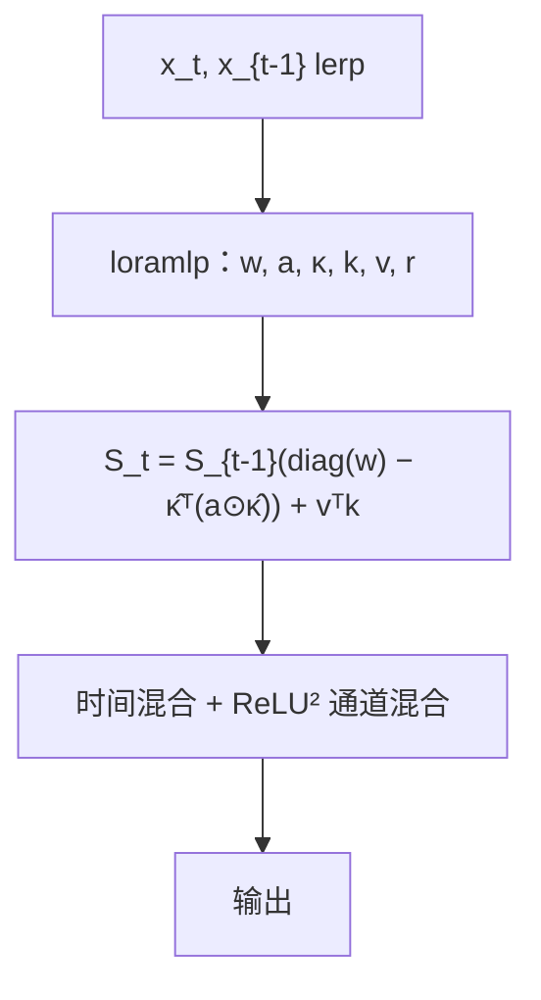

# RWKV-7 Goose

    
把 delta 规则推广成向量门控、向量学习率与解耦的擦除 / 写入键之后，常状态 RNN 可以做状态跟踪、识别所有正则语言，同时训练仍可并行。

    <footer>—— Peng, Zhang, Goldstein 等，RWKV-7 "Goose" with Expressive Dynamic State Evolution，arXiv:2503.14456</footer>

[RWKV](/llm/rwkv) 第四代把时间混合收成带通道衰减的 WKV，推理常数状态、训练可并行。第五代矩阵状态、第六代数据依赖对角衰减，仍是「衰减整表 + 外积写入」：[DeltaNet](/llm/delta-net) 指出衰减不能按键擦除。Bo Peng、Ruichong Zhang、Daniel Goldstein 等人的 **RWKV-7「Goose」** 把转移写成广义 delta：

$$
S_t=S_{t-1}\bigl(\mathrm{diag}(w_t)-\hat\kappa_t^\top(a_t\odot\hat\kappa_t)\bigr)+v_t^\top k_t.
$$

2.9B 模型在少得多的 token 上拿到当时 3B 多语 SoTA，英语下游打平同档 SoTA。语料是开源 **RWKV World v3（3.1T）**；发布 0.19B–2.9B 四档 World，以及 Pile 上 0.17B–1.47B 对照档。权重与数据清单在 Hugging Face `RWKV`，代码 `RWKV/RWKV-LM`，Apache 2.0。本篇写广义 delta 与表达力，不把后续 G1 推理档的额外 1T 数据写进主实验。

## 问题

Softmax 注意力二次缓存；线性注意力 / SSM 把历史压进固定 $S$，却长期在「只加不减」或「整表衰减」里打转。RWKV-6 与 GLA 的 $S_t=S_{t-1}\mathrm{diag}(w_t)+v_t^\top k_t$ 能淡化，不能按地址替换。DeltaNet 按当前键做秩一覆盖，学习率却是标量，擦除键与写入键相同。[Gated DeltaNet](/llm/gated-delta-net) 再乘头级标量门，仍不是通道级替换。

第二条缺口是表达力。对角转移的线性 RNN 与 Transformer 在标准猜想下困在 $\mathsf{TC}^0$，做不了需要状态跟踪的正则语言（奇偶、括号）。Grazzi 等人指出负特征值能打开一截；RWKV-7 要证明的是更强命题：广义 delta 在常数层内识别**所有**正则语言，且单层可解 $S_5$ 状态跟踪（属 $\mathsf{NC}^1$）。同时训练必须仍是对角加秩一，以便沿时间分块并行。

### 广义 delta 比经典 delta 多了什么

经典：$S_t=S_{t-1}(I-a k^\top k)+a v^\top k$。Goose 把衰减换成向量 $w_t$，把学习率换成向量 $a_t\in(0,1)^D$，并把擦除方向 $\kappa$ 与写入键 $k$ 分开。参数化 $z_t=-\hat\kappa_t$、$b_t=\hat\kappa_t\odot a_t$，落在作者给出的稳定域里（附录 C）。于是每个通道可以独立决定「这段状态留多少、沿哪把钥匙挖掉」。隐含位置偏置来自数据依赖的对角门，不必另加 RoPE。

表 1 把 RWKV-7 标成同时具备大状态、灵活衰减、动态依赖、广义特征值（GE）。预训大模型里负特征值只放开一部分，因为实验观察到不稳。复现「超出 TC⁰」要用附录证明设定，不要默认生产权重已打开全谱负根。

## 方法

时间混合仍从 token-shift 出发，但去掉对 $x_{t-1}$ 的数据依赖插值系数，改为固定 $\mu$ 的 lerp，加快训练。$r,k,v,w,a,g$ 等多用低秩 MLP（loramlp）从 $x$ 生成，在参数量、速度与下游之间折中。通道混合去掉 receptance 门，保留 $\mathrm{ReLU}^2$ 前馈。架构继承 bonus 等 RWKV-6 零件，主替换发生在状态转移。

状态按头是 $64\times 64$ 量级矩阵（图示 4×4 只是示意）。更新先按 $w_t$ 对角衰减，再沿归一化擦除键 $\hat\kappa_t$ 做通道加权的秩一扣除，最后写入 $v_t^\top k_t$。这仍是 DPLR，Yang 等人的分块并行可以延拓。World v3 加强英语、代码与多语；四档 World 训练 token 从 1.6T 到 5.6T 不等，2.9B 并不是从零吃满 5.6T——作者强调可从 RWKV-5/6 升级权重，降低重训成本。Pile 档用 GPT-NeoX 词表，方便与其它架构对齐。

表达力：非对角、输入依赖的转移能表示 copy 型状态迁移（Lemma 3），这是「常数层识别全部正则语言」证明的关键元件。训练并行与 $\mathsf{NC}^1$ 级跟踪可以同时成立，因为并行的是数值扫描，不是电路深度上的 $\mathsf{TC}^0$ 上限消失——论文把可并行训练与超 $\mathsf{TC}^0$ 的可表示性写成两件分开的事。

### 升级权重不是免费午餐

从 5/6 升 7，结构变了，不是换一层名字。作者把它当作降低计算的工程路径：先继承已有 World 表示，再在新转移上继续训。引用「更少 token 达到 3B SoTA」必须对着论文的对照表，不能把升级路径理解成零数据。多语 SoTA 与英语「打平」是 2.9B 档的陈述；0.19B 档不要套这句。

## 机制

衰减只能按通道淡化所有键上的值；delta 按键覆盖。Goose 把两者乘进同一转移，并允许擦除键 ≠ 写入键：模型可以「在 $\kappa$ 方向挖掉旧内容、在 $k$ 方向写入新内容」，减少「覆盖 A 却弄脏 A 的邻居」的强迫对齐。向量 $a_t$ 让有的通道快换、有的慢换，类似于 KDA 的通道遗忘，但 RWKV-7 仍是纯 RNN 主干，没有周期性 softmax 层。

Token-shift 提供一阶短程混合，减轻状态里塞句法的压力。去掉通道混合的 receptance，是速度选择：门控表达力让给时间混合里的 $g$。低秩生成 $w,a$ 限制了每步能写多大的满秩修正，这是带宽税：存几个 $D$ 维向量，而不是存 $D\times D$ 的任意转移。

RWKV-7 与 Titans / TTT 同时期。后两者用动量 SGD 与分块更新；Goose 坚持逐步广义 delta 以便 RNN 推理逐步常数时间。不要把「测试时学习」写成 Goose 的默认叙事。

## 边界与工程取舍

### 常数状态仍会撞容量

3B 多语领先不能外推到「已替代 70B Transformer」。有限 $64\times 64$ 每头在百万 token 精确针上仍可能糊。混合架构（Kimi Linear、Qwen3-Next）把少数满注意力层当保险；Goose 论文主线是纯 RNN。负特征值与正则语言证明在附录，生产权重为稳定性收紧了谱，工程实现若打开全谱需自己看损失尖峰。

许可与出处：Linux Foundation AI & Data 下的 RWKV 项目，EleutherAI / Recursal 等共同作者。Wiki 将架构代号记为 Goose，论文 2025-03-18 首发、03-30 v2。引用公式以 arXiv:2503.14456 表 1 与 §4 为准。World 与 Pile 两套词表不要混评：Pile 档是为了和 GPT-NeoX 生态对齐，多语 SoTA 只属于 World v3 的 2.9B。推理逐步常数时间在 batch=1 时最明显；大 batch 训练仍靠时间维并行扫描，墙钟取决于核，而不是渐近记号本身。

出处：Peng, Zhang, Goldstein, Alcaide, Merrill 等，*RWKV-7 "Goose" with Expressive Dynamic State Evolution*，arXiv:2503.14456。前代见 Peng et al. EMNLP 2023（RWKV-4）与 RWKV-6 技术报告。Delta 并行见 Yang et al. NeurIPS 2024。

## 小结

- Goose 用向量门控、向量学习率与解耦擦除键推广 delta 规则。
- 推理逐步常数时间与内存；转移仍是 DPLR，训练可分块并行。
- 表达力在标准猜想下超出 Transformer 的 $\mathsf{TC}^0$，可识别全部正则语言。
- World v3 3.1T；2.9B 多语 3B SoTA、英语打平同档。
- 出处：Peng et al.，arXiv:2503.14456。
