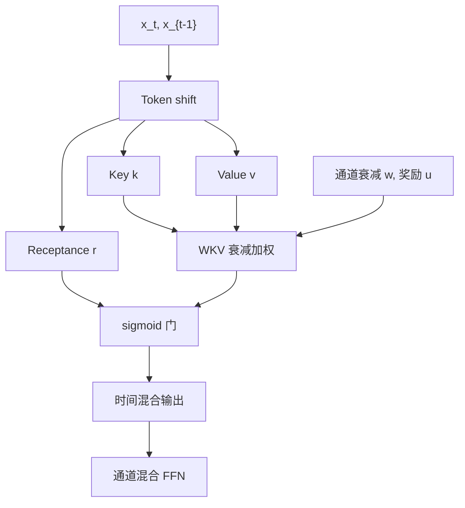

# RWKV

    
训练时当 Transformer 那样并行扫过序列，推理时当 RNN 那样只带常数状态；线性注意力加上通道衰减与接收门，RNN 第一次被拉到百亿参数。

    <footer>—— Peng et al., RWKV: Reinventing RNNs for the Transformer Era, EMNLP 2023</footer>

Transformer 训练可并行，推理却背着随长度增长的 KV 缓存；RNN 推理是常数状态，训练却难以并行、也从未在当时的规模上打平注意力。Peng 等人 2023 年的 RWKV（Receptance Weighted Key Value）把一层拆成时间混合与通道混合：时间混合用 WKV 算子——[AFT](/llm/aft) 式的加权键值，但把成对矩阵 $W$ 收成按通道的衰减，并加当前 token 的奖励 $u$——通道混合则是带接收门的位置级前馈。同一套权重，训练用时间并行的扫描/展开，推理用递推。论文把非 Transformer 架构扩到数十亿参数，并在同规模上与 Transformer 可比较。本篇写 RWKV-4 原文的块结构与 WKV，不把 RWKV-5/6/7 的后续改动算进这一篇。

## 问题

语言模型的部署痛点是解码：每步都要把新的 $k,v$ 追加进缓存，显存与带宽随已生成长度线性涨，算力却吃不满 GPU。RNN 没有这个问题，但 BPTT 与时序依赖让大模型训练吞吐远低于 Transformer，且历史经验认为 RNN 缩不上去。需要一种层：数学上等价于某种线性注意力 / AFT，因而训练可以沿时间并行；形式上每步只更新 $O(d)$ 的状态，因而推理常数复杂度。

AFT 已经去掉了注意力矩阵，但 AFT-full 的 $w_{t,t'}$ 仍是 $T\times T$。要做语言模型，必须把位置交互参数化成与 $T$ 无关的向量，同时保住「近处权重大、当前 token 另眼看待」这两点。还需要门控，否则线性加权平均会把所有过去糊在一起。RWKV 的「R」不是查询向量，是 sigmoid 接收门：决定本层输出放多少 WKV 结果。内容寻址的弱形式在 $k$ 与衰减 $w$ 里，不在 $r$ 与 $k$ 的点积里。

## 方法

### Token shift

时间混合里的 $r,k,v$ 不是 $x_t$ 的瞬时投影，而是当前与上一步的线性插值：

$$
r_t=W_r(\mu_r\odot x_t+(1-\mu_r)\odot x_{t-1}),
$$

$k_t,v_t$ 同理，各有一套 $\mu$。这是廉价的一阶短程混合，实现上对时间维做一次 pad 即可。通道混合对 $r',k'$ 同样做 token shift。没有这项，层对相邻 token 的敏感性全压在 WKV 的衰减上，短距离句法会变钝。

### WKV 算子

对每个通道，

$$
\mathrm{wkv}_t=\frac{\sum_{i=1}^{t-1}e^{-(t-1-i)w+k_i}v_i+e^{u+k_t}v_t}{\sum_{i=1}^{t-1}e^{-(t-1-i)w+k_i}+e^{u+k_t}}.
$$

$w$ 是学到的通道衰减（正值对应指数遗忘），$u$ 是当前 token 的额外加成，避免 $w$ 退化时模型无法突出「现在」。这与 AFT 的差别：AFT 的 $W$ 是成对标量场；RWKV 的 $W$ 是相对位置上的通道向量 $e^{-(t-i)w}$。分子分母都有递推：

$$
a_t=e^{-w}a_{t-1}+e^{k_t}v_t,\qquad b_t=e^{-w}b_{t-1}+e^{k_t},
$$

输出时用 $u$ 把当前项从递推状态里单独加权，以免「当前」与「历史」抢同一套衰减。数值上用 log-space 的 max 跟踪，防止 $\exp(k)$ 溢出，这是实现能否训起来的关键，不是可选项。

时间混合输出 $o_t=W_o\bigl(\sigma(r_t)\odot\mathrm{wkv}_t\bigr)$。通道混合用平方 ReLU：$\sigma(r')\odot W_v(\max(k',0)^2)$，扮演 Transformer 里 FFN 的角色，但带接收门与 token shift。

### 两种计算图同一套权重

训练：token shift 是时间上的平移，WKV 的指数衰减是因果卷积 / 前缀扫描，整段 $t=1\ldots T$ 可并行，没有逐步 Python 循环。推理：只保存每通道的 $a,b$（及 token shift 需要的上一 $x$），每步 $O(d)$。论文据此声称：这是第一个扩到数十亿参数的非 Transformer 架构，因为训练吞吐终于和注意力模型处在同一数量级，而解码不再付 KV 税。并行训练不是「把 RNN 展开成大图再 checkpoint」，而是 WKV 作为对 $t$ 的扫描，可以写成与长度成线性、且高度向量化的核。若实现成逐步 for-loop，RWKV 的训练优势消失。

## 机制

WKV 是带衰减的线性注意力：状态 $(a,b)$ 即 $\sum e^{k}v$ 与 $\sum e^{k}$ 的遗忘版本。没有 softmax 那种跨位置竞争，质量是否集中取决于 $k$ 的动态范围与 $w$ 的大小。$w$ 大则有效上下文短，模型变「近视」；$w$ 过小则状态接近无界累加，早期 token 与最近 token 分不开。$u$ 专门给当前项，缓解「衰减为了忘掉噪音，却把正在生成的 token 也忘掉」。

接收门 $\sigma(r)$ 在通道上开关读出，替代注意力里查询的角色，但它不看键表，只看移位后的局部 $x$。因此 RWKV 的检索是「通道级的匹配 + 时间衰减」，不是「在序列里找某一行」。多层叠加后可以模拟相当复杂的路由，单层做不到任意位置精确拷贝。这与 AFT 的局限同源，规模把它掩盖了一部分。

通道混合的平方 ReLU 提供位置内非线性。没有它，整网在通道上过于线性，表达力会塌到 WKV 的加权平均里。Token shift 把 $t-1$ 的信息注入每一层的投影，形成一条与 WKV 平行的短边，类似一阶 FIR。

## 边界与工程取舍

长程精确引用、针测、随机哈希式检索，RWKV-4 弱于同规模 Transformer。不要只看零样本平均分就宣称「RNN 已全面替代」。状态虽常数，但每层每通道都要存，深而宽的模型状态总量仍可观，只是不随 $T$ 涨。衰减在训练长度上拟合，外推到远长于训练的上下文时，$w$ 不会自动变成「无限记忆」——指数遗忘的半衰期是常数。

与 [RetNet](/llm/retnet) 比：二者都是训练并行、推理递推；RetNet 保留 $QK^\top$ 再乘衰减矩阵，更接近注意力；RWKV 走 AFT 路线，没有点积。与后续 Mamba 比，RWKV 的选择在 $k,w,r$ 上，不是输入相关的 SSM 步长。工程上必须用稳定的 WKV 核（官方 CUDA）；朴素 $\exp$ 会 NaN。解码器偏好的「KV 量化、分页」生态对 RWKV 不适用，工具链要单独做。

论文规模证据是当时的十亿到百亿；今日对比应以同数据同词表重训，而不是直接引用 2023 年的零样本表。推理若在很短的 prompt 上，Transformer 的 KV 还很小，RWKV 的常数状态优势不明显，墙钟可能输给 FlashAttention。「无限上下文」是状态有界的说法，不是信息论无损。指数衰减下，足够久以前的 token 系数低于浮点精度，等于忘了。

## 小结

- RWKV 用时间混合（WKV）替换注意力、通道混合替换 FFN，同一权重可并行训练、常数状态推理。
- WKV 是 AFT 的通道衰减版，外加当前 token 奖励 $u$ 与 token shift。
- 接收门 $\sigma(r)$ 做读出门控，没有 $QK$ 点积，检索弱于 softmax。
- 数值稳定的递推/扫描核是可训练性条件；for-loop 实现没有论文声称的吞吐。
- 首次把非 Transformer 语言模型拉到数十亿参数，同规模上可比较。
- 长程精确拷贝与超长外推不是 RWKV-4 的强项；指数遗忘半衰期由 $w$ 决定。
- 出处：Peng et al., *RWKV: Reinventing RNNs for the Transformer Era*, EMNLP 2023。
