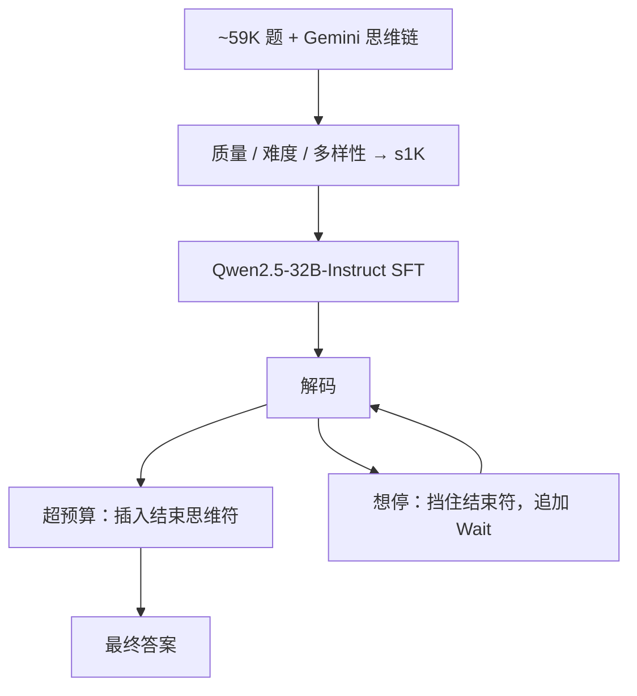

# s1 / budget forcing

    
一千条选过的教师思维链做监督微调，再在解码时强行截断或塞入 Wait，就能把思考长度当成测试时旋钮来拧。

    <footer>—— Muennighoff 等，s1: Simple test-time scaling，2025</footer>

o1 把测试时变长思维做成产品，方法不公开。Muennighoff、Yang、Shi、Li、Fei-Fei、Hajishirzi、Zettlemoyer、Liang、Candès、Hashimoto 要的是**最简单**仍能画出测试时缩放斜率的开源配方：数据只要 1,000 条（s1K），训练是普通 next-token SFT，推理干预叫 budget forcing——到预算就插入结束思维标记；还想接着想，就挡住结束标记并追加字符串 `Wait`。得到 s1-32B（Qwen2.5-32B-Instruct 微调）。本篇按 arXiv:2501.19393 写选数、强迫预算与曲线边界；更一般的计算最优见 [Snell](/llm/snell-test-time)。

## 问题

复现长链推理的两条主流都很重：大规模 RL（R1-Zero），或百万级蒸馏轨迹。作者问：若教师已经会想（他们用 Gemini Thinking Experimental 抽链），学生端是否只需要**极少**样本，真正的缩放放在测试时控制长度？这要求两件事同时成立。数据不能随机抽 1K——太易、太同质、格式烂，SFT 学不到「会停下来再检查」。解码不能只靠 `max_tokens`：模型常在思维标签处自己结束，或在重复循环里耗尽长度却不给答案。

他们给测试时方法列了可检验的指标：对思考 token 数的**可控性**、准确率随 token 的**斜率**、以及能达到的点。多数票是并行缩放，budget forcing 是序列缩放。基座 Qwen2.5-32B-Instruct 上做多数票，追不上 SFT 之后再序列加长——这是他们用来支持「先内化长链模板、再拧长度」的图。

### 1K 不是随便 1K

候选池约 59K 题（NuminaMATH、历史 AIME、OlympicArena、OmniMath、AGIEval 等，去污后约 54K，质量过滤后约 51K），教师链来自 Gemini Flash Thinking API。筛到 1K 的三原则：**质量**（格式、无坏 ASCII/缺图）、**难度**（基座不会或链很长等信号）、**多样性**（跨约 50 个域）。消融：只随机、只多样、只取最长链，AIME24 上大约差 30 个百分点一档；拿全部 59K 训，相对精心 1K 没有实质增益。这把「数据越多越好」在这条蒸馏设定下否定掉，绑定他们的教师与基座。

s1K 是教师轨迹的蒸馏，不是 RL。s1-32B 不会在训练里用组相对策略梯度。把它写成「小数据 R1」是错的；写成「小数据 SFT + 解码干预」才对。

## 方法

SFT：Qwen2.5-32B-Instruct 在 s1K 上标准语言建模。原文：16×H100，约 26 分钟。模板把思维与答案分开，结束思维有显式分隔符。

Budget forcing：

- **上限**：思考 token 达到预算，则追加结束思维分隔符，并常加 `Final Answer:`，迫使进入作答。
- **下限**：模型要吐结束符时屏蔽它，并在当前思维末尾追加 `Wait`，促使继续写、常出现回头检查。可重复多次（文中 AIME 曲线画到 2/4/6 次）。

他们报告 s1-32B 在竞赛数学上超过当时 o1-preview 最多约 27% 的相对声明（须看具体表与题目集）；AIME24 上用强迫拉长可从约 50% 到 57%。表 2 在最大 32K 思考 token 的 forcing 下，s1K 配置 AIME 50.0、MATH-500 93.0、GPQA Diamond 57.6（Wilson 区间见原文）。超过约六次 `Wait`，斜率变平，并可能进入重复循环；强迫结束用于从循环里救出一个「当前最佳答案」。

对照包括 o1 系列、R1 系列、QwQ-32B-Preview、Sky-T1、教师 Gemini 等。R1-32B 蒸馏用大约 800 倍样本，分更高；s1 的主张是样本效率边界，不是绝对 SOTA。教师在 AIME 上接近，说明蒸馏过程有效；MATH-500 / GPQA 上教师 API 评测受引用错误等限制，作者对部分集改用手评或放弃对齐。

### 为何 Wait 会触发再想

模型从未被单独训「看到 Wait 必须自检」。长链语料与教师轨迹里，停顿、Wait、Alternatively 一类词后面经常跟着改写。Budget forcing 利用的是这个**已有关联**，不是设计好的控制 API。因此换基座、换词（Let、Perhaps）会改变斜率——后续复现文章已经观察到关键词敏感。上限强迫则利用 SFT 学到的「结束符之后开始写 Final Answer」模板。

## 机制

### 序列缩放对已内化的草稿更有效

并行 Best-of-N 覆盖多条独立短答；若每条都不会「在草稿上改错」，N 再大也只是投票。SFT 把「写长草稿、中间推翻自己」写进权重之后，同一条链上多付 token 才有边际。这与 Snell 说的「深度扩展要求策略已经会用长链」一致。s1 用 1K 样本完成的是模板内化；用 Wait 完成的是沿该模板走得更久。

斜率最终会弯。原文观察到过度 Wait 导致重复而不是更好的证明。没有原则上的停止规则，只有在 AIME24 上调过的次数。把 57% 写成可无限加 token 的定律，与图不符。

### 可控性是他们的一等指标

随便加长 `max_tokens` 往往不可控：模型早停或死循环。插入结束符提供硬切；屏蔽结束符提供硬续。这使横轴「思考 token」真能当旋钮，才能谈斜率。评测若不允许这种干预，测到的是另一条模型——「会不会自己想够久」，不是 budget forcing。

## 边界与工程取舍

教师是封闭 API，数据许可与污染风险要单独看；作者做了 8-gram 去污，不能保证无泄漏。AIME 30 题置信区间宽（表中 ±16.8），点估计噪声大。Wait 对未在长链上 SFT 的指令模型可能无效或有害。简单题上强迫加长会过度思考。它不提供验证器，错的自检仍是错；与 Lightman 的独立 PRM 互补而不是替代。

相对 R1：没有可验证奖励上的探索，学生不会发明教师轨迹外的新策略，只会把教师风格拉长。相对 Snell：没有按题自适应选「搜索还是修订」，全局一种 Wait 策略。服务上插入字符串要进采样循环，与标准 generate() 不同，实现必须改 stopping。

「超过 o1-preview 最多 27%」是论文对部分竞赛数学的声明，须并列模型快照与题目。封闭模型版本变化后不要把该句当永久排名。

### 何时不必上 budget forcing

已经在 RL 里把长度内化、可用思考开关调节的模型，不必再塞 Wait。需要逐步剪枝，用 PRM 搜索。没有分隔符模板的模型，强迫结束没有锚。评测禁止干预解码器时，不能把 s1 曲线与「原样 generate」混报。

## 小结

- s1：在 1,000 条按质量–难度–多样性选出的教师长链上 SFT，得到 s1-32B。
- Budget forcing：超预算则插入结束思维符；想停则屏蔽并追加 Wait。
- 原文显示思考 token 与准确率的正斜率，约六次 Wait 后变平，并可能循环。
- 59K 全量未必优于 1K 精选；随机 / 只多样 / 只取最长明显更差。
- 这是蒸馏 + 解码干预，不是 RL；Wait 依赖语料关联，换词换模型会脆。
- 出处：Muennighoff 等，*s1: Simple test-time scaling*，arXiv:2501.19393，2025。
