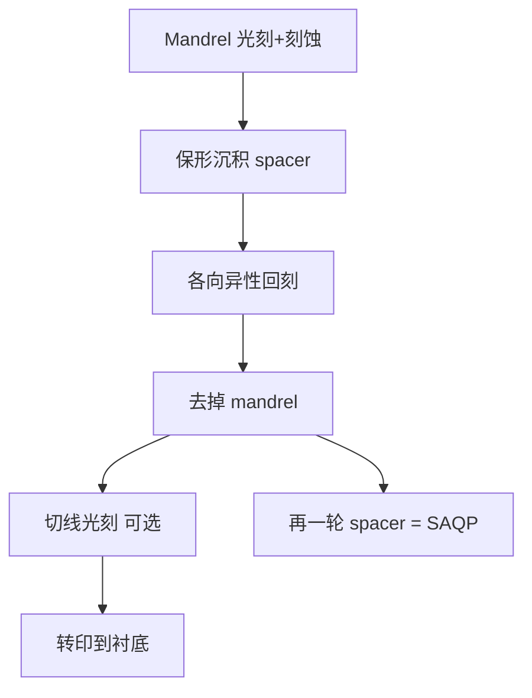

# SADP / SAQP 自对准双重/四重图形

自对准双重图形用薄膜侧墙把节距对半劈开：线宽由沉积厚度定义，成对线条之间不依赖第二次光刻的套刻。

<footer>—— 归纳自 spacer-defined double patterning 的标准工艺逻辑；分辨率极限仍受 Mack 单次曝光 $k_1$ 约束于 mandrel</footer>

LELE 把相邻线分给两张掩模，靠套刻把它们拼回目标节距。自对准双重图形（SADP）走另一条路：一次光刻只做出较疏的 mandrel（芯轴），在侧壁沉积 spacer，去掉 mandrel 后，留下的 spacer 环（再切开）成为节距减半的线条。线宽由原子层沉积一类薄膜的厚度决定，均匀性可以优于空中像阈值切割。再做一轮 spacer，就是 SAQP（自对准四重），节距再近乎减半。本篇讲自对准的含义、一维偏好，以及切线层如何把套刻请回来。

## 问题

浸没单次曝光对 mandrel 仍要满足 $k_1\ge 0.25$ 量级。若目标线节距是 mandrel 节距的一半，SADP 把光学负担留在疏一倍的芯轴上，密线负担交给薄膜。问题是：spacer 形成的是围绕 mandrel 的闭合环，要变成逻辑或存储器用的线栅，必须切开（cut）或用后续刻蚀丢掉不需要的边。切的位置是另一次光刻，与鳍、栅或金属的套刻重新成为一阶。SADP 不是「这一层再也不需要对准」。

二维拐角、T 型结、任意宽度的金属，spacer 几何很难自然生成。SADP 擅长固定节距的一维栅（鳍、某些金属），不擅长任意二维布线。把全芯片金属都说成 SAQP，通常是宣传而不是布局事实。

### Mandrel 光刻仍是普通 DUV

芯轴要用 [ArF 浸没](/llm/arf-immersion) 加上 OAI/OPC 印出来，CD 与线边粗糙度会传到 spacer 位置：mandrel 宽度误差改变两根 spacer 之间的芯轴侧间距，但不以 LELE 那种方式把两根 spacer 相对滑开——两根 spacer 仍贴在同一芯轴的两侧。这就是「自对准」：成对线的内间距由 mandrel CD 与 spacer 厚度决定，不由第二次线层曝光的 overlay 决定。外间距（相邻 mandrel 之间）则吃 mandrel 光刻的 CD 与节距均匀性。

SADP 之后会出现两种间隔：芯轴侧（core）与间隙侧（gap/space），往往统计上不完全相等。电性与刻蚀要分别标定。不要假设节距减半后所有 space 同一分布。

## 方法

典型正 spacer 流程：光刻与刻蚀 mandrel → 保形沉积 spacer 材料（常 ALD）→ 各向异性回刻，只留侧墙 → 去掉 mandrel → 以 spacer 为掩模往下刻硬掩模或衬底。负 spacer / 反相方案改变谁留下，几何思想相同。SAQP：在第一轮 spacer 图形上再做 mandrel 或直接再长 spacer，把节距再劈一次。每一轮薄膜厚度都进入最终 CD。切线掩模（cut mask）用另一次光刻在选定位置打断线，或先切 mandrel 再长 spacer（方案多种）。

与 LELE 的对照：SADP 增加的是沉积与回刻模块，而不是第二次线层曝光。扫描机次数：mandrel 一次 + 每次切线一次，通常少于同等密度的 LELE 线层次数，但刻蚀与薄膜步骤更多。产能账要按模块算，不能只数光刻。

### SAQP 把均匀性要求转到薄膜

四重之后，最终半节距大约是 mandrel 半节距的四分之一（在理想一维图里）。光学 $k_1$ 仍只约束 mandrel。薄膜厚度的晶圆内均匀性、加载效应与微负载，变成 CD 均匀性的主源。原子层沉积的逐圈控制是 SAQP 能进鳍工艺的原因之一。Mack 的瑞利公式在这里不再直接给出最终鳍宽——鳍宽是 spacer 厚度经刻蚀转移后的结果。

## 机制

自对准的几何：spacer 的内边缘贴着 mandrel 侧壁。两次曝光之间的相对平移不会把左 spacer 和右 spacer 拆开，因为没有第二次「线」曝光。LELE 的 $\delta$ 在这一对线上不出现。Mandrel 的 overlay 仍然决定整组线栅相对有源区或浅槽隔离落在哪里——那是层间套刻，不是对内半节距。切线若要对准到栅或接触，overlay 回到切线层。

线端与环的处理消耗设计规则：线不能任意终止，必须在允许切的栅格上切。这就是为什么标准单元和鳍工艺愿意改布局去迁就 SADP，而随机金属层更常留在 LELE 或 EUV。SAQP 的线端与多重 spacer 的「哪一轮定义哪条边」更绕，设计规则更长。

「自对准」不是「无套刻」。它只免除成对 spacer 之间的线层套刻。层间、切线、通孔仍然要套。把 SADP 写成可以放松扫描机 overlay 规格到微米级，是错的。

### 与 LELE 共存

同一商品节点里，鳍或某一维金属走 SAQP，切栅、通孔、二维局部互连走 LELE 或 EUV，是常见分工。比较「谁更先进」没有意义；比较的是拓扑与误差源。LELE 误差源是 overlay；SADP 误差源是薄膜与 mandrel CD。两者都会叠加到最终电性，但 knobs 不同。

## 边界与工程取舍

SADP/SAQP 增加工艺模块、缺陷机会（spacer 掉落、残留、微桥）和周期时间。掩模张数不一定少：切线、通孔、填充仍要掩模。EUV 插入后，部分原 SAQP 层改为 EUV 单次，是为了缩短周期与简化 2D，不是因为 spacer 物理失效。浸没 DUV 仍可给 mandrel 与大量切线层供货。

不要用 SADP「等效 $k_1$」去倒推良率。等效 $k_1$ 只是把最终半节距代回瑞利公式的一种说法，薄膜误差不在 $k_1$ 里。本篇不提供 7 nm / 5 nm 的成品率数字。公开文献讨论过逻辑鳍用 SAQP、金属用 LELE 或 EUV 的组合，那是图形策略，不是良率表。

spacer 材料与衬底的刻蚀选择比必须足够高，否则转印时 CD 漂移，自对准的几何优势被刻蚀偏置吃掉。这是[工艺链](/llm/litho-process-flow)最后一段的事。

## 小结

- SADP 用 mandrel + spacer 把节距减半；线宽由薄膜厚度定义，成对线自对准。
- SAQP 再做一轮 spacer，理想一维下节距再近乎减半。
- Mandrel 光刻仍受单次 $k_1$ 限制；最终 CD 主要吃薄膜与刻蚀。
- 切线、层间对准仍要光刻套刻；「自对准」范围仅限 spacer 对。
- 拓扑偏一维栅；任意二维金属通常不是 SADP 的主场。
- 与 LELE 按误差源和图形类型分工，而不是互相完全替代。
- 出处：Mack 对单次曝光极限与多重图形动机的论述；spacer DP 的标准工艺描述（与 ASML 多重图形/浸没公开语境一致）。
