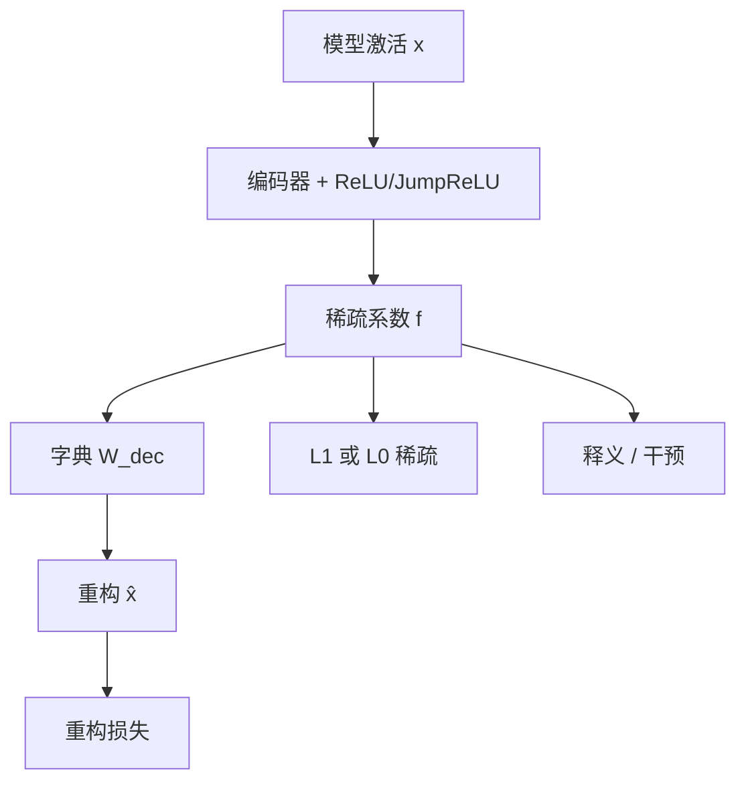

# 稀疏自编码器 SAE

    
多义性挡住了用神经元讲故事的路；若叠加把特征写成超完备方向，就可以用稀疏自编码器从激活里无监督地找回这些方向，并且它们比神经元本身更好解释。

    <footer>—— Cunningham et al., Sparse Autoencoders Find Highly Interpretable Features in Language Models, ICLR 2024</footer>

稀疏自编码器（sparse autoencoder, SAE）是把 [叠加](/llm/superposition-hypothesis) 写成可训练目标的一种字典学习：用过完备的编码器把模型激活打成少数几个非零系数，再用解码器把激活重构回来。Cunningham、Ewart、Riggs、Huben 与 Sharkey 在 ICLR 2024（arXiv:2309.08600）里把这条路从 Sharkey 等人 2023 年的中期报告推进成可复现实验：相对神经元与其他矩阵分解，自动可解释性分数更高，并能在 GPT-2 的间接宾语识别电路上把因果特征定位得更细。Bricken 等人的 [Towards Monosemanticity](/llm/towards-monosemanticity) 几乎同时用同类架构解剖单层 Transformer。本篇写 SAE 的损失、稀疏度量与验收，不把某一家的特征浏览器当成算法本身。

## 问题

隐藏状态 $x\in\mathbb{R}^{d}$ 里若同时住着多于 $d$ 个稀疏特征，读单坐标没有稳定语义。需要另一组向量 $\{d_i\}_{i=1}^{F}$，$F\gg d$，使得大多数输入上只有很少的 $f_i$ 非零，且 $x\approx \sum_i f_i d_i$。这是经典稀疏编码，但数据是冻结模型的激活，不是自然图像。问题有三层：如何参数化编码器以免推理时做昂贵的迭代推断；如何让稀疏真的发生而不是所有特征都微亮；如何证明学到的是模型在用的方向，而不是自编码器自己编出来的好看基。

Cunningham 等人面对的具体对象是语言模型残差或 MLP 激活。他们用自动释义（Bills 等人 2023 年的神经元自动解释）当可解释性代理，并用 Wang 等人 2022 年的 IOI 任务做因果定位。没有这两项，只报重构误差，无法区分「压得动」和「拆得懂」。

### 重构好不等于特征对

一个把 $x$ 原样抄过去的恒等映射重构完美、稀疏度为 $d$，对解释毫无帮助。一个把所有点压成零的编码器极稀疏，重构崩溃。SAE 活在中间：允许 $F$ 很大，但每次只用 $L_0\ll F$ 个特征。调 $\lambda$ 或阈值就是在这条帕累托上走路。死特征（训练中从未激活）会让有效 $F$ 变小，表面上很稀疏，实际回到欠完备。$L_1$ 惩罚的是系数幅度，真正想要的是 $L_0$ 计数。二者在非负 ReLU 特征上相关，但不等价：许多微小系数可以付很少的 $L_1$ 却让 $L_0$ 爆炸。读论文时要同时看重构 MSE、平均 $L_0$ 和死特征比例，单看损失不够。

## 方法

标准 ReLU SAE 把激活中心化后编码、再用字典解码：

$$
f=\mathrm{ReLU}(W_{\mathrm{enc}}(x-b_{\mathrm{dec}})+b_{\mathrm{enc}}),\qquad
\hat x=W_{\mathrm{dec}}f+b_{\mathrm{dec}}.
$$

训练目标是

$$
\mathcal{L}=\|x-\hat x\|_2^2+\lambda\|f\|_1.
$$

$W_{\mathrm{dec}}$ 的列通常约束为单位范数，避免靠放大字典、缩小系数来逃 $L_1$。膨胀倍数 $F/d$ 从数倍到上百倍不等。数据是模型在大量 token 上的激活，模型权重冻结。推断是一次前向，不像 ISTA 那样迭代——这是「自编码器」相对一般稀疏推断的工程理由。

后续变体针对 $L_1$ 的偏差。Gated SAE 把「是否打开」和「开多大」拆开；JumpReLU（Rajamanoharan 等人 2024）用可学习阈值 $\theta$，

$$
\mathrm{JumpReLU}(z;\theta)=z\cdot H(z-\theta),
$$

直接接近 $L_0$。Gemma Scope 选用 JumpReLU，见 [Gemma Scope](/llm/gemma-scope)。训练中还常用神经元重采样：把长期死亡的特征重新初始化到重构残差大的方向上。

### 验收要过三道门

第一道是帕累托：在相近 $L_0$ 下谁重构更好，或在相近重构下谁更稀。第二道是自动可解释性：用语言模型给最大激活样本写释义，再在新样本上打分，比较 SAE 特征与神经元、PCA 方向。第三道是因果：在 IOI 一类已知电路上，替换或消融少量 SAE 特征，看反事实行为是否比消融神经元更干净。三道门都过，才能说「可能解开了叠加」；只过第一道只说明压缩器有效。

## 机制

### 特征分裂是过完备的结构性后果

编码器是一次性的稀疏推断近似：它必须学会「当前 $x$ 该点亮字典里的哪几列」。若字典过完备且特征相关，会有多组系数重构同样好，这就是特征分裂：把一个概念拆成若干更细的触发条件。膨胀倍数升高时分裂更常见，可解释性单条看起来更「纯」，但完整概念被撕碎，电路分析反而变烦。反过来，字典太窄则多个概念挤回同一特征，多义性从神经元搬到 SAE 里。

与 [字典学习](/llm/dictionary-learning-interp) 的关系是特殊化：SAE 用编码器用一次矩阵乘代替迭代稀疏编码，换的是可扩展性，付的是编码器可能学不会真正的 $\ell_0$ 最优码。Yun 等人 2021 年已在 Transformer 上做过稀疏字典可视化；Cunningham 与 Bricken 的贡献是把稀疏、可解释性度量与因果任务绑成一套现代协议。

SAE 解释的是某一层、某一位点（残差、MLP 输出、注意力输出）的激活，不是整网算法。跨层要对齐特征，还需要转码器或手工电路。把某一层的「金门大桥特征」当成模型的世界知识库，会高估字典的完备性。

## 边界与工程取舍

训练成本随 $F$ 与激活存储上升，全面套件只有少数实验室能训，这正是开放权重套件重要的原因。超参敏感：$\lambda$、学习率、重采样、是否把解码器梯度通过编码器回传，都会改变死特征与可解释性。自动释义会把「看起来像」当成「就是」；人类抽查仍然必要。IOI 是窄任务，推广到欺骗、幻觉要另做干预。

SAE 也不能保证特征是计算上的因果原子。重构残差里可能仍藏着模型在用、字典没覆盖的方向。Templeton 等人后来在生产模型上明确承认：特征集不完备，也缺少是否忠实刻画计算的严格检验。把 SAE 当显微镜可以；当完整蓝图还早。

不要把平均 $L_0\approx 100$ 理解成「每 token 只用一百个概念」。那是该层该宽度下的折中读数，且同一概念可能在相邻层重复出现。跨层求和会把真实计算图算重。比较两篇论文的 SAE 时，必须对齐位点、宽度、$L_0$ 和激活函数，否则「谁的特征更好」没有公共纵轴。

## 小结

- SAE 用过完备编码–解码加稀疏惩罚，把激活写成少数特征方向的线性组合。
- 标准损失是 MSE + $L_1$；JumpReLU / Gated 更接近 $L_0$，并缓解幅度偏差。
- 验收需要重构–稀疏帕累托、自动可解释性、以及至少一项因果干预，缺一不可。
- 特征分裂与死特征是过完备字典的结构性现象，不是调参失误的同义词。
- 它是解开叠加的可扩展近似，不是完备的电路说明书。
- 出处：Cunningham et al., *Sparse Autoencoders Find Highly Interpretable Features in Language Models*, ICLR 2024, arXiv:2309.08600；前序 Sharkey et al., 2023；架构对照 Bricken et al., 2023。
