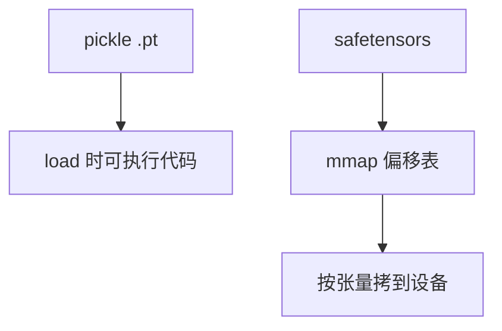

# safetensors

张量文件应当是可以 mmap 的字节布局加一份 JSON 头，而不是一棵会执行代码的 pickle 树。

<footer>—— Hugging Face safetensors 规范与安全公告；对照 Python pickle 的任意代码执行面</footer>

[上一课](/llm/weight-loading-streaming)把加载当成带宽与驻留。格式决定 *能不能安全地 mmap、能不能零拷贝、头部是否可读*。PyTorch `.pt` 默认 pickle，恶意文件可在 `load` 时执行代码。safetensors 用固定头 + 偏移表 + 原始张量字节，加载路径无执行。本课写格式契约与对启动的影响；它不是量化算法，也可以装 FP16 或量化后的块。GGUF 是另一生态的容器，见 [GGUF](/llm/gguf)。本单元「引擎里的细节」到 safetensors 收束，下一单元离开 CUDA 服务栈。

## 问题

检查点分发是供应链：来自 Hub 的文件被服务进程以高权限打开。pickle 的攻击面不可接受。另一些格式（原始 bin）缺形状与 dtype 元数据，加载慢且易错。缺口是：一份按偏移 mmap 的张量字典，dtype/shape 在头里，校验和可选。加载器按名切片映射到设备，不必把整个文件读进主机 RAM 再 `cudaMemcpy`——大模型上主机体峰值本身会 OOM。

多框架：同一文件应对 PyTorch、NumPy、JAX 可读。这要求头是 JSON、体是小端原始数组，而不是 Python 对象图。

safetensors 不管量化语义。文件里可以是 `int8` 加 scale 张量，语义由模型代码解释。不要说「转成 safetensors 就 4-bit 了」。

## 方法

文件：8 字节头长、JSON 头（张量名 → dtype, shape, 偏移）、然后数据区对齐。加载：mmap，按张量创建指向文件的视图，再异步拷到 GPU 或直接给 CPU 核。与流式加载配合：按层名顺序拷贝。校验：可选哈希在发布侧做，热路径可跳过或抽检。

和 GGUF 比：safetensors 不内置分词器与架构超参；那些仍在 `config.json`。服务启动要读两份。GGUF 把元数据打进同一文件，本地单文件分发更省事。GPU 训练/推理生态以 safetensors + config 为默认。

## 机制

无执行 + mmap 使加载器成为纯字节搬运，便于与[自定义加载流水](/llm/weight-loading-streaming)重叠。JSON 头解析是一次性 CPU 微秒～毫秒，相对百 GB 搬运可忽略。对齐保证直接转 `bfloat16` 视图合法。跨进程共享只读 mmap 可减冷启动主机内存（fork 前打开），GPU 仍要各自一份设备副本。

## 边界与工程取舍

不要用 `pickle.loads` 加载来路不明的检查点。不要把 safetensors 当万能容器塞 Python 对象。与 GGUF 的选择按运行时：vLLM/HF 一条，llama.cpp 一条。下一课程单元改谈 GPU 之外的运行时，从 ONNX Runtime 开始。

出处：Hugging Face safetensors 规范与安全文档。无单独会议论文，不编造 arXiv。

## 小结

- safetensors 是可 mmap 的无执行张量容器；替代 pickle 检查点。
- 头 JSON、体原始数组；量化语义在模型代码。
- 与 config.json 配对；GGUF 是单文件本地生态。
- 零拷贝视图减主机峰值，设备仍要驻留副本。
- 加载与按层流式兼容。
- 下一课：ONNX Runtime。
- 出处：Hugging Face safetensors。
