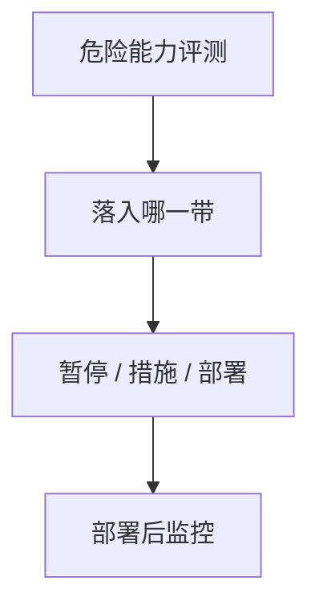

# 安全等级与 RSP

能力越过某条线，部署与研发要换一套约束，而不是继续用同一张模型卡。等级是政策对象，不是又一个排行榜分数。

<footer>—— Anthropic Responsible Scaling Policy 一类公开框架；对照危险能力评测</footer>

[上一课](/llm/model-fingerprinting)是检测。本课把对齐失效收成**部署政策**：安全等级与负责任扩展政策（RSP）——预先承诺：测到哪些危险能力，就触发哪些暂停、安全措施或外部报告。缺口不是再写一条越狱防御，而是承认能力会随规模跳变，政策必须先于跳变写好。后课部署后监控是等级制度的运行时部分。

## 问题

[危险能力评测](/llm/dangerous-capability-eval) 给出测量。若测量不绑定决策，只变成论文表。RSP 要回答：谁有权部署、需要哪些防护（隔离、监控、访问控制）、何时升级评测深度。缺口是把「我们会小心」写成可审计的阈值与动作，哪怕阈值会错、会改。

公开 RSP 是自我承诺，不是监管。本课只讲结构：能力带 → 触发 → 措施。不把任何公司的具体 ASL 编号当成物理常数。

## 方法

结构四段。**能力带**：例如网络攻击辅助、自主研发、生物误用（只作为评测类别名，不写操作细节）。**评测方案**：独立红队、持有集、是否允许最大引出。**触发**：达到带则停止扩大部署或停止进一步训练，直到措施到位。**措施**：物理与逻辑隔离、客户限制、监控（下一课）。报告要可复现到「用了哪套题、哪次解码」。

## 机制

规模与训练计算使能力前移；若政策只在事后写，跳变窗口里模型已经在用户手里。预先承诺把「再训 2× 计算」从纯工程决策变成带门槛的决策。误报（评测过严）会拖慢部署；漏报会让提取与误用赶上无措施的接口——见 [模型提取](/llm/model-extraction-attack)。

## 边界

本课不提供任何危险能力的操作指南。等级名称以各组织公开文档为准，本栏不发明一套新 ASL。下一课写监控：等级触发之后，线上仍要看漂移与滥用。

## 小结

- RSP：能力带 → 评测 → 触发动作，预先承诺。
- 分数不绑定决策就只是排行榜。
- 公开政策是审计对象，不是物理定律。
- 出处：Anthropic RSP 等公开框架；危险能力评测课。
