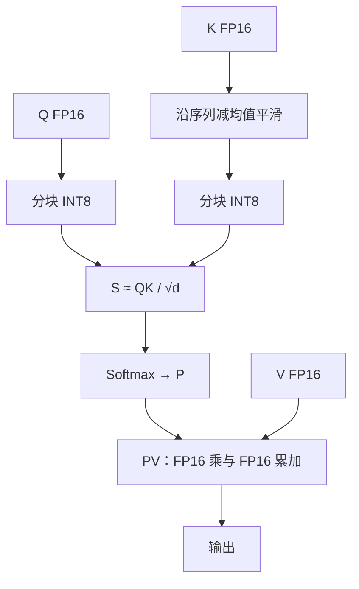

# SageAttention

    
在若干消费级 GPU 上，INT8 矩阵乘远快于 FP16；若能把注意力里的 $Q,K$ 可靠地量化，并处理 $K$ 的通道异常值，就可以在推理时即插即用地加速，而不改权重训练。

<footer>—— Zhang et al., SageAttention</footer>

Flash 家族的主线是精确（或硬件 FP8 下受控近似）的分块 softmax，速度来自 IO 与异步。SageAttention 走另一条轴：把注意力内部的矩阵乘降到低比特，换取张量核吞吐，并用专门的数值手法把误差压到端到端指标可接受的范围。它被表述为训练后、即插即用的推理替换——调用时仍输入 FP16/BF16 的 $Q,K,V$，核内再量化。本篇只写公开方法里比较明确的部分：INT8 的 $Q,K$、对 $K$ 的平滑、以及 $PV$ 侧不盲目跟 8-bit。后续的 4-bit 版本另有技术报告，细节不在这里展开。

## 问题

[SDPA](/llm/sdpa) 有两次主导 GEMM：$QK^\top$ 与 $PV$。在 RTX 4090、3090 一类设备上，INT8 矩阵乘的峰值明显高于 FP16，也常高于这些卡上的 FP8 路径。若注意力仍用 FP16 的 FlashAttention-2，就吃不到这条吞吐。直接把 $Q,K$ 逐元素量化到 8-bit 却会伤精度：键沿通道常有异常值，动态范围被少数维撑开，其余维在格子上挤成噪声，softmax 的相对顺序乱掉。

另一端的诱惑是把概率 $P$ 和 $V$ 也打到 8-bit。$P$ 来自 softmax，数值区间和稀疏峰值与 $Q,K$ 不同，量化误差会直接进加权和。作者的选择是：加速应对准「哪一次 GEMM 在该硬件上最划算」，而不是「所有张量一律 8-bit」。问题于是分成数值与内核两条：如何让 INT8 的 $QK$ 够准；如何让 $PV$ 在精度与速度之间落到一个可实现的点。

### 即插即用的合同

与训练期量化感知不同，SageAttention 默认不更新模型权重。替换对象是注意力实现，不是线性层的权重量化方案（后者可以同时存在，但是另一件事）。合同是：在语言、图像或视频生成等评测上，端到端指标相对满精度注意力下降可忽略——这是作者的主张，应用时仍应在自己的任务上回归，尤其是对异常值敏感的层。不能把「即插即用」理解成数学恒等。

消费级卡上 INT8 快，不意味着数据中心 GPU 上同一套核仍是最优。Hopper 上 [FA3](/llm/flashattention-3) 的 FP8 异步路径可能更快或更准。SageAttention 的硬件命题要和论文评测设备对齐。

## 方法

对 $Q,K$ 做分块 INT8 量化，块的粒度与 Flash 式 tiling 对齐，以便融合进同一类核，而不是先写出全矩阵再量化。针对键的通道异常值，采用平滑：沿序列维估计 $K$ 的均值并减去，使通道分布更居中，再量化。作者报告该步骤的时间开销相对端到端很小，但对精度关键；关闭平滑有时稍快，在分布不规则时可能明显掉点。查询侧是否采用对称的平滑，以实现与版本为准，不在此臆造。

$PV$ 一侧，SageAttention 保持 $P,V$ 为 FP16，并用低精度（FP16）累加器做这次矩阵乘：在支持该 MMA 形态的设备上，这比 FP32 累加的 FP16 乘更快，作者将其作为「不必把 $P,V$ 量化到 8-bit」的替代加速。核实现上融合 RoPE 与量化、用 Triton 或 CUDA 走 INT8 MMA，并按层在不同速度–精度变体之间选择——这些属于工程装配，以发布代码为准。

### 不要把后续版本写进本方法

公开后续工作把 $Q,K$ 进一步打到更低比特、并把 $P,V$ 放到 FP8 等，是另一组权衡，针对第一版的两点弱点：INT8 相对 INT4 仍慢一截；FP16 累加器的 $PV$ 路径绑定部分消费卡。本篇的方法节停在第一版已经写清的 INT8 $QK$ + 平滑 $K$ + FP16 $PV$。需要 4-bit 时去读对应技术报告，不要把两套比特宽度混成一个「Sage 注意力」。

## 机制

INT8 $QK$ 加速的是点积分数的吞吐。分块量化让缩放因子跟瓦片走，比全张量一个 scale 更贴局部动态范围，这与 FA3 FP8 的分块量化是同一类直觉，格子和硬件指令不同。平滑 $K$ 相当于去掉通道上的直流偏置：异常值往往表现为某些维整体偏大，减均值后量化桶分给交流分量，softmax 依赖的是相对点积，对加性通道偏移不那么敏感——前提是查询侧与缩放仍匹配实现所假设的形式。若分布并无此类偏置，平滑收益小，这是可以关掉的原因。

$PV$ 留在 FP16，是因为 $P$ 的行随机且峰值尖锐，8-bit 化容易把小概率质量抹掉或把峰值打歪；值向量的误差会直接进入残差流。FP16 累加器则是在「累加精度」和「该设备 MMA 吞吐」之间的选择：累加更糙、乘更快。作者用「先加到 FP16 再及时折回更高精度缓冲」一类实现降低长期漂移，具体指令序列以核为准。机制上应记住：SageAttention 的近似发生在 GEMM 操作数上，softmax 定义仍在，不是线性注意力。

与权重量化叠加时，误差会相乘。注意力核 INT8、KV 再 4-bit、权重再 INT4，不能把三篇论文各自「几乎无损」相加。回归要在最终图上做。

### 和 Flash 核的关系

SageAttention 的实现受 Flash 式 tiling 启发：不物化 $A$，在片上完成量化后的乘加。它不是 FA2 的官方后续，也不能替换 FA3 在 Hopper 上的异步调度命题。服务栈里通常是：能走 Sage 核的形状走 Sage，否则回退 Flash 或厂商核。头维支持列表有限时（发布说明里曾列出若干固定头维），不在列表上的层必须回退，端到端加速被这些层钉住。

## 边界与工程取舍

即插即用失败模式是静默的：短文本 perplexity 几乎不动，长上下文针测或视频时序一致性先坏。必须在目标任务上测，而不是只看内核 TOPS。训练期是否可用同一核，第一版定位是推理；把推理量化核塞进训练要另做梯度与数值稳定性工作，不能默认。因果、dropout、变长、paged KV、解码 split-KV 是否都覆盖，取决于发布版本，缺了就不是「全局替换」。

硬件上，INT8 相对 FP16 的倍数是设备属性。数据中心卡若 INT8 优势不大，Sage 可能慢于 FA2/FA3。精度策略也不要和 FA3 FP8 混用同一套「低精度注意力」叙事：一个是消费级 INT8 即插推理，一个是 Hopper FP8 加 incoherent processing。两者都可以对，但表格必须分列设备与比特。

作者为 Zhang、Wei、Huang 等（清华团队公开实现）。第一版标题强调 Accurate 8-bit attention。不确定的层选择启发式、各层比特混合的精确阈值，以论文表格与代码为准，这里不编造。

## 小结

- SageAttention 用分块 INT8 量化 $Q,K$ 加速注意力 GEMM，定位为推理期即插替换，不是新的相容性函数。
- 对 $K$ 沿序列减均值以抑制通道异常值，是公开方法里明确写出的精度关键步骤。
- $PV$ 保持 FP16 并用低精度累加器加速，而不是默认把 $P,V$ 也打到 8-bit。
- 数学上仍是 softmax 注意力，近似来自操作数量化；总复杂度仍二次。
- 收益绑定消费级 INT8 吞吐；与 FA3 FP8、与后续 4-bit 版本应分开讨论。
- 端到端「几乎无损」是作者在其评测套件上的结论，部署必须在本任务上回归。
- 出处：Zhang et al., *SageAttention: Accurate 8-Bit Attention for Plug-and-play Inference Acceleration*。
