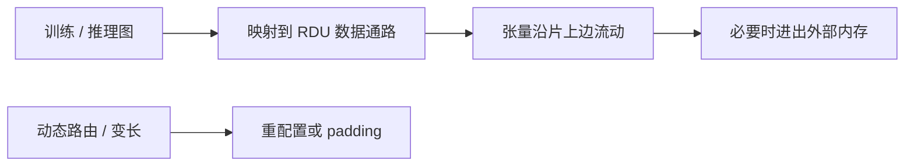

# SambaNova 数据流

把层融进一片可重配置的数据通路，让张量在芯片上流动，而不是每个算子 launch 一次核、再回 HBM。图能静态融合时，带宽墙后退；图在运行时打结时，通路空转。

<footer>—— SambaNova RDU / 数据流体系的公开描述</footer>

[Groq](/llm/groq-lpu-deterministic) 把确定性推到时钟级。本课 SambaNova 的 RDU 走 **可重配置数据流**：空间上铺算子图，时间上流水，目标覆盖训练与推理更完整的图，而不只是 decode SLA。缺口是数据流机与 GPU kernel 启动模型差在哪——以及为何 LLM 的动态形状仍让空间架构难受。对比时与 TPU 的 XLA 融合、GPU 的 CUDA Graph 是亲戚，不是同一硬件。

## 问题

GPU 上每个 PyTorch 算子可能对应一次 kernel，中间张量写 HBM，算术强度被切碎。编译器融合（XLA、torch.compile）能补一部分，但仍受 SIMT 与缓存层次约束。数据流芯片把算子映射到固定或可配置的功能单元网络，张量沿边流，中间值留在片上。墙变成：图有多大、能否塞进一片（或一组）RDU，以及重配置的间隔。

LLM 训练有反向、有动态损失缩放、有变长、有 MoE 路由。数据流图要么做大而保守的静态形状，要么频繁重配置。问题是 **融合收益 vs 重配置 / padding 成本**。

公开叙事强调软件把模型编译到 RDU 图。没有大规模公开的 NCCL 对标表格。本课讲机制，不编造某代对标 H100 的加速比。

## 方法

编译器把计算图划分到一颗或多颗 RDU，插入片上缓冲与芯片间链路。能融合的 MLP 与注意力块尽量整块驻留。主机负责数据与检查点，类似其他加速器。集群仍需要某种集体：要么在数据流图里显式加 All-Reduce 节点，要么在主机 / 专用互连上做——不要默认有一份 NCCL。

与 GPU 迁移：API 可能包一层框架，但性能来自图是否匹配空间硬件。只跑通不等于吃到数据流。

## 机制

空间架构的利用率 = 图在芯片上的驻留时间与流水填充。气泡来自：反压、外部内存访问、集体等待、以及重配置。这与 GPU 的 SM occupancy 不同，不能用同一公式。集体若在图外用主机实现，会把数据流的「中间值不回内存」优势打断——类似 GPU 上融合被 `.item()` 打断。

和 Cerebras 的空间网格比：一个偏晶圆 mesh 上的核，一个偏可重配置数据通路。都怕全局不规则；都要编译器。

## 边界与工程取舍

不要把数据流写成「永远省 HBM」。图切分后仍会 spill。不要在动态 MoE 上假设与密 MLP 同样的融合。生态与工具链计入对比方法课的软件维。下一课 Tenstorrent 提供另一条：偏 RISC / 多核 + mesh，更接近「可编程核」而不是固定数据通路。

## 小结

- RDU 数据流用空间铺图减少中间 HBM 往返。
- 收益取决于静态融合；动态图要 padding 或重配置。
- 集群集体必须画进图或接受打断数据流。
- 利用率模型不是 SM occupancy，禁止直接套 GPU MFU。
- 出处：SambaNova RDU / 数据流公开体系结构描述。
