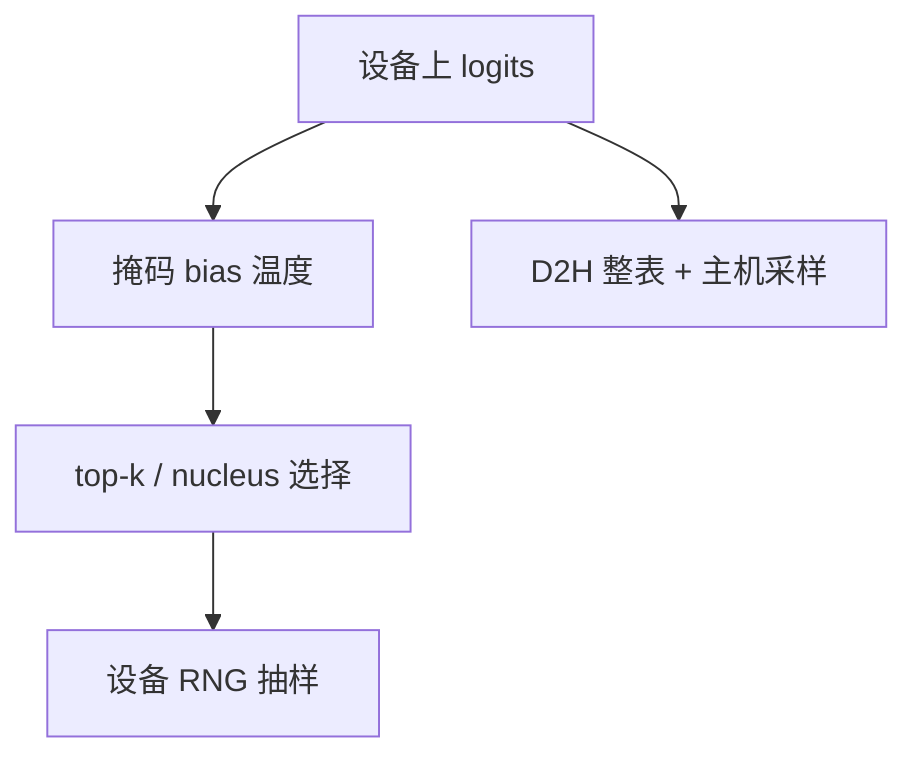

# 采样器内核

逐步采样看起来像一次 softmax 加一次多项式抽签；在连续批里它是「每请求不同温度、不同核、不同 bias」的不规则核，处理不好就会比注意力还刺眼。

<footer>—— 对照 vLLM / TensorRT-LLM / FlashInfer 把采样收进融合核的做法；分布定义见 Holtzman et al., ICLR 2020</footer>

[上一课](/llm/streaming-detokenize)把字符串边界留在 CPU / 网关。本课回到 GPU：logits 已经在设备上，若 D2H 整份词表再在 Python 里采样，词表 10 万、batch 数百时，搬运与同步会吃掉 decode 步。采样器内核把温度、[logit bias](/llm/logit-bias)、top-$k$ / top-$p$、多项式抽样，以及可选的文法掩码，收成设备上的融合路径。后课才把文法本身的开销展开；这里先修「采样是热路径上的核，不是脚本」。

## 问题

一步 decode 的注意力与 MLP 可以融合；采样却常被写成：拷 logits → `softmax` → 主机上 `random.choice`。小 batch 时被掩盖；连续批把 batch 拉到容量墙附近后，词表维的带宽与核启动变成可见项。更麻烦的是 *每请求状态不同*：$T$、$p$、$k$、$b$、是否贪心、是否有掩码，不能打成一个整齐的 GEMM。缺口是：在不规则参数下仍把采样留在设备上，并与[温度协议](/llm/sampling-temperature-topp)一致——包括 $T=0$ 走 argmax，而不是极小温度加核。

随机数质量与可复现性是第二缺口。设备 RNG 与主机 Python 不同；TP 下各 rank 的 logits 归约后再采，必须只在一处采，否则分叉。不要用种子当正确性测试，先修课已说；内核仍要保证 *同一 rank、同一算法* 的可重复，便于调试。

argmax 路径不应进入 softmax：半精度下指数会溢，且浪费。内核应分发：贪心一条，有限核一条，带掩码一条。过度模板化会膨胀二进制。

## 方法

融合顺序与协议一致：掩码（置 `-inf`）→ 加 bias → 除以 $T$ → 求 top-$k$ 或扫描核（top-$p$ 需要对排序或直方图）→ 归一化 → 按 CDF 抽样。top-$p$ 的朴素实现是对词表排序，延迟随 $|\mathcal{V}|$ 变；生产核用 radix select、部分排序或近似核，必须在文档里声明是否与主机 `torch.multinomial` 比特一致——通常不一致，只要求分布在容差内。

连续批：每行一个参数结构体（$T,p,k$ 指针到 bias 与 mask）。实现应避免为最大词表物化稠密 mask；文法引擎提供稀疏合法集时，采样在合法集上做，而不是先写满 $|\mathcal{V}|$ 再乘。贪心请求与采样请求不要在同一次不规则核里硬挤到同一控制流而不做分派：贪心可以提前结束该行。

## 机制

decode 带宽墙上，多搬一次 $|\mathcal{V}|$ 的 logits 到主机，相当于额外一轮中等大小的向量 IO，且打断流水。留在设备上后，采样通常不是屋顶：相对读权重，词表向量仍小。例外是极大词表（十万以上）加每步排序的 top-$p$，这时采样核自己变成延迟项，需要更好的选择算法或关 top-$p$ 改 min-$p$ / 贪心。与[投机](/llm/speculative-decoding)结合时，校验步要对 $\gamma$ 个位置各采一次接受决策，采样核变成「短序列、多位置」，批形状又变。

FlashInfer 一类库把采样与注意力同样当 kernel 目录里的条目。引擎若只融合注意力、采样走 PyTorch 算子碎片，profile 会在 `multinomial` 上冒出尖刺。

## 边界与工程取舍

不要为了「与 numpy 比特一致」在热路径保留主机采样。不要在 TP 的每个 rank 上独立采样。结构化输出的掩码生成若在主机，采样核再快也会等掩码——这是下一课的开销。数值：`-inf` 掩码在 FP16 要真的是 `-inf`，否则核里仍有质量泄漏。

出处：Holtzman et al. 定义核；工程实现以 vLLM、TensorRT-LLM、FlashInfer 的采样核为准。无单独必引的「采样器内核」会议论文，不编造。

## 小结

- 采样应留在设备上融合；D2H 整表在高并发 decode 上可见。
- 每请求 $T,p,k,b$、掩码不同，核是不规则的。
- $T=0$ 走 argmax；TP 只在一处采样。
- top-$p$ 的排序实现可能自己成为屋顶。
- 与投机、连续批的形状变化要单独测。
- 后课：掩码从哪来、要花多少钱。
- 出处：Holtzman et al., ICLR 2020；vLLM / TensorRT-LLM / FlashInfer 采样实现。
