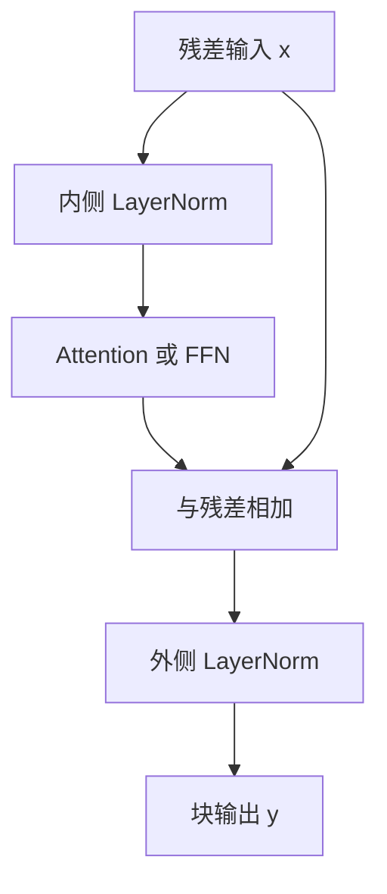

# Sandwich / Sandwich-LN

把归一化同时放在子层入口与残差出口，是为了让深层网络既走得动梯度，又压得住激活尺度。

<footer>—— 工程实践，见于部分中文大模型与早期 BERT 变体</footer>

Transformer 块里，残差和 LayerNorm 的相对位置决定了梯度能不能穿过几十上百层。Vaswani 等人 2017 年的原版是 Post-LN：先算子层，再与残差相加，最后归一化。GPT-2 以降的主流是 Pre-LN：先归一化再进子层，残差路径保持一条干净的恒等通路。Xiong 等人在 *On Layer Normalization in the Transformer Architecture*（2020）里把这两种摆法的训练动力学写清楚了。Sandwich-LN 不是一篇独立论文的名字，而是一种工程拼法：残差**内侧**保留 Pre-LN，残差**外侧**再加一层 LN，形状接近 $\mathrm{LN}\bigl(x + \mathrm{Sublayer}(\mathrm{LN}(x))\bigr)$。它出现在一些中文大模型实现、早期 BERT 变体和若干稳定深网的内部配方里，目的很具体——用多一次归一化换训练稳定性。

## 问题

深层 Transformer 的训练失败，经常不是注意力公式错了，而是残差两侧的尺度失控。Post-LN 把 LN 放在残差之后，输出分布被强制拉回，但梯度必须穿过 LN 的雅可比，层数一深就容易初期不稳。Pre-LN 把 LN 挪到子层前面，残差路径上没有归一化，梯度几乎以 $1$ 的系数回传，深网好训，代价是块输出的均值和方差会随深度漂移，后面的层看到的尺度不一致。

### 残差内外各缺一层时会怎样

只做 Post-LN，六十层以上往往要温启动、层间缩放或 DeepNorm 一类修正，否则 attention 的输出会把残差吞掉。只做 Pre-LN，预训练后期有时出现「最后几层贡献很小、logits 对尺度敏感」的现象，因为没有出口处的 LN 把表示钉在固定范围。Sandwich 要回答的问题就是：能不能同时保住 Pre-LN 的梯度通路，以及 Post-LN 对输出尺度的约束。

相邻技术点里，Pre-LN / Post-LN 讨论的是二选一；RMSNorm 讨论的是 LN 的简化；残差缩放与 DeepNet 讨论的是用系数 $\alpha$ 压残差。Sandwich-LN 是第三条路：不加新的缩放超参，而是在残差内外各放一层归一化。不要把 Sandwich-LN 写成某篇虚构论文的贡献。公开文献里它更多是实现细节：残差内侧 LN 负责子层输入，残差外侧 LN 负责块输出。称呼来自形状像三明治，而不是某个会议的正式命名。

## 方法

记子层为 $\mathrm{Sublayer}$，可以是多头注意力，也可以是 FFN。三种摆法写在一起最清楚：

$$
\begin{aligned}
\text{Post-LN:}&\quad y = \mathrm{LN}\bigl(x + \mathrm{Sublayer}(x)\bigr),\\
\text{Pre-LN:}&\quad y = x + \mathrm{Sublayer}\bigl(\mathrm{LN}(x)\bigr),\\
\text{Sandwich:}&\quad y = \mathrm{LN}\bigl(x + \mathrm{Sublayer}\bigl(\mathrm{LN}(x)\bigr)\bigr).
\end{aligned}
$$

内侧 LN 与 Pre-LN 相同，保证子层看到零均值、单位方差附近的输入；外侧 LN 与 Post-LN 相同，保证下一块接到的 $y$ 尺度被重新校准。有的实现还会在注意力子层和 FFN 子层上各做一次三明治，于是一个 Transformer 块里出现四次 LN。这与 NormFormer 等「多加 LN」的思路同类，但 Sandwich 特指残差内外成对出现，而不是只在注意力输出上加一层。

### 和 BERT 变体、中文大模型里的用法

早期 BERT 及若干复现会在词嵌入之后、每个块之后额外放 LN，目的同样是锁尺度。后来一些中文预训练模型在 32 层以上的 Post-LN 配方里，把「子层前 LN + 残差后 LN」写成默认块，训练曲线比纯 Post-LN 平滑，比纯 Pre-LN 的最终损失略稳。这些做法很少单独发论文，而是作为稳定深网的工程手法写进配置：学习率可以更大一点，梯度裁剪可以松一点，不必一上来就上 DeepNorm。

外侧 LN 通常仍带可学习的 $\gamma,\beta$。有人把外侧改成无仿射的 LN，只做标准化、不重新放缩，以免和内侧的 $\gamma$ 打架。这是超参，不是定义的一部分。

## 机制

从梯度看，Sandwich 的残差路径并不是完全干净的恒等。对 $x$ 的导数要经过外侧 LN：

$$
\frac{\partial y}{\partial x} = J_{\mathrm{LN}}(z)\left(I + \frac{\partial\,\mathrm{Sublayer}(\mathrm{LN}(x))}{\partial x}\right),\quad z = x + \mathrm{Sublayer}(\mathrm{LN}(x)).
$$

$J_{\mathrm{LN}}$ 在高维、batch 较大时接近一个收缩映射，谱半径往往小于 $1$。因此 Sandwich 的梯度通路比 Pre-LN 窄，比 Post-LN 宽：内侧 LN 让子层本身好训，外侧 LN 又给残差加了一层软约束。外侧 LN 的雅可比会吃掉一部分恒等梯度。层数极深时，Sandwich 仍可能需要残差缩放，不能假定「夹两层 LN」就自动等价于任意深度的 Pre-LN。

从表示看，外侧 LN 把每层输出重新投到相似的数值范围，后面的注意力点积不容易因为前一层范数漂移而溢出。这对 FP16 / BF16 训练有实际好处：Pre-LN 网络后半段激活有时会慢慢变大，Sandwich 把这个问题按层清零。

### 计算与参数

多一层 LN 的 FLOPs 相对注意力和 FFN 可以忽略，但参数上每层多一组 $\gamma,\beta$，宽度 $d$ 时每块多 $2d$ 或 $4d$。真正的成本是内存带宽：反向时要多存一份归一化统计。推理期若把外侧 LN 融进相邻线性层，收益有限，因为 LN 是逐 token 的仿射，不能像 Bias 那样完全吸收进下一层的权重。

## 边界

Sandwich-LN 解决的是**训练稳定性**，不是新的归纳偏置。它不会让模型突然更会长上下文，也不会替代 RMSNorm。现代开源 LLM 的默认块仍是 Pre-LN + RMSNorm：LLaMA、Qwen、DeepSeek 走这条路，因为深网已经能训起来，再加外侧 LN 会改变预训练好的尺度假设，微调时也不方便对齐。

适用边界大致三条。第一，从 Post-LN BERT 类编码器往深里堆时，Sandwich 是比 DeepNorm 更局部的补丁，不用改残差系数。第二，混合精度、大学习率、浅层热身不足时，外侧 LN 能当保险。第三，若已经用 Pre-LN 训到百层且损失健康，再加 Sandwich 往往只是多一次归一化，验证集没有稳定增益。

不要把它和「并行 Attention-FFN」或「QK-Norm」混为一谈。并行块改的是子层是否共享残差；QK-Norm 管的是注意力 logits。Sandwich 只规定 LN 相对残差的位置。也没有一篇叫 *Sandwich-LN* 的经典论文可引用；写进技术报告时，应直接画出 $\mathrm{LN}(x+\mathrm{Sublayer}(\mathrm{LN}(x)))$，并说明这是稳定深网的工程手法。

从 Post-LN 迁到 Sandwich 时，学习率、热身步数和权重衰减往往要重搜一遍，因为外侧 LN 改变了残差的有效尺度。已经用 Pre-LN 训好的检查点，不能只在配置里打开外侧 LN 接着训：新参数 $\gamma,\beta$ 若初始化为 1 和 0，会把原先漂移过的表示瞬间拉回，后面的层相当于换了输入分布。更稳妥的做法是把外侧 LN 初始化成接近恒等，或只在从头预训练时启用。和 RMSNorm 组合时，内外两侧应使用同一种归一化，避免一套均值方差、一套纯均方根，统计意义拧在一起。若只在注意力子层做三明治、FFN 仍用纯 Pre-LN，梯度通路会在块内不对称。这可以当消融，但不要再叫完整的 Sandwich-LN。完整拼法是每个子层的残差内外各一层。早期 BERT 复现里「嵌入后再 LN、块后再 LN」看起来也像夹心，但嵌入侧的 LN 管的是词向量尺度，和块内残差夹心不是同一件事，写配置注释时要分开。

## 小结

- Sandwich-LN 指残差内侧与外侧各一层归一化，典型形式为 $\mathrm{LN}(x+\mathrm{Sublayer}(\mathrm{LN}(x)))$。
- 内侧对应 Pre-LN 的输入校准，外侧对应 Post-LN 的输出锁尺度。
- 它不是独立论文名，可见于部分中文大模型实现与早期 BERT 变体，目的是稳定深网训练。
- 梯度通路比 Pre-LN 窄、比 Post-LN 宽；极深时仍可能要配合残差缩放。
- 现代主流 LLM 多用 Pre-LN + RMSNorm，Sandwich 属于特定配方下的工程选择。
- 出处：Vaswani et al., *Attention Is All You Need*, 2017（Post-LN）；Xiong et al., *On Layer Normalization in the Transformer Architecture*, 2020（Pre-LN / Post-LN 动力学）。Sandwich 本身按实现描述，不虚构论文标题。
