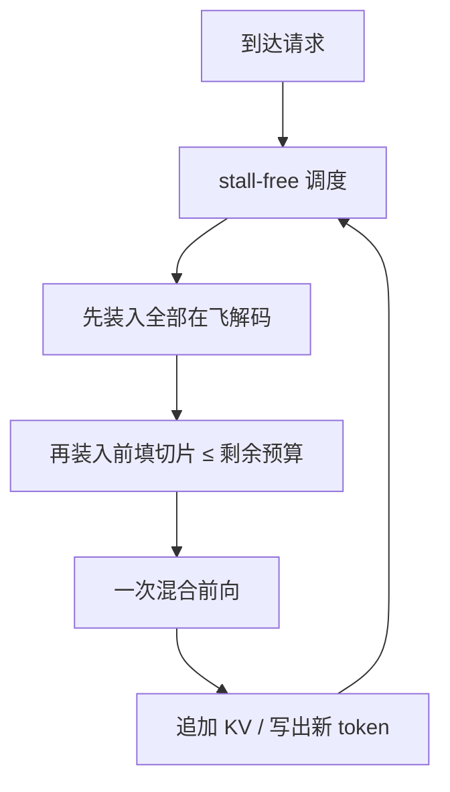

# Sarathi / Sarathi-Serve

    
把过长的前填切成仍能喂饱计算单元的块，再与正在生成的 token 拼进同一拍，解码才不必为新来的长提示停机。

    <footer>—— Agrawal et al., Taming Throughput-Latency Tradeoff in LLM Inference with Sarathi-Serve, OSDI 2024</footer>

连续批处理解决了「谁进这一拍」，却没有解决「这一拍有多重」。Orca 可以把新请求的整段前填和在飞解码塞进同一次前向，前填一长，所有解码的 [ITL](/llm/tpot-itl) 就被拉成无界。vLLM 一类引擎若用前填优先，吞吐好看、生成出现 stall；若用解码优先，用户打字流畅、新请求的 [TTFT](/llm/ttft) 在队长里堆积。Agrawal、Kedia、Panwar、Mohan、Kwatra、Gulavani、Tumanov、Ramjee 的 Sarathi-Serve 把这条吞吐–延迟权衡收成两个机制：chunked-prefills 把原子前填改成分期作业，stall-free 调度用 token 预算把解码与前填切片拼成混合批次。更早的 Sarathi 技术报告（arXiv:2308.16369）已经写出「解码搭前填的便车」；OSDI 论文把它做成可钉 TBT SLO 的调度器。本篇写这篇系统论文本身，切块公式见 [chunked prefill](/llm/chunked-prefill)，装填规则见 [SplitFuse / 混合批次](/llm/splitfuse)。

## 问题

一次请求先经历算力密集的前填，再经历带宽密集的解码。前填把整段提示并行算完、写出 KV、吐出首 token；解码每步只追加一个 token，却要反复读权重与日益变长的 KV。批处理对解码极有效：多条请求分摊一次权重搬运。批处理对前填却是双刃剑——前填自己已经能喂饱张量核，再和别人绑在一起，只会把这一拍的墙钟拉长。

调度器若坚持「这一拍要么整段前填、要么纯解码」，就只能在两条坏路上选。前填优先：GPU 利用率高，正在生成的请求遇到 generation stall，尾部 TBT 爆掉。解码优先：TBT 好看，GPU 大部分时间停在带宽墙上，容量上不去。Orca 的混合批次把整段前填塞进解码拍，stall 的上界等于最长那条提示的二次项。真实对话与摘要负载里，提示中位数已经到数千 token，这条二次项不是边角。

### 前填饱和点远低于常见提示长度

论文在 A100 上测前填吞吐：序列到大约 512 token，吞吐曲线已经开始变平。再加长，单次作业更重，但对「这一拍是否算满」帮助有限。ShareGPT 类对话与 arXiv 摘要的提示均值远大于这个饱和点。于是存在一个窗口：块足够大以保持高算术强度，又足够小以使迭代时间落在 TBT 预算内。Sarathi 要做的，不是发明新注意力，而是把调度单位从「一条请求的完整前填」改成「一块仍能饱和 GPU 的 token」。

饱和点随模型宽、核实现和硬件代数而变，不能把文中的 512 写成物理常数。换一张更宽的卡或更强的 FlashAttention，曲线会右移；换小模型或未融合核，曲线会左移。调 token 预算必须重新画这条曲线。

## 方法

令提示长度 $L_p$、块长 $C$，块数为 $\lceil L_p / C \rceil$。第 $i$ 块的查询长度约 $C$，键长度约 $iC$：必须看见本请求已经写下的前缀 KV，否则分块就改了因果可见集合。前馈与投影按 $C$ 计，注意力按累积前缀计。总 FLOPs 与一次整段前填同阶，只是被拆到多拍，并且后面的块会重复读前面的 KV 页。

stall-free 调度在每一拍遵守 token 预算 $\tau$：先装入全部在飞解码（每条一个新 token），再装入尚未做完的前填切片，最后才接纳新请求的前填。新前填永远不能把正在生成的请求挤出这一拍。$\tau$ 由「这一拍必须在 TBT SLO 内结束」反推，再按硬件饱和点取下限，避免小到掉出算力区。这样定义之后，正在解码的请求不会遇到「下一拍被一条 20k 原子前填独占」；它们仍要等待这一拍的混合计算，但等待时间由 $\tau$ 封顶。

### 均匀迭代与流水线气泡

切块加融合之后，各拍的 token 数落在窄带里。这对流水线并行很重要：气泡来自相邻 microbatch 耗时差。原子前填的某一拍可能是整段 20k，下一拍是 32 条解码，振幅把流水线抽空。Sarathi-Serve 把振幅钉住，跨节点 PP 的空转下降。这不是产品卖点——用户看不见气泡——而是多卡部署时相对「前填/解码时长差两个数量级」的系统收益。论文用 Falcon-180B 的流水线设置把这条收益写进主结果。

### 和当时基线怎么比

评测钉在 Mistral-7B、Yi-34B、LLaMA2-70B、Falcon-180B 与 openchat_sharegpt4、arxiv_summarization 等负载上，对照 vLLM 一类连续批引擎。在尾延迟约束下，单卡 A100 上 Mistral-7B 的服务容量约 2.6 倍；两卡 A100 上 Yi-34B 约 3.7 倍；Falcon-180B 走流水线时端到端容量可达约 5.6 倍。数字钉在他们的引擎、块长与 SLO 上，不是「切块恒定五倍」。源码当时放在 `microsoft/sarathi-serve`。

「服务容量」是在给定尾部 TBT / TTFT 约束下还能吃进去的请求率，不是无约束吞吐。只报吞吐，前填优先永远好看，因为可以把 stall 藏进平均值。Sarathi-Serve 的对照必须带 SLO。

## 机制

机制可以收成一句话：用有上界的计算量子去填满解码拍里浪费的算力，同时不让量子大到打穿 TBT。解码步算术强度低，权重每拍白扫一遍；同拍里塞进 $C$ 个前填 token，解码等于搭顺风车，分摊这次搬运。代价是解码必须等这一拍的算力作业结束，ITL 基线高于纯解码批——这是用可预测的、被 $\tau$ 封顶的等待，替换不可预测的 generation stall。

切块本身不降注意力复杂度。总计算仍是对 $L_p$ 的二次前填，只是时间上分期。$N$ 块之后，KV 读次数随块下标累加，块数很多时带宽税可见。这是后文 DistServe 批评「切得过碎」的伏笔：为了保护 ITL 而把 $C$ 砍到掉出算力区，前填自己变慢，TTFT 与能耗一起坏。Sarathi 的经验图像是停在饱和点附近，而不是切到解码那么细。

### piggyback 不是近似注意力

每一块仍对当前合法前缀做精确 softmax。改变的是时间轴上的粒度，不是连通性。实现上第 $i$ 块是「短查询、长键」的前向，和 [分页 KV](/llm/paged-attention) 正交：每块追加若干页，不必预留整段连续显存。最后一块不足 $C$ 时按真实长度算，不要 padding 到 $C$ 再打满注意力。尚未做完前填之前不采样输出——用户侧 TTFT 要等最后一块结束并采出首词。

DeepSpeed-FastGen 的 Dynamic SplitFuse 与 stall-free 调度是同一类装填：拆提示、按 token 预算与解码融合。不要把两个系统的实验数字互相套用；Sarathi-Serve 的 2.6×–5.6× 只对它的基线与 SLO 成立。

## 边界与工程取舍

Sarathi-Serve 仍是 colocate：前填切片与解码共享同一张 GPU、同一套并行策略。它消除的是时间轴上的无界 stall，不是阶段之间的资源耦合。当 TTFT 与 TBT 都极紧、或两阶段的最优 GPU 代数不同，[PD 分离](/llm/pd-disaggregation) 仍有理由；Mooncake 后来明确写过：线上 SLO 更严时，切块并不能同时拉满前填 MFU 与解码 TBT。小流量、短提示、松 SLO 的服务，切块的收益会被实现复杂度淹没。

预算过小：算术强度掉下去，前填从算力问题变成反复读权重的带宽问题，总时延上升。预算过大：单次迭代再次无界，stall 回来。MoE 上每块可能再次触发专家加载，切得越碎，冷专家搬运越频繁。推测解码打在混合批次上时，草稿树节点也要计入 $\tau$，否则「预算内」只是名义。

不要宣称切块降低了注意力阶。也不要把「vLLM 后来默认开启 chunked prefill」写成这篇论文的结果：那是引擎版本选择。评测对比必须写 $C$ 或 $\tau$，否则分块与不分块不在同一 SLA 下。

出处钉两篇：Agrawal 等 *Sarathi: Efficient LLM Inference by Piggybacking Decodes with Chunked Prefills*，arXiv:2308.16369；Agrawal 等 *Taming Throughput-Latency Tradeoff in LLM Inference with Sarathi-Serve*，OSDI 2024，arXiv:2403.02310。正文数字以 OSDI 实验节为准。

## 小结

- Sarathi 用 chunked-prefills 把原子前填改成仍能饱和 GPU 的计算量子；Sarathi-Serve 再用 stall-free 调度把量子与在飞解码拼进同一拍。
- token 预算 $\tau$ 由 TBT SLO 反推：先装解码，再装未完成切片，最后才接纳新前填。
- 均匀迭代缩小流水线气泡；主收益写在 Falcon-180B 的 PP 设置上。
- 相对当时 vLLM，容量约 2.6×（Mistral-7B）到约 5.6×（Falcon-180B PP），必须带尾延迟约束读。
- 切块不降 FLOPs 阶，过碎会多付 KV 流量；colocate 切块不能替代阶段分离。
- 出处：Agrawal et al., *Sarathi-Serve*，OSDI 2024（arXiv:2403.02310）；前置技术报告 arXiv:2308.16369。
