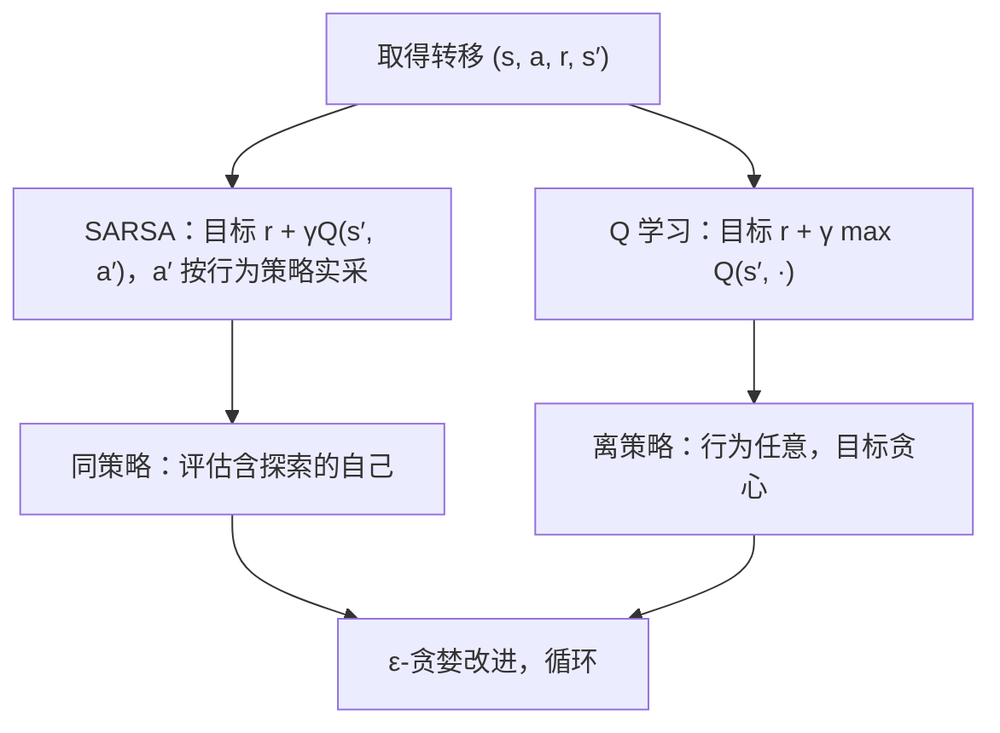

# SARSA 与 Q 学习

同策略先承认「我接下来大概会乱走」，离策略直接假设「下一步必然最优」；max 的乐观会把估计误差记成价值。

<footer>—— 据 Sutton & Barto, 2018, 第 6 章；Watkins, Learning from Delayed Rewards, 1989 整理</footer>

[上一课](/llm/td-zero-bootstrapping)把学习信号写成 TD 误差，但评估的对象仍是给定策略的 $v_\pi$；评估只是控制的一半，另一半是改进——按价值给动作排序需要 $q_\pi$（定义见[回报、折扣与价值函数](/llm/return-discounting)），改进的探索端由 [ε-贪婪与乐观初始化](/llm/exploration-epsilon)供给。缺口在于：把自举搬到 $(s,a)$ 上时，目标里的「下一个动作」取谁，会把算法劈成两族。本课写 SARSA 与 Q 学习，以及 max 算子带来的系统性过估计。

## 问题

TD 思想平移到 $(s,a)$：状态的后继是状态，状态-动作对的后继是「下一状态加下一动作」。SARSA 取行为策略**实际会选**的 $a'$：目标 $r_{t+1}+\gamma Q(s_{t+1},a_{t+1})$，名字来自五元组 State-Action-Reward-State-Action。Q 学习（Watkins 1989）取「无论实际做什么，都假设下一步最优」：目标 $r_{t+1}+\gamma\max_{a'}Q(s_{t+1},a')$。一个对 $q_\pi$ 自举、评估的就是那个含探索的自己（同策略）；一个对 $q_*$ 自举、行为与目标脱钩（离策略）。差别浓缩成目标里的一个算子：$Q(s',a')$ 还是 $\max_{a'}Q(s',\cdot)$。

## 方法

SARSA 更新：

$$Q(s_t,a_t)\leftarrow Q(s_t,a_t)+\alpha\big[r_{t+1}+\gamma Q(s_{t+1},a_{t+1})-Q(s_t,a_t)\big]$$

$a_{t+1}$ 必须真的按当前 ε-贪婪策略采出来再进公式——学到的价值因此含探索的代价。Q 学习把目标里的 $Q(s_{t+1},a_{t+1})$ 换成 $\max_{a'}Q(s_{t+1},a')$：行为策略可以随便探索，学习目标始终贪心。两者的收敛账都在表格、覆盖与衰减步长下成立：Q 学习收敛到 $q_*$（Watkins &amp; Dayan 1992），SARSA 配合 ε 递减到最优。

## 机制

max 的代价是一条不等式：对任意带噪声的估计，$\mathbb{E}[\max_a X_a]\ge\max_a\mathbb{E}[X_a]$——挑最大时总把误差的最大份也挑了进去，高估是系统性的，动作越多挑得越狠；转移与奖励的噪声越大越重。Double Q 学习（van Hasselt 2010）把「挑」与「评」拆到两套表格上，一套选、另一套评，是这条病的直接修法。同策略那一侧不是缺陷而是如实记账：Sutton &amp; Barto §6.5 的 Cliff Walking（ε=0.1）里，Q 学习学出贴崖最短路，执行时 ε 一抖就坠崖，期均回报反而差；SARSA 学出绕开悬崖的安全路——它知道自己会乱走。

Cliff Walking 的口径：起点到终点之间一条紧贴悬崖的捷径，每步奖励 −1，坠崖 −100 并送回起点。ε=0.1 时 SARSA 的安全路是「含探索代价的最优」，不是胆小。

对 LLM 埋两条线。其一，[语言生成作为 MDP](/llm/llm-decision-view) 已指出动作是几万到几十万的词表：表格 $Q$ 写不下，逐动作 $\max$ 也扫不动，函数逼近不可回避——它将在致命三要素处回来。其二，Q 学习的「离策略」只到目标为止，数据仍由自己生成；当数据干脆来自别的策略（旧版本模型的 rollout、重放池），分布差要重要性采样校正——下一课。

## 边界

过估计在小而确定的网格上几乎看不见，要在实验课里专门加噪声才能复现——「没见过高估」不等于「max 无罪」。SARSA 的安全相对执行策略而言：换成更贪心的执行，账本作废。两者的收敛都要求每对 $(s,a)$ 被无限次访问：离策略不豁免探索。Q 学习对 $q_*$ 自举，等于把「最优性」假设写进目标；当真实环境的最优不是你想要的最优（奖励有洞），它学得比谁都快。

## 小结

- SARSA 对实际执行的下一动作自举（同策略）；Q 学习对 $\max_{a'}Q$ 自举（离策略）。
- 差别浓缩为目标里的一个算子：$Q(s',a')$ 还是 $\max_{a'}Q(s',\cdot)$。
- max 在噪声下系统性过估计，动作越多越重；Double Q 把挑与评拆开。
- 同策略学到的价值含探索代价；执行策略一换，账本作废。
- 词表尺度的动作空间逼出函数逼近，外来数据逼出重要性采样——两条线都在后课。
- 出处：Watkins 1989；Watkins & Dayan 1992；van Hasselt 2010；Sutton & Barto 2018 第 6 章。
