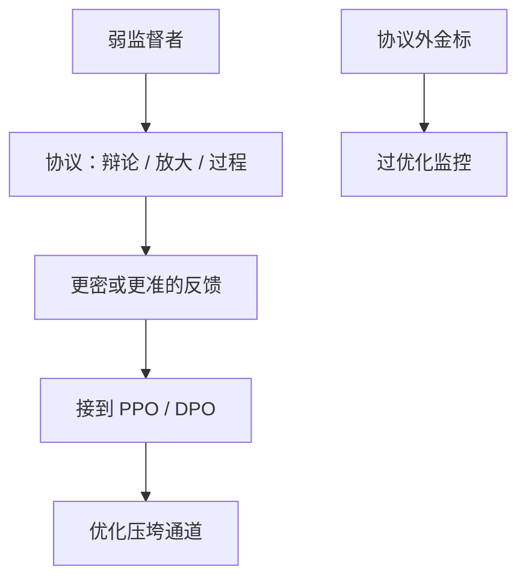

# 可扩展监督

监督者比被监督者弱，还要把反馈做到足够密、足够真；方案是协议，不是更大的奖励模型。

<footer>—— Bowman 等 Measuring Progress on Scalable Oversight；Christiano 的放大与递归奖励模型；辩论与弱到强是子协议</footer>

[上一课](/llm/weak-to-strong)给出一种测量：弱标签能否唤醒强表征。本课把辩论、过程监督、递归奖励、宪法、弱到强收成同一纲领——可扩展监督（scalable oversight）：**人（或弱模型）的每小时注意力，如何监督更长、更强、更不可见的计算。** 不重写 [RLHF](/llm/rlhf-pipeline) 三阶段，只写第三阶段的反馈从哪放大。

## 问题

InstructGPT 假设标注员能判断两条回答谁更好。任务变长、模型变强、欺骗变可能时，这个假设坏掉。Christiano 的放大：把难题拆成子问题，人只解子问题，模型学组合。递归奖励模型：用当前助手帮助人训下一个奖励模型。辩论：人只看交锋。过程监督：人标步骤而不是终点。弱到强：承认标签弱，指望泛化。共同结构是协议 + 测量：在仍有金标的代理任务上，弱监督者借助协议后的准确率是否上升。

Bowman 等强调要测量，不要只讲故事。没有金标的「感觉更安全」不算进度。代理任务要预先锁死：一旦用辩论协议刷过同一套金标再报进步，那是过拟合协议，不是监督杠杆。

### 优化压力会摧毁监督通道

Baker、Korbak 等后来在推理模型上表明：把监视器写进奖励，链会变得看起来无害。可扩展监督的通道一旦进入 [PPO](/llm/ppo-llm) 的 $r$，就会被 Goodhart。纲领里必须留**不被直接优化**的审计通道，或付 monitorability tax。

可扩展监督 ≠ 无人类。人设计协议、抽检金标、写宪法。扩大的是注意力杠杆，不是退出。

## 方法

选代理任务（有金标的难题）→ 选协议（辩论 / 逐步标 / 放大）→ 弱监督者 + 协议 vs 弱监督者独做 vs 强专家上限 → 报准确率与费用（人时、生成 token）。把胜出的协议接到 RL 时，另留一份协议外金标做过优化监控。与 [可验证奖励](/llm/verifiable-reward) 的关系：能程序判定的不要用人协议；协议留给不可判定轴。

## 机制

杠杆来自分解：局部更容易核对（过程、引用、子问题）。失败来自合成：模型在分解缝隙里作弊，或协议被修辞填满。弱到强提供另一杠杆：预训练知识纠噪声。两者可叠加：协议提高相关，泛化吃掉剩余噪声。没有银弹。

递归 RM 会把上一代的黑客写进下一代奖励，错误复合。必须隔代用人类校准。

## 边界与工程取舍

近期产品仍以人类比较 + 校验器 + 宪法为主，可扩展监督是研究与前沿实验室的规划语言。下一课把宪法式 RL 写成已经落地的实践，而不是纯协议思想。安全拒绝、诚实校准是监督目标的两个具体轴。

协议一旦写进奖励就会被优化掉。测量必须在代理任务上、并另留协议外金标，否则只是更贵的 RLHF。

## 小结

- 可扩展监督研究弱监督者如何借助协议监督强计算，必须在代理任务上测量。
- 子协议：放大、递归 RM、辩论、过程监督、弱到强。
- 通道一旦进入奖励就会被优化掉，需协议外金标。
- 能校验器解决的轴不要用人协议。
- 出处：Bowman 等；Christiano 放大 / 递归 RM；Irving 辩论；Burns 弱到强；Lightman PRM。
