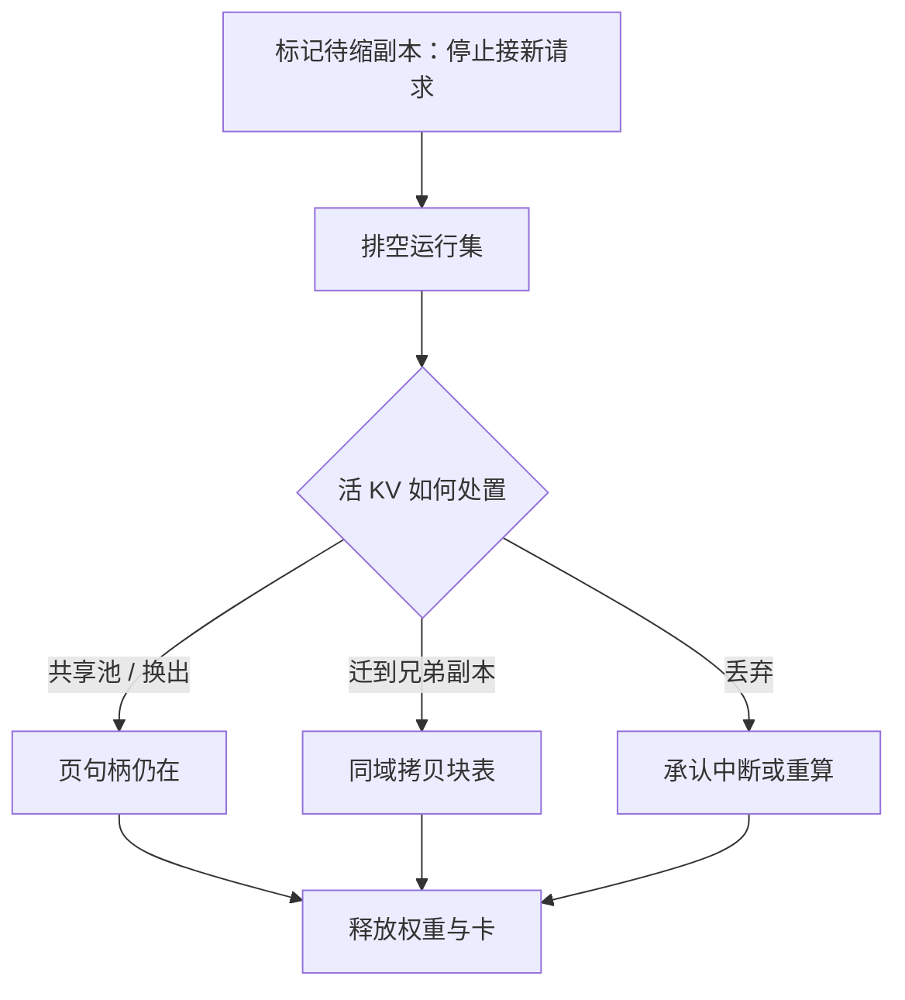

# 弹性与缩容时的 KV

    
加副本只付一次加载权重的时间；减副本会把还活着的键值一起删掉，除非先把页迁走、换出，或承认会话中断。

    <footer>—— 对照分页 KV 与抢占换出的服务实践，把水平扩缩写成对缓存的显式操作</footer>

弹性听起来是集群的优点：流量涨则加卡，流量落则还卡。对无状态服务，缩容等于少几个可以立刻消失的进程。[推理工作负载](/llm/k8s-inference) 里，每个 decode 副本的 HBM 里装着正在生成的 KV 页、可能还有前缀缓存。调度器若按 Deployment 的方式直接删 Pod，效果等价于对运行集做一次不可恢复的集体 [抢占](/llm/preemption-fairness)，且没有换出路径。本篇写缩容时 KV 的几种结局、扩容时冷启动如何接流，以及「弹性」在生成式服务里真正的成本函数。不把某云厂商的托管弹性 API 当成论文。

## 问题

KV 与权重的寿命不同。权重可以从对象存储再加载，是副本的静态部分；KV 是请求的动态部分，只存在于该副本的页池（或超节点的 [分布式池](/llm/cloudmatrix-moe-kv)）。缩掉一份 decode，权重可再拉，KV 默认随进程地址空间消失。用户侧的表现是：对话突然从中途重来，或网关报 5xx，然后在另一副本上从头 prefill——TTFT 回到「从未见过前缀」。

扩容的对称问题是冷。新副本权重加载完成前不能接 decode；即使就绪，前缀缓存是空的，短时间内 TTFT 差、KV 命中率为零。若负载均衡把粘性会话打散到新副本，等于主动制造缩容同款的缓存丢失。弹性若只优化「卡的数量」，会在 SLO 上反复交税。

### 缩容是一次针对受害者集合的决策

哪些副本可以走，取决于它们持有什么。空闲副本：运行集为空，前缀页可丢或可卸到共享池。忙副本：有长 decode、有高命中前缀、有租户亲和。HPA 若按平均 GPU 利用率选「任意一个」删，往往会删掉最热的那份——因为它最忙，看起来最该腾挪，其实最不该杀。

抢占针对的是请求在运行集中的席位；缩容针对的是整份引擎的地址空间。前者还可以换出单条 KV；后者若不做迁移，是所有页一起没。不要用请求级抢占的语言去形容 `kubectl delete pod`。

## 方法

缩容流水线应是：停止调度新请求到目标副本 → 排空运行集（自然结束，或按策略换出/迁移）→ 确认页引用为零或已落到共享后端 → 再摘掉进程与卡。三条处理活 KV 的路，与抢占相同，只是粒度是整副本。

**换出到主机或远端池。** 把页搬到 CPU DRAM、NVMe，或 UB 上的缓存子系统。恢复时另一副本按句柄拉回。适合有共享内存池的超节点；普通 PCIe 机器则受 [卸载带宽](/llm/kv-offload) 约束，整副本换出可能要数秒到数十秒，必须计入排空窗口。

**迁移到兄弟副本。** 把逻辑序列连同页表拷到仍存活的 decode。目标要有空闲块，且最好在同一 Scale-Up 域，避免走慢的 Scale-Out。这是最接近「用户无感」的路，也最吃互连。

**丢弃并重算。** 短会话、可重建的前缀（系统提示可再命中共享缓存）时，丢掉后缀 KV，下次请求再 prefill。成本是 TTFT；收益是缩容快。长上下文写作不能走这条。

### 扩容要反向做预热

新副本加载权重后，先不要均分流量。预热前缀：把高频系统提示、热租户的公共前缀写入页池，或从共享缓存拉取。负载均衡对多轮会话做粘性，直到新副本的命中率接近稳态。PD 分离时，扩 P 与扩 D 的信号不同：排队 TTFT 升应扩 P；KV 占用与 TPOT 升应扩 D。缩的时候也要按池缩，避免只缩 D 导致 P 写出的 KV 无处可去。

弹性的会计应写成「卡·小时 + 排空窗口 + 重算 FLOPs」，而不是只报自动扩缩次数。一次失败的缩容可以在 SLO 上贵过整天多挂一张卡。

## 机制

引擎能排空，是因为迭代级调度本来就会在逐步边界改成员。把副本级「停止准入」做成与队列关闭相同的状态：等待集不再进入该副本，运行集自然萎缩。萎缩速度取决于生成长度：长写作可能排空数分钟，SLA 不允许就只能迁移或硬丢。共享前缀页有引用计数，排空时不能把仍被其他请求引用的页先释放——缩的是副本，不是整个租户的提示库。若前缀在分布式池里，副本可以走，页留下；这是超节点池化相对单卡进程的优势。

网关侧必须配合。端点集合变更时，已建立的流式连接要在旧副本上继续到 EOS 或显式迁移点，而不是负载均衡一刷新就打断 SSE。取消语义见服务栈里的流式中止；缩容是一种系统性的「对许多请求同时 cancel」，更需要明确策略。

### 与抢占、淘汰的分工

内存不够时用请求级抢占或 [窗口淘汰](/llm/kv-eviction)；卡要从集群拿走时用副本级排空。前者保副本活着，后者结束副本。混用会导致：HPA 看见利用率低要缩，引擎同时因瞬时尖峰在抢占，两者抢同一批页，账会乱。应有一个集群控制器做互斥：正在抢占救 SLO 时不要缩；正在排空缩容时不要往该副本塞新的高优先级请求。

## 边界与工程取舍

不是所有弹性都值得。权重数百 GB、加载十分钟、会话又高度粘性的大 MoE，日内频繁缩扩会把时间花在加载与迁移上。更稳的是按峰配 decode 池，用请求级抢占吃谷。小模型、批任务、无多轮的补全，丢 KV 缩容很划算。跨可用区迁移 KV 通常不值得，除非有内存级互连；跨区应丢弃或只迁会话元数据。

不要承诺「缩容对用户透明」却不实现迁移或共享池。文档里写 HPA 而不写排空超时，等于把中断藏进默认值。超时到达后必须有显式行为：强制删除并记一次 SLO 事故，或取消这次缩容。

CloudMatrix 的 PDC 池让缓存子系统可以在 P/D 副本增减时独立活着，这是缩容更便宜的硬件前提。没有池的单进程引擎，KV 与副本同生共死，弹性策略要更保守。

## 小结

- 缩容默认销毁该副本上的 KV；必须先停准入、排空，再换出、迁移或显式丢弃。
- 扩容要预热前缀并粘性切流，否则冷副本会重放一遍缩容的缓存惩罚。
- 排空建立在迭代级调度上；副本级操作与请求级抢占要互斥，不要同时抢同一批页。
- 共享 KV 池把页的寿命从进程解开，超节点上弹性才接近「还卡不还记忆」。
- 大模型日内频繁缩扩往往比稳态超配更贵。
- 出处：PagedAttention 的页寿命；Orca 的迭代边界；CloudMatrix-Infer 的缓存解耦。无单独经典论文专写「HPA + KV」，本篇把已有机制接到扩缩上。
