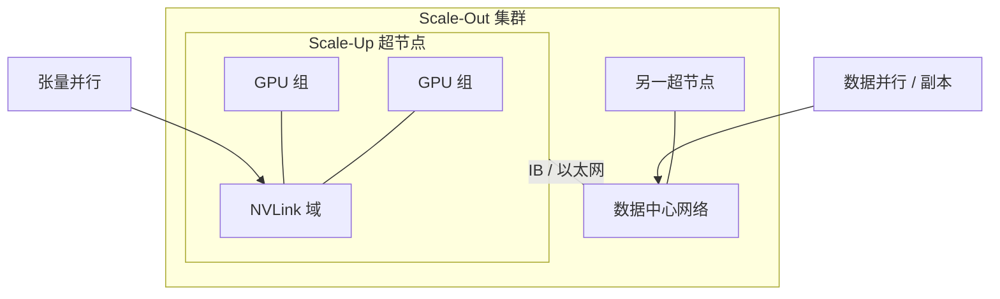

# Scale-Up 超节点 vs Scale-Out 集群

NVLink 域把几十张 GPU 收成一块大加速器；以太网 / InfiniBand 把许多机柜收成一台计算机。两层都叫扩展，通信语义不是同一件事。

<footer>—— 对照 NVIDIA GB200 NVL72 公开规格中的机柜级 NVLink 域，以及集群侧的 Scale-Out 网络</footer>

训练与推理的并行维最终要落到链路上。[张量并行](/llm/tensor-parallel) 的 All-Reduce 体积跟激活走，怕延迟，习惯待在节点内 NVLink；数据并行的梯度同步可以叠计算，更常跨机；专家并行的 All-to-All 则两种都见。硬件把这种差别产品化成两种形态：**Scale-Up**——用专用互连把多张 GPU 做成一个统一域（超节点 / 机柜级 NVLink）；**Scale-Out**——用数据中心网络把许多域连成集群。NVIDIA 公开的 GB200 NVL72 是前者的对照物：36 个 Grace CPU、72 个 Blackwell GPU、液冷机柜、一个 72 GPU 的 NVLink 域，官方称该域「像一块巨大的 GPU」，并给出域内聚合带宽等**已公布**规格。本篇讲系统形态与并行如何对号入座，不编造未出现在厂商文档里的链路带宽，也不把营销加速比当成自己测的数。

## 问题

只 Scale-Out、域内仍是 8 卡 NVLink，则单层矩阵再宽、单专家再大，TP / 部分 EP 就要跨以太网。跨域做高频 All-Reduce，利用率会被延迟打穿，这是过去「节点内 TP≤8」口诀的来源。只 Scale-Up、不做 Scale-Out，则模型与数据再大也走不出一个机柜：故障域、供电、机房规划都绑死。现代大模型两者都要——超节点吞下高带宽并行维，集群吞下副本、流水线阶段与数据。问题是：哪些通信允许跨机柜，哪些必须假设「机柜内全互连」。

另一半是软件习惯。CUDA 与 NCCL 在 8 卡 HGX 上已经有成熟拓扑；把域扩到 72 卡，集合通信的算法、NUMA、故障隔离都要变。把超节点当 9 个独立 8 卡服务器来管，等于买了 Scale-Up 的电，只用 Scale-Out 的编程模型。把以太网当 NVLink 用，则是反向的错误。

### 带宽数字只引用已公开规格

NVIDIA 公开材料写：第五代 NVLink 下，NVL72 域内每 GPU 通信能力相对上一代节点内域显著提高，并给出 NVL72 域约 130 TB/s 的 GPU 通信聚合，以及每 GPU 约 1.8 TB/s 量级的 NVLink。H200 类 8 卡域的节点内数字也有公开对照（例如上一代每 GPU 约 900 GB/s 量级的 NVLink）。这些是厂商规格，用来理解「域变大了、专用互连仍比以太网密一档」，不是本博客的测量。未在官方文档出现的背板、铜缆单通道速率，本文不写。

同一条 All-Reduce，在超节点内走 NVLink Switch，在超节点间走 InfiniBand 或以太网。库名可以都叫 NCCL，物理屋顶线差一档。调 TP 度之前先问：这组 rank 是否落在同一个 NVLink 域。

## 方法

Scale-Up 的规划单位是 **NVLink 域**。NVL72 公开结构是 18 个计算托盘加 9 个 NVLink 交换托盘，托盘间经机柜背板 / 铜缆组件互连，形成 72 GPU 的全互连域。并行上，把 TP、需要低延迟的 CP 切片、以及宽专家并行中延迟敏感的那一段，优先放进该域。域内可以看成一块逻辑加速器来做模型并行，细节见 [机柜作为一块逻辑加速器](/llm/rack-as-accelerator)。

Scale-Out 的规划单位是 **机柜 / 超节点之间的数据中心网络**。DGX SuperPOD 一类公开参考架构用 InfiniBand 把许多 GB200 机柜连成可扩展单元，再在单元之上长 Clos。这一层承担：数据并行副本、流水线的跨阶段、检查点存储、以及超节点装不下的 MoE All-to-All。路由、拥塞、轨对齐（rail-aligned）是这一层的问题，不是 NVLink 域内的问题。

### 并行维如何对号

经验对齐（不是物理定律）：TP 与频繁的激活 All-Reduce → Scale-Up；PP 的点对点可以跨节点，但相邻阶段尽量近；DP / ZeRO 的梯度同步 → Scale-Out，并可与计算重叠；EP 视专家是否切出超节点——域内 EP 像超宽 MLP，跨域 EP 像分布式服务。Decode 推理的 batch 往往很小，跨域 TP 比训练更不划算；服务更常在超节点内复制或做宽 EP，跨节点用数据并行加 [KV 感知路由](/llm/kv-aware-routing)。

软件要把进程组画在拓扑上：同一 TP 组的 rank 不要跨越 NVLink 域边界，除非测量证明以太网扛得住。这与 [5D 并行](/llm/nd-parallel) 里「维必须正交」是同一纪律，只是正交的坐标轴从逻辑网格换成了机柜。

## 机制

Scale-Up 变快，是因为集合通信的消息走专用交换、短距铜缆、低跳数，延迟与有效带宽都按「加速器互连」而不是「数据中心 hop」设计。域变大之后，原来必须拆成多机 TP 的模型可以缩回域内，流水线气泡和跨机激活传输减少。Scale-Out 变快（或变能用），是因为副本数、数据与故障隔离可以随机柜数增长；它不试图让每一次 GEMM 后的 All-Reduce 都享受 NVLink。

两者的故障语义不同。NVLink 交换托盘影响整柜域内带宽；以太网叶子故障影响部分轨。运维上，超节点更像一台大型 SMP（坏一块背板，整台加速器降级），集群更像分布式系统（坏一台，踢出副本）。把超节点当刀片堆来热插拔 GPU，而不理解域是单一故障单元，会在 SLA 里写错。

NVIDIA 还给出过相对 8 卡系统的吞吐倍数、以及万亿参数实时推理的营销加速比。那些数字依赖指定模型与精度，本篇不转述为一般定律。形态结论只依赖「域的大小与互连类型」，不依赖某一栏 PFLOPS。

### 推理与训练的不对称

训练微批大，Scale-Up 上的 TP 容易被算力掩盖。推理 decode 步小，同样的 TP All-Reduce 变成延迟主导，超节点的价值更多体现在：放下更大的单副本（宽 EP、长上下文 KV）、以及 prefill 大 GEMM。Scale-Out 推理则是多副本加路由，见 TGI / MindIE 的水平扩展。不要用训练的 3D 切分直接当推理拓扑。

液冷与供电是 Scale-Up 机柜密度的一部分：公开产品形态是液冷托盘加很高的单柜功率。这限制了「机房里把超节点当普通 10 kW 机柜插满」的幻想，属于设施约束，不是算法超参。

## 边界与工程取舍

不要在没有 NVLink 域的以太网集群上用 64 路 TP 去「模拟 NVL72」。不要假设昇腾超节点与 NVIDIA NVL72 的托盘数、交换芯片数可互换——MindIE 跑在 Atlas 上，拓扑以华为文档为准，本篇只用 NVL72 作对照。不要把未公开的铜缆测试报告写进容量规划；规划用官方域规格加自己的 NCCL 微基准。

超节点增大了单域的爆炸半径：一次固件或交换故障影响 72 卡而不是 8 卡。Scale-Out 侧要用足够的副本与存储冗余来补。成本账是：Scale-Up 买的是域内带宽与简化后的模型并行；Scale-Out 买的是台数与隔离。两者的最优配比随模型稀疏度、序列长度和是否 decode 服务而变，没有一张全局表。

出处：NVIDIA GB200 NVL72 产品页与 DGX GB 机柜硬件用户指南、SuperPOD 网络参考架构中的托盘与域描述；并行算法见 Megatron 类文献。不引用未公开带宽。

## 小结

- Scale-Up 用专用互连扩大 NVLink 域；Scale-Out 用数据中心网络连接许多域。
- TP 与延迟敏感的集合通信优先落在超节点内；DP、跨柜 PP、多副本服务走 Scale-Out。
- NVL72 是公开对照：72 GPU 一域、18 计算托盘 + 9 交换托盘；带宽只用厂商已公布数字。
- 推理 decode 更怕跨域 TP；服务扩展常靠副本与 KV 路由，而不是把训练拓扑原样搬出去。
- 故障域随超节点变大，运维模型更接近一台巨型加速器而不是 9 台小服务器。
- 出处：NVIDIA NVL72 / DGX 公开文档；[通信：NCCL 与 NVLink](/llm/pretrain-comm)。
