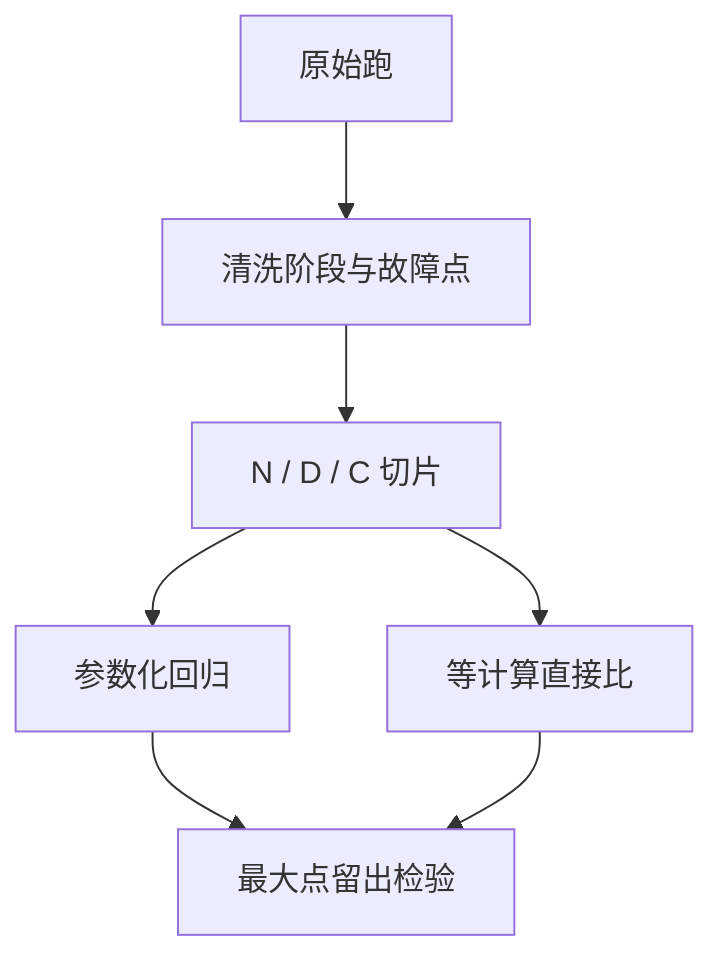

# 拟合缩放律的方法

幂律的指数对拟合窗口和脏点极其敏感；三种独立方法指向同一谷底，才配叫计算最优，而不是一条回归的自信区间。

<footer>—— Kaplan et al., 2020；Hoffmann et al., Training Compute-Optimal Large Language Models, 2022 附录中的多种拟合法</footer>

[上一课](/llm/multi-epoch-repetition)要求进入定律的是 $D_{\mathrm{eff}}$ 不是 $RU$。缺口是怎么把 $\{N,D,L\}$ 收成可外推的曲线。主干 [Kaplan](/llm/kaplan-scaling) 与 [Chinchilla](/llm/chinchilla) 已经给出函数形式与「约 20 token / 参数」的读数，本课不重写那条政策建议，只写**拟合卫生**：窗口、三种独立法、不要把 warmup 与尖峰与 SDC 回滚吃进指数。后课的涌现争论依赖「你画的是哪一种横轴」；推理算力最优依赖「谷底是训练损失还是部署损失」。

## 问题

Kaplan 用 $L(N)=E+(N_c/N)^{\alpha_N}$ 一类形式（另有 $D$、$C$ 切片）。Hoffmann 指出：拟合假设、学习率日程、是否训满，会把等计算谷底从「偏大模型」推到「参数与数据近等比例」。同一家族的点，窗口若含压熵段，早期 $L$ 高、斜率陡，外推会高估大模型收益。若含未收敛的短跑，会低估 $D$ 的指数。Chinchilla 论文用三种方法交叉：参数化损失面再约束最优、固定 $C$ 的直接比较、最后损失插值。一种方法给出的漂亮 $\alpha$ 不够。

对数空间的线性回归对横轴两端的点权重大。一个 SDC 回滚后少训 2% 却被当成完整 $D$ 的点，会拧弯 $\alpha$。阶段课要求先标注再拟合，本课把它收成硬步骤。

$C\approx 6ND$ 对 MoE、对序列长度变化、对词表softmax 占比高的小模型都是近似。拟合前声明 FLOPs 计数器：只算 GEMM、还是含注意力二次项、是否含嵌入。计数器变了，$\alpha$ 不能与文献比。

## 方法

步骤：

1. **清洗。** 去掉未结束 warmup 的点、明确失败的 NaN 跑、SDC 回滚且 token 缺口未补的点。尖峰后已恢复的跑可用终点，但不要用尖峰处的 $L$。
2. **单位。** $D$ 用 $D_{\mathrm{eff}}$；$L$ 用硬目标 CE 或 BPB，不混。
3. **切片。** 先画 $L$ vs $N$（$D$ 充足）、$L$ vs $D$（$N$ 固定）、再画等 $C$ 曲线。只看一条切片会重演 Kaplan vs Chinchilla 的误会。
4. **交叉。** 至少两种：回归求约束最优，以及在相近 $C$ 上直接比较若干 $(N,D)$。两者谷底应同侧。
5. **留出。** 最大模型不参与拟合，用来检验外推。没有留出的 $\alpha$ 只是描述统计。

不要用下游准确率去拟合幂律再外推「涌现点」——那是下一课的陷阱。损失面拟合只用压缩指标。

## 机制

幂律是经验描述，在中间尺度成立，两端有不可约误差 $E$ 与数据饱和。把 $E$ 固定错，会把曲率赶进 $\alpha$。Hoffmann 的参数化把 $E$ 与两轴指数一起估，比先拍 $E$ 更诚实，也更易过拟合——所以需要留出。等计算比较不依赖参数化形式，点少时更稳，但需要真的把各跑训到该 $C$，不能把「还在降」的点与「已平台」的点放在同一 $C$ 上比。

## 边界

本课不产出新的 20 token / 参数。换稳定件、换 MoE、换重复数据，$f(R)$ 与 FLOPs 计数一变，谷底就动。下一课：即使损失光滑，下游指标仍可能看起来「突然」变好——先问是指标还是模型。

## 小结

- 拟合前清洗 warmup、尖峰、SDC 缺口；用 $D_{\mathrm{eff}}$ 与声明过的 FLOPs 计数器。
- 三种切片交叉，谷底同侧才谈计算最优；留出最大点。
- 对数回归吃两端脏点；不要用下游准确率拟合 $\alpha$。
- 形式是经验，稳定件与数据制度会移动谷底。
- 出处：Kaplan et al., 2020；Hoffmann et al., 2022。
