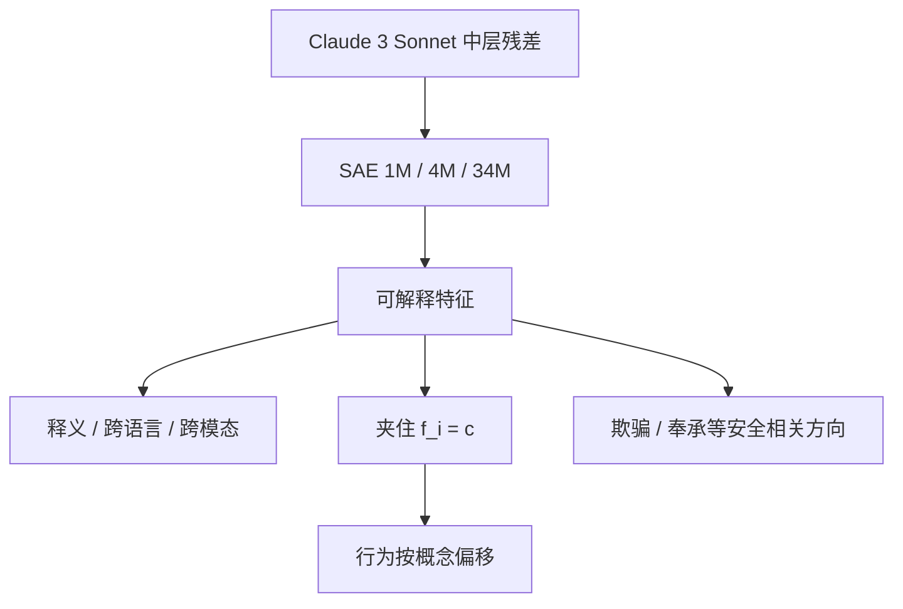

# Scaling Monosemanticity 与特征转向

    
稀疏自编码器能否从生产级模型里抽出可解释特征，此前并不清楚；我们在 Claude 3 Sonnet 的中层残差上训到数千万特征，并显示夹住这些特征会按释义方向改变行为。

    <footer>—— Templeton et al., Scaling Monosemanticity: Extracting Interpretable Features from Claude 3 Sonnet, 2024</footer>

*Scaling Monosemanticity* 把 [Towards Monosemanticity](/llm/towards-monosemanticity) 从一层小模型推到 Anthropic 当时的生产模型 Claude 3 Sonnet（2024 年 3 月的 3.0 对话权重，不是基座）。Templeton、Conerly、Marcus、Lindsey、Bricken 与 Henighan 等人在中层残差流上训练宽度约一百万、四百万、三千四百万的 [SAE](/llm/sae-sparse-autoencoder)，用缩放律选超参。结果不只是「大模型也有可读特征」，还包括：特征跨语言、跨模态（文本训练却能响应图像中的同一概念）、以及**特征转向**（feature steering）——把某个特征的激活夹到极值，输出会朝释义一致的方向偏。公开演示里把「金门大桥」特征夹死，模型会在无关问题上执着地谈到金门大桥。本篇写缩放带来了什么、转向证明了什么、以及作者自己划下的不完备性。

## 问题

小模型上的成功可能是玩具残留：宽度小、电路浅、特征种类少。生产模型若叠加更密、抽象更高，SAE 可能只学到词面与句法，学不到欺骗、奉承、权力寻求这类安全相关方向。需要直接在正在服务的模型上做分解，并回答三个工程问题：多宽的字典才够；如何在不可穷举的特征里抽样验收；干预能否把「看起来像」升级成「模型在用」。

残差中层是选点。太浅则多为词法；太深则靠近解嵌、特征可能已经混成任务相关的打包。中层被当作抽象概念还在线性可加、又尚未完全写成下一 token 的折中。这不是唯一合法位点，只是这篇的主实验面。

### 缩放律先于一次 3400 万的训练

训一个数千万特征的 SAE 极贵，不能靠网格暴力扫 $\lambda$ 与学习率。作者用较小字典上的损失与 $L_0$ 拟合缩放，再外推到目标宽度。这与语言模型的 Kaplan / Hoffmann 逻辑同构：先在便宜的面上走，再付大账单。没有这条，3400 万只是一个无法解释的单点。缩放律优化的是 SAE 损失（重构加稀疏），不是「人类可解释性」。损失低的字典往往更好读，但不是定理。安全相关特征是否出现，取决于数据里是否有对应激活，不取决于损失公式里有一项「请找出欺骗」。

## 方法

SAE 仍是过完备编码–解码，训练在 Sonnet 中层残差的激活上。三档宽度用来看特征分裂与新抽象是否随 $F$ 出现。验收分几条平行线：人工与自动释义；跨语种同一概念是否共用方向；多模态探针（图像里的金门大桥能否点亮文本训出的桥特征）；几何（特征方向如何排布）；以及转向。

转向的操作是：前向到该层时，把选定特征的系数 $f_i$ 写成常数 $c$（或加一个大的偏移），再解码回残差，让后续层在被篡改的流上继续。若 $c$ 大且释义正确，生成应稳定地体现该概念；若只在训练样例附近才像，特征可能是记忆碎片。安全部分专门找欺骗、权力寻求、奉承、偏见等方向，并报告夹住它们会改变相关输出。这是因果证据，不是伦理结论。

$$
x' = x + (c-f_i)\,d_i
$$

（实现上通过 SAE 编解码或直接沿解码列加减，细节随是否重编码而变。）金门大桥实验是同一公式的公众可读版本：概念被放大到压过正常上下文。

### 转向不是微调，也不是提示

微调改权重，提示改输入，转向改一次前向里的内部坐标。它可逆、可针对单个特征、不必重训。正因为如此，它既是分析工具，也是一种粗暴的控制面：能演示因果，也能制造滑稽或危险的模式崩溃。论文把它当证据，不当产品开关。更细的向量算术传统（激活差、对比对）是转向的亲戚，但 SAE 提供的是可命名的轴，而不是一对提示的差向量。

## 机制

### 更宽的字典同时做分裂与长出抽象

宽度增加时，字典做两件事：为已有概念长出更细的触发条件（分裂），以及长出先前宽度装不下的抽象（新方向）。安全相关特征往往更抽象，需要足够的 $F$ 才稳定出现。跨模态泛化支持「方向编码的是概念而非表面 n-gram」：图像编码器把视觉送进同一残差几何时，文本训出的检测器仍然响——前提是多模态 Sonnet 确实把二者写进共享空间。

转向能工作，说明至少有一部分计算对残差是近线性可加的：沿 $d_i$ 走相当于把该特征的贡献拧大。不能工作的特征则可能是 Downstream 用了非线性组合，或释义抓错了共现。作者强调缺少「这套特征是否穷尽模型计算」的严格检验——转向成功是局部因果，不是全局完备。

金门大桥演示很容易被理解成「模型的灵魂住在一个特征里」。更准确的说法是：在中层残差的某个过完备基下，存在一个方向，把它拧到极值足以压过许多正常回路。极值转向会破坏能力，说明该方向并不是以这种幅度参与日常计算。分析应用的是中等幅度；娱乐应用的是饱和。

## 边界与工程取舍

字典不完备：没有覆盖的方向上，电路分析是盲的。忠实性未解决：特征可能是相关统计，而真正的算法在残差的其他子空间。闭源模型上的 SAE 权重若不能随模型发布，社区无法复现转向。计算上，三千四百万特征的存储与编码已经是专门基础设施；每次新模型都要重训。开放对照见 [Gemma Scope](/llm/gemma-scope)。

把转向当对齐手段有副作用。夹住「诚实」或夹住「拒绝」可能同时损伤有用能力，或被另一种措辞绕过。它证明内部存在可操纵的线性方向，不证明已经有了稳健的安全层。评测转向时必须看无关任务是否崩，否则只是在展示过驱动的一个模式。

论文分析的是对话微调后的 Sonnet，不是基座。对齐会把某些安全相关特征变得更可见或更可转向。把这些方向当成预训练就有的「阴谋电路」，是把后训练写进了基座。作者注明方法对基座也可用，但正文证据来自生产对话模型。

## 小结

- Templeton 等人把 SAE 缩放到 Claude 3 Sonnet 中层残差，宽度达约 3400 万特征。
- 特征可跨语言、跨模态，并包含抽象与安全相关方向。
- 特征转向通过夹住系数沿解码列改残差，提供与释义一致的因果证据。
- 缩放律用于选超参；损失代理的是重构–稀疏，不是安全覆盖。
- 明确限度：不完备、缺忠实性检验、转向是分析工具而非对齐产品。
- 出处：Templeton et al., *Scaling Monosemanticity: Extracting Interpretable Features from Claude 3 Sonnet*, Anthropic, 2024。
