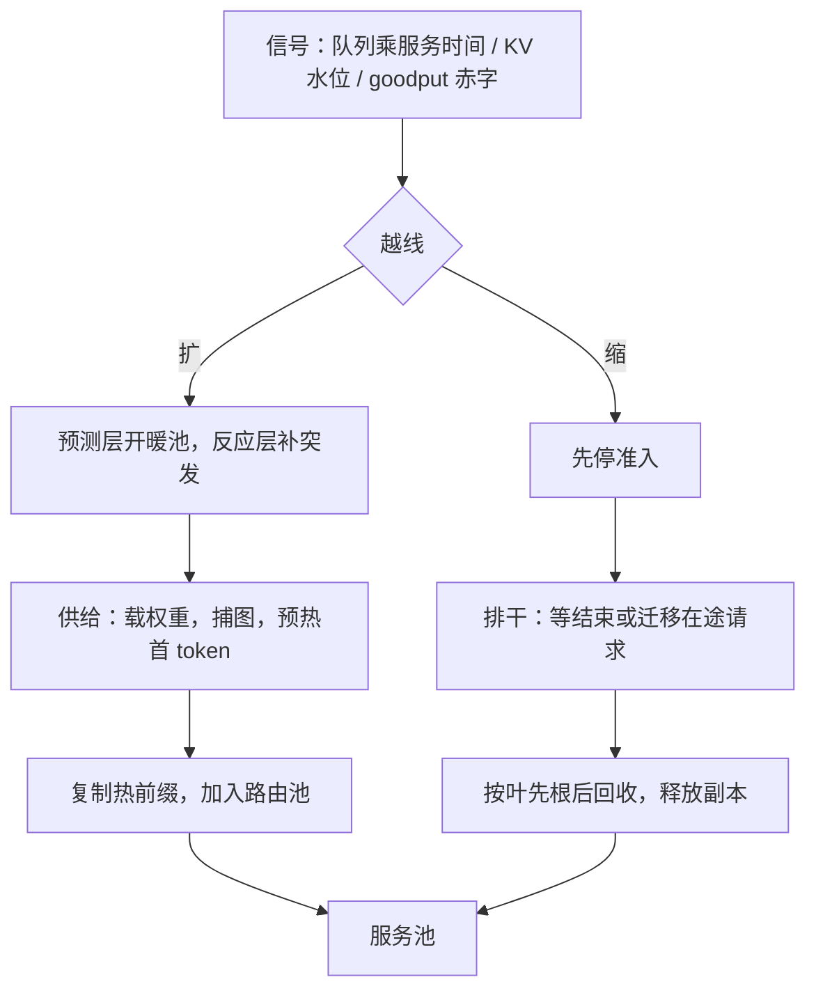

# 弹性伸缩

副本不是 30 秒就位的无状态容器：权重加载以分钟计，排干以输出长度计；伸缩的正确信号是 goodput 赤字，不是利用率。

<footer>—— 据 Zhong et al., OSDI 2024 的 goodput 口径与前缀感知扩缩容的工程实践整理</footer>

[上一课](/llm/sch-overload-degradation)用三道闸在容量不足时保护存量；本课写容量本身怎么跟上流量。无状态服务的扩缩容直觉在这里处处失灵：副本有状态（KV 与路由亲和）、冷启动重、缩容要排干在途生成。前缀感知的扩缩已有专文（[前缀感知扩缩容](/llm/prefix-aware-autoscaling)），本课写完整闭环：信号、供给、排干、冷启动的预算。

## 问题

三个失灵。**信号失灵**：GPU 利用率到 80% 时 goodput 可能已经在掉——本步 token 预算被 prefill 吃满、ITL 合同破了，利用率还在涨；裸队列长度也不含服务时间的变化，长提示为主的时段，同样的队列深度意味着长得多的等待。**供给失灵**：新副本不是加一台空机，要进程启动、权重从存储加载、CUDA 图捕获、首 token 预热，分钟级；多卡副本要整组到齐（gang）。**退出失灵**：缩容不能杀进程了事，在途 decode 少则几十秒、多则几分钟（由输出上界决定），杀掉就是违约。

### 信号、供给与排干

信号组：等待队列深度乘单步期望服务时间（Little 定律反推 TTFT 走向）、KV 水位、goodput 赤字（承诺速率减实际达标速率），取最先越线者触发。供给分两路：**预测**（日周期流量提前开暖池，夜间闲置由批处理层回填）与**反应**（突发靠准入缓冲撑过启动窗口）。新副本的放置按组合算：PD 配比按当前负载重算（[PD 分离的调度](/llm/sch-pd-disaggregated) 的公式），多卡 gang 整组分配。扩入与扩出对称相反：先停准入 → 在途排干（等自然结束，或按 [抢占与请求迁移](/llm/sch-preemption-migration) 把请求迁到存留副本再停）→ 热前缀按叶先根后回收。

## 机制

冷启动是三段预算：权重加载（存储带宽决定，分钟里的最大头）、图捕获与编译（秒到十秒级）、首 token 预热（分配器与页表的冷路径）。暖池大小按「流量方差加启动窗口」定价：多留一台是空转卡时，少留一台是分钟级违约——按方差算，不按均值算。伸缩决策时延与流量翻倍时间的赛跑决定预测是不是必需品：流量 5 分钟翻倍而副本 6 分钟就位，纯反应式永远追不上，准入缓冲（上一课）负责把这段窗口垫过去。缩容的排干上界是 `max_tokens` 上限乘步时延，这个数决定「等结束」是否可接受；不可接受就付迁移的钱——取舍就是抢占课的三本账。

权重加载账：70B 模型 fp16 约 140 GB，NVMe 顺序读按 3.5 GB/s 算约 40 s，加上图捕获与预热，冷启动 1–2 分钟；还没算多卡副本必须整组到齐的 gang 等待。scale-to-zero 只对可容忍分钟级首 token 的层成立，交互层永远留暖池。

## 边界

伸缩的粒度受架构约束：TP 组整组伸缩，PD 两池独立伸缩但配比联动；跨区弹性受数据驻留与配额限制（[多区域故障转移](/llm/multi-region-failover)）。预测模型会失效：营销活动、爆款应用的流量形态跳变，预测错了要靠准入缓冲与降级阶梯兜底——三课是同一个系统。缩容与故障处理共享排干机制：节点故障时在途请求的处置（迁移或重算）与计划内缩容是同一套代码，分开写就会只测过一条路。

## 小结

- 信号用 goodput 赤字、队列乘服务时间、KV 水位；利用率与裸队列都会说谎。
- 供给是分钟级三段：权重、图、预热；预测开暖池，反应靠准入缓冲垫窗口。
- 扩容单位是组合（PD 配比、gang 组），不是一台机器。
- 排干先停准入，再等结束或迁移；上界是输出上限乘步时延。
- 暖池按流量方差定价；scale-to-zero 只属于容忍分钟级延迟的层。
- 出处：goodput 口径见 Zhong et al., OSDI 2024；前缀复制见站内前缀感知扩缩容专文，余按工程实践整理。
