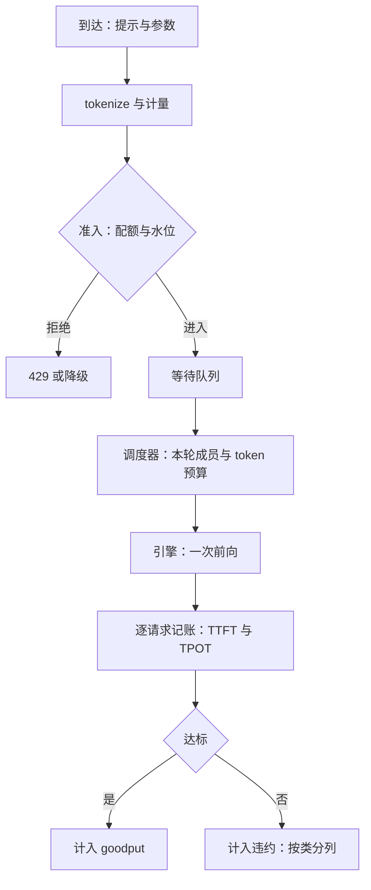

# 请求调度的基础与指标

调度器手里的硬通货只有两种：一次前向里的 token 名额，与 KV 池里的字节；指标不是报表，是给这两种通货的分配记账的账本。

<footer>—— 据 Kwon et al., SOSP 2023 的调度器口径与 Little, Operations Research, 1961 整理</footer>

[上一课](/llm/kv-map)把 KV 管理与压缩的十三课压成一张决策单，结尾留了话头：缓存管好之后，瓶颈移向「谁在什么时候用池子」。本课是「服务调度与多租户」的第一课，钉三件事：调度器到底控制什么、用什么指标记账、为什么指标合同必须先于任何机制。迭代级调度的来历与调度器循环主干已有专文（[iteration-level 调度](/llm/iteration-scheduling)、[vLLM 调度器](/llm/vllm-scheduler)），本课不重推，只立全课程共用的骨架。后课默认你已经会用 TTFT、TPOT、goodput 三本账去审任何调度决定。

## 问题

调度器是推理服务热路径上唯一做分配的组件。每个迭代它决定三件事：本轮哪些请求参与前向、每个请求本步最多写多少 token、谁的 KV 留在池子里。它控制的是两种耦合的资源：**算力名额**决定本步走多久，**KV 字节**决定谁还能继续 decode。麻烦在到达过程完全未知：提示长度、输出长度、到达间隔都是随机变量，而输出长度只有生成完才知道。

没有指标合同，任何调度改动都无法判定好坏：把批从 32 加到 64，利用率与吞吐都涨，TTFT 尾部也涨——这是变好还是变坏，答案不在引擎里，在合同里。缺口因此不是某个算法，而是先把「什么算好」钉死，再谈怎么调度；本课程后面的每一课都在这套账本上评审。

## 方法

给每条请求记三个时刻：$t_{\mathrm{arrive}}$、$t_{\mathrm{first}}$、$t_{\mathrm{last}}$。于是 $\mathrm{TTFT}=t_{\mathrm{first}}-t_{\mathrm{arrive}}$，$\mathrm{TPOT}=(t_{\mathrm{last}}-t_{\mathrm{first}})/(n-1)$，$\mathrm{E2E}=t_{\mathrm{last}}-t_{\mathrm{arrive}}$。三笔账要在服务端、按请求级、按类别分别记：交互聊天与离线摘要写进同一列平均值里，两张脸都看不清。吞吐是单位时间完成的 token 数；**goodput** 是满足双 SLO 的请求速率——它才是调度要最大化的量，定义见[有效吞吐 Goodput](/llm/goodput)。

排队侧用 Little 定律 $L=\lambda W$：每秒到达 4 条、平均停留 25 s，系统里平均同时在线 100 条。这条算式给出容量规划的第一行：承诺的延迟决定了必须容纳的并发，而不是反过来。调度器据此维护三个集合——等待、运行、被换出——各自的进出条件是后课全部机制的地基，循环本身见 [vLLM 调度器](/llm/vllm-scheduler)。

## 机制

指标先于机制，是因为调度是个最优化问题，指标就是目标函数；换目标函数，同一个机制的评价会反转。FCFS 对吞吐友好、对 TTFT 尾部不友好；抢占保住新请求的 TTFT，代价是老请求的 TPOT 出现空洞——哪边对，取决于合同写的是哪个分位数。自回归服务的停留时间方差极大，尾巴由 $\max$ 而不是均值决定，所以合同必须写成「P99 TTFT $\lt$ 800 ms、P99 TPOT $\lt$ 60 ms」这样的分位数对，而不是一个平均延迟。利用率尤其不能当目标：它度量「忙」，不度量「忙得对不对」。把 prefill 塞满每一步，利用率很好看，交互流的 ITL 已经烂掉，见 [服务 SLO 与尾延迟](/llm/serving-slo)。

排队论的老结论在 LLM 服务上原样成立：M/M/1 在利用率 $\rho=0.9$ 时，平均逗留时间已是空载的 10 倍，$\rho\to 1$ 时爆炸。这就是容量规划永远要留头部余量的原因，也是「再加点负载试试」的实验必须在离峰期做的原因。

## 边界

指标合同不解决公平与隔离：先到先得、按权重分、按承诺分是三种不同的正义，后课分别处理。调度也不能凭空造容量：并发当旋钮扫出的是延迟-吞吐前沿，两端不可同时最优，见 [延迟-吞吐帕累托](/llm/latency-throughput-pareto)。测量本身有坑：客户端测的 E2E 含网络与客户端排队，与服务端账不同源；重试不去重会把同一请求记三次，分位数被改写。本课程的默认模型是服务端、请求级、分分类别记账；所有后续机制在这套账本上评审。

## 小结

- 调度器控制两种耦合资源：每步的算力名额与 KV 池字节；到达与输出长度是未知量。
- 指标合同先于机制：TTFT、TPOT、E2E 按请求分列，goodput 是要最大化的量。
- Little 定律 $L=\lambda W$ 给出并发期望，是容量规划的第一行。
- 合同写成双分位数；均值与利用率都不能签字。
- 利用率是体检指标不是目标；只报吞吐会选出填满批的坏配置。
- 出处：调度器口径见 Kwon et al., SOSP 2023 与 Yu et al., OSDI 2022；Little 定律出自 Little, Operations Research, 1961。
