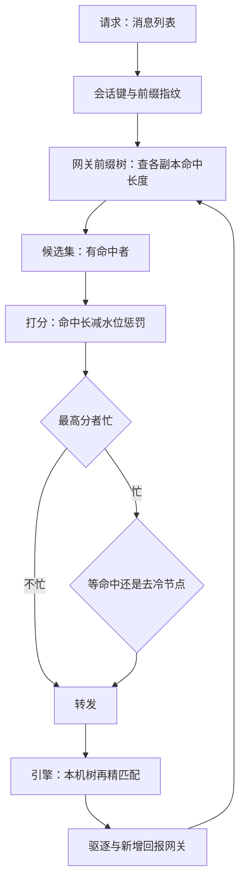
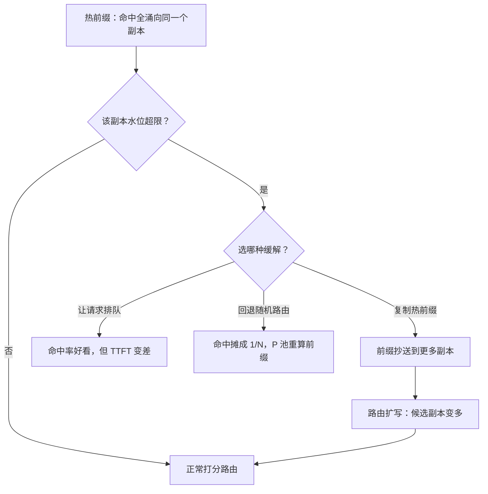

# 缓存感知路由

命中率不是运气，是放置：网关的每一次转发，都在决定这段前缀的全集群第二位作者是谁。

<footer>—— 据 Kwon et al., SOSP 2023 的放置口径与 SGLang Router、Preble 的路由实践整理</footer>

[上一课](/llm/sch-multi-lora)把适配器亲和写进路由的输入；本课展开路由的另一个输入：前缀缓存。单机内 KV 怎么留、怎么匹配，KV 课程已收束（[前缀缓存与跨请求共享](/llm/kv-prefix-cache)、[KV 管理收束](/llm/kv-map) 把「命中靠放置」列为决策单的第二刀）；本课把「放置」写成集群层的算法：入口怎么看见各副本的树、命中与负载怎么折中、软状态怎么维护。引擎内的树见 [RadixAttention](/llm/radix-attention) 与 [SGLang 前缀树](/llm/sglang-radix-tree)，入口路由器见 [SGLang Router](/llm/sglang-router)、[KV 感知路由](/llm/kv-aware-routing)。

## 问题

$N$ 个副本加随机路由，共享前缀的命中期望被摊成 $1/N$：系统提示、工具说明书、长文档，每台各自算一遍。前缀命中省的是 P 池最贵的算力与用户可感的 TTFT。但反过来，纯缓存最优路由——永远打持有最长前缀的那台——会把热点节点打爆：局部性与均衡是两个目标，权重不是常数而是水位。第三个麻烦是视图：路由器的树是软状态，引擎在按自己的 LRU 驱逐，路由器不知道；术语翻译：软状态就是「丢了也无妨、过期会自己被纠正的临时记录」。路由器手里的前缀树只是引擎真实缓存的近似影子——引擎随时在驱逐，影子随之变旧；所以命中信息只能拿来排序候选，不能当成铁的承诺。把它当硬承诺用，请求就会被派去一台其实早没这段缓存的机器。拿过期视图做「最优」决策，比随机好不了多少。

### 打分路由与水位折中

工程解是打分：$\mathrm{score}=\alpha\cdot\ell_{\mathrm{hit}}-\beta\cdot q$，$\ell_{\mathrm{hit}}$ 是候选副本上命中前缀的长度，$q$ 是该副本的队列深度或 KV 水位。流程：按会话键（租户加会话 id，或最长公共前缀）在网关树上查候选，取分数最高者；命中副本全忙时，比较「等命中」与「去冷节点重算」——这就是 $\alpha/\beta$ 的物理含义，且应动态：P 池越忙，$\beta$ 越大，越倾向重算也不排队。网关树要双向同步：引擎把驱逐与新增回报网关（或网关树带 TTL 衰减），把软状态当概率用——命中信息只影响排序，不做硬承诺。

## 方法

本课的方法是**打分函数加软状态管理**：把「命中与均衡怎么折中」落成一条可调的打分式——命中前缀长度减水位惩罚，$\alpha$ 与 $\beta$ 的比价含义是「等命中还是去冷节点重算」；常见误区：初学者容易把「缓存命中率」当成唯一要最大化的数。但如果为了命中率把所有请求都派去同一个持有缓存的副本，P99 TTFT 会先爆掉——命中率和水位是两张都要付的账单，打分式里的 $\beta$ 就是这两张账单之间的汇率。网关前缀树按软状态管：TTL 衰减加引擎回报驱逐与新增，命中信息只影响排序、不做硬承诺。方法论沿 KV 课程那句「命中靠放置」：路由器不制造缓存，只决定每段前缀在集群里的第二位作者。

## 机制

命中的收益可以显式定价：命中 $\ell$ 个 token 省 $\ell/r_{\mathrm{prefill}}$ 的 P 池时间，叠加 TTFT 的直接改善——路由把「缓存」从单机优化变成放置问题，这正是 KV 课程那句「命中靠放置，不靠运气」的集群版。放置的极端是热前缀打满单机：此时正确动作不是让请求排队，也不是回退随机路由，而是**复制热前缀**到更多副本（[前缀感知扩缩容](/llm/prefix-aware-autoscaling) 的思路），路由随之扩写。与公平的张力也要显式处理：亲和天然偏袒老会话——老会话持续命中，新会话总在冷节点起步；新会话的水位保底要写进打分，否则命中率报表与公平性报表打架。直觉类比：会话亲和就像老顾客总去同一家分店，店员记得他的口味，点单又快又顺；但如果店就一个座位，新顾客全被挡在门外——所以得给新顾客留几个座位（水位保底），或者干脆把招牌菜的做法（热前缀）抄送几家新店（前缀复制）。

热前缀把单机打满时，三种缓解动作的代价完全不同：

一个量级例：8 副本随机路由，8k 共享系统提示的命中期望是 1/8；每秒 8 条这样的流，P 池要烧约 10 卡秒每秒在重复前填上（单次 8k 前填按 6k token/s 约 1.3 s）。命中路由后降到约 1 卡秒每秒——省下的近九成算力，就是路由层这层软件的价值。

## 边界

缓存键必须含租户（与适配器，见上一课）：跨租户命中是机密事故不是优化，网关树的分键要与引擎配额对齐。会话内多轮是亲和的最小受益单元（[多轮前缀](/llm/multi-turn-prefix)），单轮请求的命中主要来自共享系统段。亲和与排干冲突：副本下线时（伸缩单元展开）会话要跟着搬，命中损失计入排干成本。路由器本身是新的故障域与延迟源：树操作必须是有界的 $O(\ell)$，热路径上不做全树扫描。

## 小结

- 随机路由把命中摊成 $1/N$；缓存感知路由把命中变成放置决策。
- 打分 = 命中长度减水位惩罚；$\alpha/\beta$ 的物理含义是「等命中与重算」的折中。
- 网关树是软状态：带 TTL 与回报机制，命中只排序、不做硬承诺。
- 热前缀打满单机时复制前缀，而不是排队或回退随机。
- 缓存键分租户分适配器；亲和要给新会话留水位保底。
- 出处：Kwon et al., SOSP 2023；SGLang Router 与 RadixAttention 的文档口径；前缀复制见站内前缀感知扩缩容专文。
