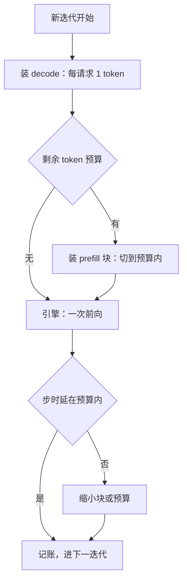
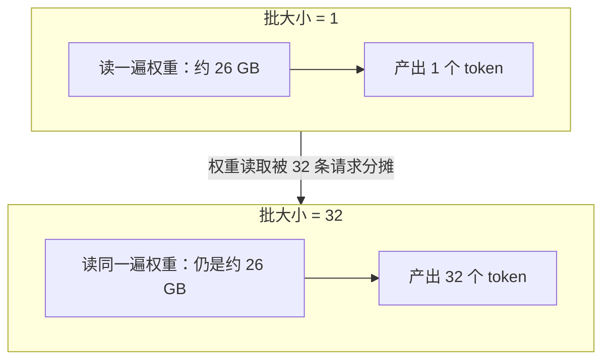

# 连续批处理深入

成员可变只是解除了批的寿命约束；每一次迭代怎么组——塞多少、先装谁、一步多长——才决定 ITL 的分布。

<footer>—— 据 Yu et al., OSDI 2022 与 Agrawal et al., Sarathi-Serve, OSDI 2024 的调度口径整理</footer>

[上一课](/llm/sch-basics-metrics)把合同钉在双分位数与 goodput 上，本课开始填机制：批怎么组。主干已写连续批处理的定义——成员在迭代边界进出（[连续批处理](/llm/continuous-batching)、[Orca 迭代级调度论文](/llm/orca-iteration)）；本课深入定义之外的三件事：一次迭代的 token 预算、prefill 与 decode 的混批次序、以及步时延为什么必须有上界。投机解码与 MoE 改变「一步的工作量」，也一并入账。后课的抢占、PD 分离都默认你已会做「每步组批」这笔账。

## 问题

「成员可变」只回答了谁在场，没回答本步做什么。一条 8k 提示的前填若整步执行，批内所有 decode 请求的 ITL 直接多出这一次前填的墙钟；新请求的 TTFT 也压在队头提示的长度上。反过来，为了护住 decode 把 prefill 全推后，新请求的 TTFT 无界，算力在大段空闲。两个方向都错，错的根源相同：**步时延没有上界**。组批问题于是可以精确表述：给定合同给 ITL 留下的步时延预算，每一步在预算内装下尽可能多的 token，并决定 prefill 与 decode 的次序。投机解码再添一层不确定：接受数是随机的，同一步的工作量按请求波动。

### token 预算与装填次序

工程解是本步 token 预算（`max_num_batched_tokens` 一类旋钮，[vLLM 调度器](/llm/vllm-scheduler) 已点过它的角色）：decode 优先装满——每条运行中请求至多一个 token，代价几乎只是 KV 读取；剩余预算给 prefill，长提示切成不超过余量的块跨多步执行（[chunked prefill](/llm/chunked-prefill)）。数字实例：一条 8k token 的长提示，按每块 512 token 切开，就是约 16 步走完 prefill。新请求的 TTFT 从「等完整 8k 一次算完」变成「等 16 个每步时长有上界的块」——TTFT 依然变长，但从无界变成了可预算、可写进合同的有界数。次序背后的账是两条 roofline：decode 是带宽活，prefill 是算力活（[Prefill 计算特征](/llm/prefill-compute)）；decode 先装保证 ITL 稳，prefill 用余量填算力空隙。步时延上界于是由「decode 步加一个 prefill 块」决定，是常数而不是最长提示的函数。

## 方法

本课的方法是**把组批写成带预算约束的装填问题**：以步时延上界为约束、本步装入 token 数为目标，工程解落成两条规则——decode 先装满（每请求至多一 token），prefill 用剩余预算切块跨步执行。次序的理由不靠直觉，靠两条 roofline 定价：decode 是带宽活、prefill 是算力活。投机解码与 MoE 作为「一步工作量随机化」的修正项入账，预算按最坏步留。

## 机制

吞吐的来源在算术强度：单条 decode 每读一遍权重只产一个 token，批内并发是唯一摊薄权重读取的手段（[解码的算术强度](/llm/arithmetic-intensity-decode)、[Decode 的显存墙](/llm/decode-memory-wall)）；术语翻译：算术强度就是「每读一字节内存，能顺带做多少次计算」。decode 每读一遍几十 GB 的权重只算出一个小 token，属于「读得多、算得少」的带宽活；prefill 一口气算几千个 token，读一遍权重做海量计算，是算力活。批处理的价值，正是让很多条 decode 一起分摊那一次昂贵的权重读取。所以 ITL 的地板是权重读取时间，批加大先摊薄地板、再撞算力墙，拐点见 [批大小与 roofline 拐点](/llm/batch-roofline-knee)。常见误区：初学者容易以为「批越大吞吐一定越高」。过了算力墙之后，继续加大批只是拉长每步时间、ITL 变差，吞吐几乎不再涨——拐点之后加批，是用延迟换接近于零的收益。所以合同要盯的是拐点前的批，不是最大的批。组批的艺术全在这个拐点之前，翻译成预算语言：预算给小了，decode 摊不薄权重，吞吐亏；给大了，步时延超预算，ITL 合同破。投机解码让「decode 先装」的代价不再恒定：接受 $k$ 个 token 的请求本步多算约 $k$ 倍，接受率高的批步时延更长、但产 token 更多——ITL 与吞吐要按接受长度联评（[投机解码原理](/llm/speculative-decoding)）。MoE 再叠一层：步时延取决于激活了哪些专家，批的构成影响负载，见 [MoE 推理批处理](/llm/moe-inference-batching)。

批摊薄权重读取，可以直接比出来：

ITL 有个不可再压的地板：decode 步至少要读一遍权重。13B 模型 fp16 权重约 26 GB，在 3.3 TB/s 的 HBM 上光权重读取约 8 ms——任何「每步 2 ms」的承诺都物理不可行。步时延预算要从这条地板往上留，而不是从零往下压。

## 边界

预算调优是 TTFT 与 ITL 的换汇：预算大，前填走得快（TTFT 好）但步时延尖（ITL 差）。换汇点没有普适值，要从合同反推，且随负载漂移，要看分位数而不是均值。齐整离线负载（同长度分类、embedding）上静态批更省心，连续批的调度税没有对应收益。CUDA Graph 按（批大小，token 预算）桶捕获，桶太细内存爆、太粗每步多算 padding——桶距是又一个工程参数。本课的默认场景是单池混批；把 prefill 与 decode 拆成两池是另一条路，[PD 分离](/llm/pd-disaggregation) 之后课展开。

## 小结

- 连续批处理只定义成员可变；每步的 token 预算与装填次序才决定延迟分布。
- decode 先装、prefill 用余量切块执行，步时延上界是「decode 步加一块」。
- ITL 的地板是权重读取时间；批大小在该地板与算力墙之间调。
- 投机解码与 MoE 让「一步的工作量」随机化，预算要按最坏步留。
- 预算是 TTFT 与 ITL 的换汇点，按分位数调，不按均值。
- 出处：Yu et al., OSDI 2022；Agrawal et al., Sarathi-Serve, OSDI 2024；预算旋钮的工程口径对照 Kwon et al., SOSP 2023。
