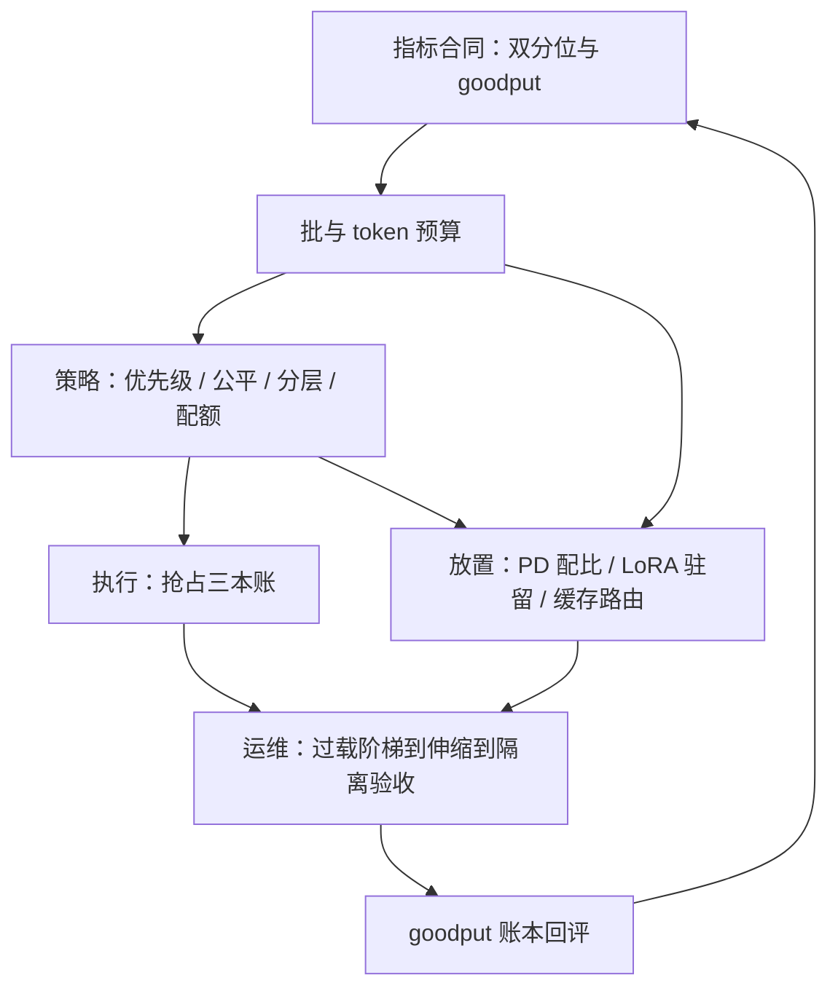
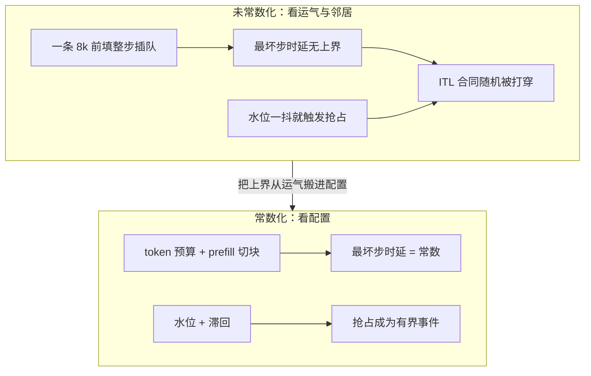

# 调度收束

收束不是把十二课再讲一遍，是把它们压成一张先后表：先立账本，再组批，再定策略，再谈资源从哪来、不够怎么办。

<footer>—— 据 Kwon et al., SOSP 2023 与 Zhong et al., OSDI 2024 的系统口径，按本课程整理</footer>

[上一课](/llm/sch-multitenant-isolation)把租户维收进三道配额。至此本课程的零件齐了：指标、批、优先级、合同、抢占、分离、适配器、路由、过载、伸缩、隔离。上游是 [KV 管理收束](/llm/kv-map) 回答的「池子怎么管」，本课程回答「池子怎么用」。本课收束：把十二课装配成一张依赖图与一张决策单。**本课程到此收束。**

## 问题

十二个机制分属三层：**机制**（批与预算、抢占）、**策略**（优先级、公平、分层）、**资源**（PD 池、适配器、路由、伸缩、隔离）。各自局部最优会互相拆台：路由为命中率把负载集中，伸缩为均衡把前缀打散；降级截断上下文，前缀命中率跟着掉；抢占保住新请求的 TTFT，打穿老请求的 TPOT 合同；适配器驻留吃掉的显存正是 KV 池的地皮。没有全局顺序，团队会在错误的位置先动刀——最常见的两条弯路：没有指标合同就调参（改完不知道好坏），跳过步内预算直接上 PD 分离（用大手术治预算能治的病）。常见误区：初学者容易一上来就调批大小，或者直接上 PD 分离这种「大手术」。但账本没立，改完说不清是变好还是变坏；步内预算没常数化，排序排得再巧，一条 8k 长前填插进来照样全线打穿。顺序错了，力气花在错的位置。收束要给的就是这张先后表。

## 方法

**决策单**，按依赖排序：

1. **指标合同**：双分位数（TTFT、TPOT）加 goodput，分租户分类别记账。一切评审的账本；没有它，后面每一步都无法验收。
2. **批与预算**：token 预算、decode 先装、prefill 切块，把最坏步时延变成常数。这是策略的落点：没有常数上界，任何排序都会被一条长前填打穿。
3. **策略层**：优先级定序、公平份额保底、SLO 分层定合同、三道配额防占坑。
4. **执行层**：抢占按三本账选路（重算、换出、迁移），让优先级在迭代边界有牙齿。
5. **放置层**：PD 配比、适配器驻留、缓存感知路由——三个同构的放置问题，命中与均衡联评。
6. **运维层**：过载三道闸、弹性伸缩的暖池与排干、隔离的对抗验收。

每层拿上一层吐不出的余量：合同没立，机制无从评审；预算没有，策略没有落点；放置没做对，运维在错的位置扩容。

## 机制

贯穿十二课的地形是三对张力：**吞吐与尾延迟**——帕累托前沿不可同时最优，预算与分层是把前沿显式化的工具；术语翻译：帕累托前沿就是「鱼与熊掌的边界线」——把所有「不可能两全」的组合画成一条曲线，线上每一点都已是能拿到的最好交易；想多要一点尾延迟余量，就必须让出一点吞吐。说某个配置「在前沿上」，意思是没有免费的改进空间了，再动就有一头要付账。**隔离与利用率**——份额切多细，峰值共享丢多少，超卖比例是定价；数字实例：10 个租户各买一卡的份额，但实测平均同时只用六成，按 1.5 倍超卖大约 4 张卡就能接住期望负载，省下 6 张卡的钱；代价是节日流量全体同时打满时，尾部延迟违约的风险由你承担——超卖比例不是技术参数，是风险定价。**命中与均衡**——亲和与水位在每个放置决策里对峙。调度器的工作不是消解张力，是把张力标价：每个机制注明它在三条轴上各花多少，按合同付账。另一个贯穿机制是「常数化」：token 预算把最坏步时延变成常数，水位加滞回把抢占变成有界事件，按层传输把迁移时间变成层数的函数——好的调度设计都在把「取决于邻居与运气」改成「取决于配置」。「常数化」前后，同一个系统面对同一条长前填的表现：

一张自检表：如果只能做三件事——先立双分位与 goodput 合同（分租户）；再配 token 预算与 chunked prefill（最坏步时延变常数）；然后上每租户三道配额。多数服务在这三步之前已拿到大半收益，后面的每一刀都要求先证明前面拿不出来。

## 边界

这张地图有时效。架构侧：GQA、MLA 把 KV 基数改小，池子变大，水位、配比、配额的每一个常数要重标；投机解码改变每步的工作量分布，预算与 ITL 地板要重算。负载侧：agent 化让输出更长、会话更黏，配比与亲和的权重漂移。地图之外：池子怎么管在 KV 管理课程，token 之下是内核与数值层——各自的地图由相邻课程交付。本课程交付的是中间这一层：**池子怎么用**的地图。

## 小结

- 决策单按依赖排序：合同 → 批与预算 → 策略 → 执行 → 放置 → 运维。
- 三对张力贯穿：吞吐-尾延迟、隔离-利用率、命中-均衡；调度把它们标价，不消解。
- 好机制的共同形状是「常数化」：最坏步时延、抢占事件、迁移时间都有配置上界。
- 永不碰的四件：只报吞吐不报分位、按请求数配额、无滞回的抢占、跨租户共享缓存键。
- 每层拿上一层吐不出的余量；任何收益要在 goodput 账本上联评后才算数。
- 出处：本课程十二课的综合口径；文献锚点为 Kwon et al., SOSP 2023、Yu et al., OSDI 2022、Zhong et al., OSDI 2024。
