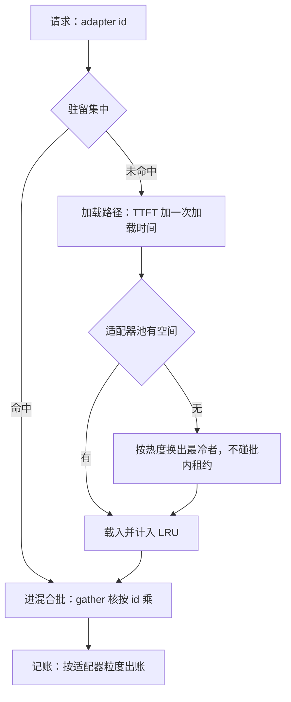
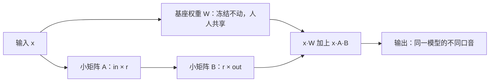

# 多 LoRA 的调度

一份基座、许多适配器之后，调度器多管一种资源：它的驻留由请求热度决定，它的抖动与 KV 抖动同构。

<footer>—— 据 Chen et al., MLSys 2024（Punica）与 Sheng et al., MLSys 2024（S-LoRA）整理</footer>

[上一课](/llm/sch-pd-disaggregated)把阶段拆成池子；本课把「模型」这一维打开：一份常驻基座、几十上千个 LoRA 适配器，请求各带各的 adapter id。服务形态与特制核主干已有（[多 LoRA 服务](/llm/multi-lora-serving)、[S-LoRA 分页适配器](/llm/slora)、[LoRAX](/llm/lorax-serving)）；本课只写调度器视角：驻留集怎么管、批怎么跨适配器混、配额怎么落到适配器粒度。

## 问题

适配器是第三种资源：基座权重常驻（人人共享），KV 按请求计费，适配器按**热度**进出显存。术语翻译：LoRA 就是「不重训整个模型，只训两个很小的矩阵，把它们的乘积当成对原权重的微调补丁」——基座权重冻结不动，换一个补丁就像给同一个模型换一种口音或专长。补丁比原模型小几个数量级，所以一份基座能同时挂几百上千个。调度器新增两个决定。第一，驻留集：GPU 上放哪些 $A$、$B$？冷适配器请求的 TTFT 里含一次加载（主存到显存，最坏是磁盘）；驻留集换得太勤，GPU 在搬矩阵不产 token——与抢占抖动同构的适配器抖动。第二，批的构成：核能否在同一次前向里对多个适配器做 gather 乘法？不能的话，「多租户」退化成同适配器分组批，不同租户的请求无法同批，连续批的收益按租户碎掉。

### 驻留当缓存管

驻留集是标准的缓存问题：键是 adapter id，值是权重增量，容量是显存里划给适配器的池。直觉类比：适配器驻留集就像厨房的调料架——台面（显存）有限，常用的盐糖酱油（热适配器）常驻手边，不常用的收进储藏室（主存甚至磁盘）；做菜中途跑一趟储藏室，上菜自然就慢（TTFT 里多出一次加载）。LRU 策略就是「最久没人点的调料先收起来」，但正在锅里用的（批内租约）谁也不许动。策略用带热度计数的 LRU：滑窗请求数决定去留，热的钉住，正在批内的适配器有租约不可换出；可预测的时段流量做预载（早高峰前把办公租户的适配器提上来）。加载是**无损**的：权重增量可再生，回来不需要重算——比 KV 换出便宜在正确性自动恢复，贵在单个体积可能比一条 KV 大。路由按适配器亲和：同 id 的请求导向已驻留的副本；代价与下一课的缓存感知路由完全同构——亲和集中与负载均衡打架。

## 方法

本课的方法是**同构映射**：把适配器驻留集映射成标准缓存问题——键是 adapter id、值是权重增量、容量是显存池——策略直接取带热度计数的 LRU，加批内租约与可预测时段预载；加载无损，免去重算那本账。第二刀是核能力决定论：gather 核能异构则批可跨租户混，调度自由度由引擎设计给死，不是调参变量。配额与路由分别落到租户粒度与亲和问题，与 KV、抢占课程共用同一套词汇。

## 机制

批内异构靠核：Punica 的 SGMV 把不同适配器的低秩乘收进一次访存，S-LoRA 把适配器权重与 KV 放进统一分页池。这两个机制决定调度器的自由度：核支持异构，批就能跨租户混；不支持，调度器只能按适配器分组，碎片化损失是引擎设计决定的，不是调参能救的。配额与隔离落到适配器粒度：租户与适配器一一对应时，每适配器的并发上限、KV 水位、优先级就是租户配额（本课程最后的隔离课把这层收拢）。一条硬边界必须重申：**KV 不可跨适配器复用**——同一段前缀在不同适配器下算出的 K、V 不同（[多 LoRA 服务](/llm/multi-lora-serving) 已钉），前缀缓存的命中统计必须按适配器分键，否则统计与正确性双错。常见误区：初学者容易以为共享前缀的 KV 在不同适配器间可以复用，反正前缀一样。不行——补丁改变了每一层的输出，同一段前缀在不同补丁下算出的 K、V 就是不同的数；复用了，正确性悄悄坏掉，而且输出上往往一时看不出来，是最难查的那种错。

为什么一个小补丁就能换风格？看一次前向里的结构：

体积账：秩 16、hidden 4096、32 层、QKVO 加 MLP 全目标、fp16，单个适配器约 80 MB。一千个就是 80 GB——比多数 7B 基座本身还大。这正是 S-LoRA 把适配器放进统一分页池、多数驻留主存的原因，也是「数千适配器」的数字总伴着「多数冷备」小字的原因。

## 边界

热且稳定的租户可以把适配器合并进基座权重，省一份间接与批内复杂度，但失去秒级下线与更新（[适配器热更新](/llm/adapter-hot-swap) 的迭代边界语义）；频繁切换、长尾租户不要合并。调度参数要与 KV 池联调：给适配器多留显存，KV 池就小，decode 并发上限下降——两种资源在同一张卡上争地皮，按租户的 KV 足迹与适配器热度联评定。多秩混合、张量并行下的适配器广播等细节以各自论文与引擎文档为准。

## 小结

- 适配器是按热度进出的第三种资源：驻留集是缓存问题，抖动与抢占抖动同构。
- 加载是无损的（可再生、不需重算），单个体积可观；LRU 加租约是默认策略。
- 批内跨适配器靠 gather 核；核不支持时多租户退化为分组批。
- 路由按 adapter id 亲和，代价结构与缓存感知路由相同。
- KV 不可跨适配器复用，缓存键与统计必须按适配器分。
- 出处：Chen et al., Punica, MLSys 2024，arXiv:2310.18547；Sheng et al., S-LoRA, MLSys 2024，arXiv:2311.03285。
