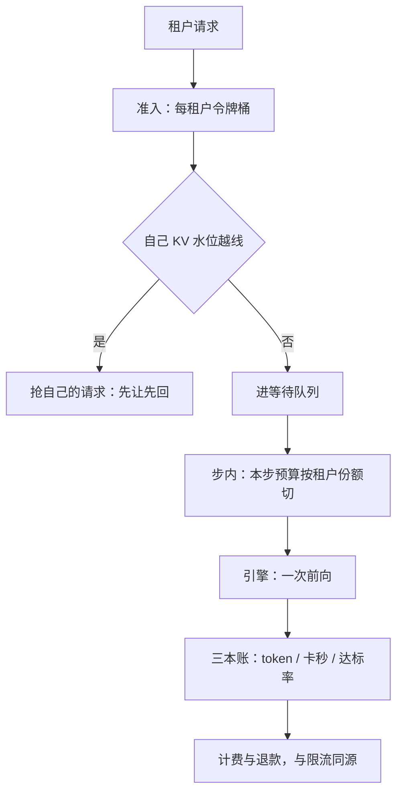
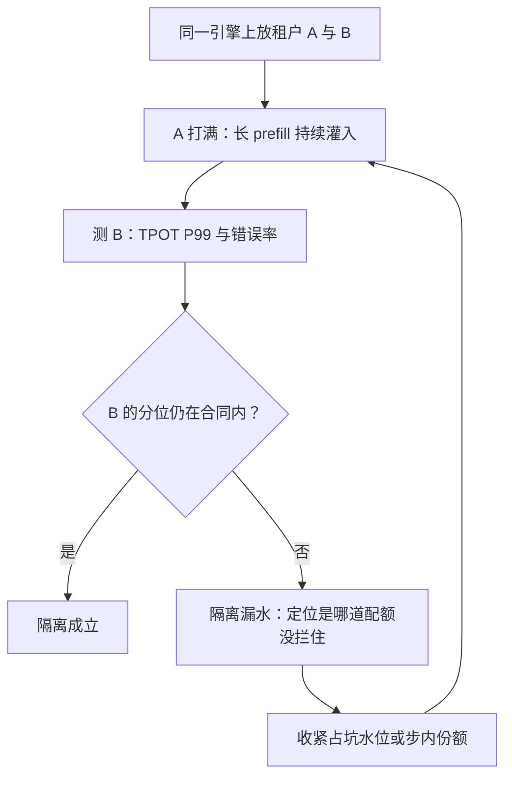

# 多租户隔离深化

隔离不是把人分开，是把最坏步时延变成常数：一次前向内部的份额，是邻居唯一绕不过的墙。

<footer>—— 据 Punica 与 S-LoRA（均 MLSys 2024）的多租户形态，按站内三层框架整理</footer>

[上一课](/llm/sch-autoscaling)管容量；本课回到租户：多个租户共享同一套引擎与池子时，调度器怎么把隔离做成机制而不是口号。性能、故障、机密三层框架主干已有（[多租户隔离](/llm/multi-tenant-gpu)）；本课深化第一层——性能隔离的调度实现：配额怎么叠、份额怎么切、怎么验收。

## 问题

性能隔离的难点是**二维资源加迭代级共享**。租户 A 的一条 8k prefill 在同一次前向里把所有租户的步时延拉长——批是共享的，伤害也是共享的。A 的长 decode 群把 KV 池占满，B 的新请求进不来，虽然 A 没有超任何「请求数」配额。按请求数配额没用：一条请求的代价差三个数量级（[token 计量与限流](/llm/token-ratelimit) 已论证按 token 计）。但按 token 配额也不够：排队占坑的请求不产 token，却实打实占着池子与名额。隔离要同时管住三样：准入速率、占坑规模、步内消耗。

### 三道配额叠着用

第一道，**准入**：每租户 TPM 令牌桶（复用限流课的机制），挡速率。术语翻译：令牌桶就是「按固定速率往桶里放代币、每个请求要花掉代币、桶容量有上限」的限速器——平时攒下的代币允许小突发，但长期速率超不过放币速率。TPM 就是「每分钟放多少币」。它挡的是租户发请求的平均火力。第二道，**占坑**：每租户最大运行数与 KV 字节水印，挡驻留；超自己水位的租户先抢自己的请求——「自己抢自己」，抢占课的机制获得租户语义。直觉类比：「自己抢自己」就像电梯超载时先请同一公司的同事下去等下一趟——同一家的请求互相让位，保证隔壁公司的人不被牵连。没有这道，A 家的长 decode 群会把整个电梯（KV 池）占满，B 家连门都进不来。第三道，**步内**：本步 token 预算按租户切份额，加权公平（[优先级与公平性](/llm/sch-priority-fairness) 的机制落到租户维）；这是唯一能在一次前向**内部**保护邻居的旋钮，批外两道管不到同批之内。份额是软的：保底下限加突发上限；超卖比例是这层的定价，依据是租户峰值不同相。计费与退款按三本账出：token、卡秒、达标率；账单口径必须与限流口径同源，否则对不上账。

## 方法

本课的方法是**三道配额叠加加对抗验收**：把「隔离」拆成准入速率、占坑规模、步内消耗三个可分别配置的旋钮——令牌桶挡速率，每租户 KV 水位配「自己抢自己」，步内预算按份额切——三道各管一段伤害路径，缺一道即漏。验收方法是对抗测试：让邻居打满长 prefill 长跑，看本租户分位是否仍在合同内。方法选型的口径先钉死：软隔离只交付性能这一层，机密与故障两层另付更贵的价钱。

对抗验收长这样：

## 机制

验收是对抗性的，这是本课最重要的一条机制：让租户 A 打满长 prefill 长跑，测 B 的 TPOT P99 与错误率——通过标准是 B 的分位仍在合同内，而不是 A 礼貌（[多租户隔离](/llm/multi-tenant-gpu) 的测试协议）。空载分位在多租户里没有意义：邻居才是分位的主要作者。常见误区：验收隔离时只跑一下空载压测、看分位漂亮就签字。空载时根本没有邻居，分位当然好看；多租户系统里你的尾部延迟主要是邻居写的——A 家一条 8k 前填就能让全楼 ITL 集体跳一截。验收必须让最坏的邻居在场。隔离与利用率是前沿：硬切份额保下限，牺牲峰值共享的收益；份额切得越细，调度税越重。边界要诚实：软隔离挡不住对抗与合规——机密隔离要地址空间与进程边界，故障隔离要切片或多进程，那是三层框架里更贵的两层，本课的调度机制只交付第一层。

一步之内的数字：一条 8k 提示不切块整步执行，邻居的 ITL 直接长出全步时间（毫秒级跳到百毫秒级）；切成 512 token 的块并给单租户步内预算上限后，伤害上界变成一块的时间。隔离的物理含义就是这句话：把最坏步时延从「取决于邻居」变成「取决于配置」。

## 边界

租户与适配器一一对应时（[多 LoRA 的调度](/llm/sch-multi-lora)），配额自然落到适配器粒度，但驻留池是新的共享地皮，LRU 也要按租户记账。共享前缀树必须按租户分键：跨租户命中是机密事故（[缓存感知路由](/llm/sch-cache-aware-routing) 的边界在这里升级为安全条款）。机群层多租户（多引擎副本、多作业）的公平与配额另有专门机制（[机群公平调度](/llm/cluster-fair-scheduling)），本课停在单引擎与路由层；两层配额要对齐口径，否则租户在引擎内守约、在网关被拒，或者反过来。

## 小结

- 性能隔离要同时管准入速率、占坑规模、步内消耗；请求数配额无效。
- 三道配额：令牌桶、每租户 KV 水位（自己抢自己）、步内预算按份额切。
- 步内份额是唯一能在一次前向内部保护邻居的机制。
- 验收是对抗性的：邻居打满时自己的分位不破才算隔离成立。
- 隔离与利用率是前沿，超卖比例是定价；软隔离只交付性能层。
- 出处：多租户形态见 Chen et al.（Punica）与 Sheng et al.（S-LoRA），MLSys 2024；三层框架与对抗测试按站内口径整理。
