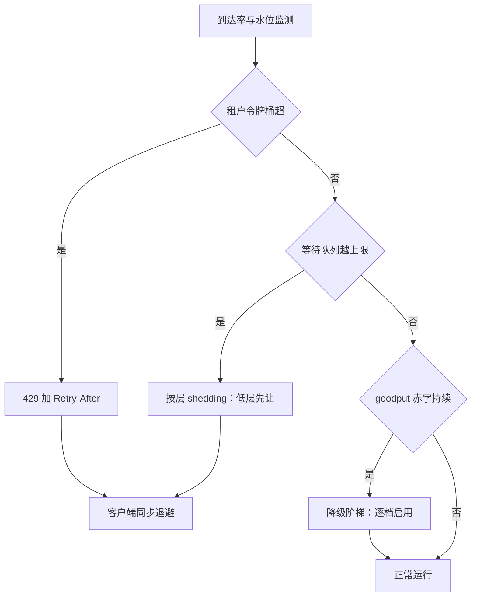

# 过载与降级

过载区间的吞吐曲线不是平的，是下坠的；硬扛的结局不是排队变长，是 goodput 崩掉——降级阶梯是预设计的合同条款，不是临时发挥。

<footer>—— 据 Little, Operations Research, 1961 的驻留口径与站内 goodput、限流两课整理</footer>

[上一课](/llm/sch-cache-aware-routing)把每条请求放到最合适的一台机；本课处理总量超过全部机力时怎么运行。计量与限流的机制主干已有（[token 计量与限流](/llm/token-ratelimit)），goodput 的定义见 [有效吞吐 Goodput](/llm/goodput)；本课把两者接进调度器的过载区间：三道闸的次序、降级阶梯的设计、以及为什么反馈信号必须是 goodput 不是吞吐。

## 问题

语言模型服务的过载与无状态服务不同。请求驻留几十秒到几分钟，队列不是 FIFO 线而是正在生成的池；到达率略超容量时，批变大、步变慢、每请求停留时间拉长，Little 定律（$L=\lambda W$）保证在线条数暴涨，KV 池更早见水，抢占与换出吃掉迭代——**单位时间产出的达标 token 反而下降**。雪上加霜的是重试放大：客户端超时短于 P99 服务时间时，最慢的那批请求全部重试，有效负载自乘。硬扛的结局是雪崩：所有用户都慢，且没人知道该先保谁。

### 三道闸与降级阶梯

按「伤害递增」放三道闸。第一道**计量准入**：每租户 TPM/RPM 令牌桶，超了回 429 带 Retry-After，闸门在 tokenize 之后、KV 分配之前（[token 计量与限流](/llm/token-ratelimit)）。第二道**队列上限**：等待队列深度封顶，超过直接拒绝而不是无限排队——保护的是在途请求的 TPOT 合同。第三道**降级阶梯**，按质量损失从小到大预先排序：砍 `max_tokens` 与投机草稿 → 截断超长上下文（保头尾、丢中段）→ 切到小模型或低精度档 → 返回缓存的高频应答。每一档写进合同：什么水位触发、承诺什么替代质量。shedding 顺序按 SLO 层从低到高，低层先让（[SLO 分层与差异化](/llm/sch-slo-tiers) 的层序直接复用）。

## 机制

为什么反馈信号必须是 goodput：过载区间里原始吞吐可能持平甚至上升（反正都在算 token），达标率跳水——用吞吐做反馈的限流与扩容会在崩溃边缘显示「健康」，用 goodput 才能看到赤字。降级的机制本质是把质量换成步时延与 KV 足迹：截断上下文直接缩短 prefill 与 KV，小模型换掉步时延地板——每一档都是在 [延迟-吞吐帕累托](/llm/latency-throughput-pareto) 的前沿上换位置，不是凭空提速。重试风暴的解法在服务端：429 的 Retry-After 让客户端同步退避而不是盲目重试，幂等键防止同一请求重复计数。

重试放大的经典算式：有效到达率 $\lambda_{\mathrm{eff}}=\lambda/(1-p)$，$p$ 是含重试的超时概率。$p=0.3$ 时放大 1.43 倍，$p=0.6$ 时 2.5 倍——放大的恰是你最没有余量的那档流量。所以「重试率」要进仪表盘：它比队列长度早几分钟预警雪崩。

## 边界

降级改变输出质量，必须可观测且不静默：响应标 degraded，账单与评测分开统计，否则质量回归无从归因。阶梯要演练：没有演练过的降级路径等于没写——按周期把流量打到触发线，逐档验证。恢复有滞后：水位回落不能立刻全开闸，积压的队列会再来一次脉冲，恢复速率要限定。最后，过载保护不替代扩容：三道闸买的是分钟级的稳定，小时级的缺口仍要弹性伸缩接手（下一课）。

## 小结

- LLM 过载不是排队变长而是 goodput 下坠：批大、步慢、池满、抢占吃迭代。
- 三道闸按伤害排序：令牌桶准入、队列上限、降级阶梯；shedding 按层从低到高。
- 降级阶梯预设计进合同，逐档写明触发水位与替代质量。
- 反馈信号用 goodput；吞吐会在崩溃边缘显示健康。
- Retry-After 加幂等键对抗重试放大；恢复限速防二次脉冲。
- 出处：Little 定律（1961）的驻留口径；限流与 goodput 机制见站内专文，余按工程实践整理。
