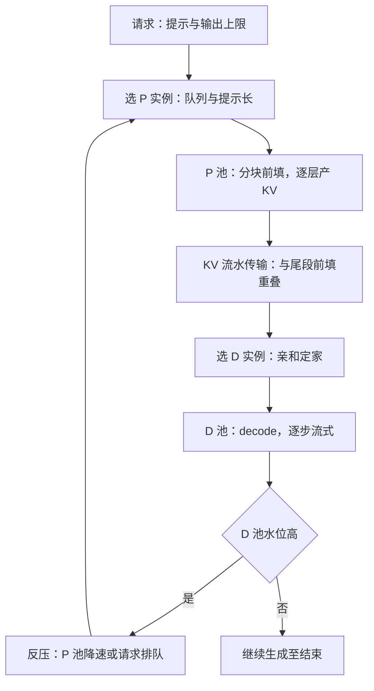
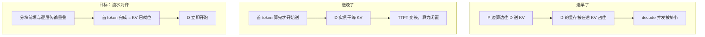

# PD 分离的调度

拆池之后，耦合没有消失，只是换了个位置：从「同一步抢算力」变成「KV 传输与两池队列的错位」。

<footer>—— 据 Zhong et al., OSDI 2024 与 Patel et al., Splitwise, ISCA 2024 的系统口径整理</footer>

[上一课](/llm/sch-preemption-migration)写完让路的三本账；本课换一个轴：把 prefill 与 decode 拆到不同池子后，调度问题怎么重写。拆分的动机与 KV 搬运的机制主干已有（[PD 分离](/llm/pd-disaggregation)、[PD 分离的 KV 传输](/llm/pd-kv-transfer)）；本课只写调度器新增的决定：请求去哪个 P 实例、KV 何时送到哪个 D 实例、两池配比多少、两池之间怎么反压。

## 问题

拆开之后，调度器多出一组决定，每一个都新。术语翻译：PD 分离就是把「读题」和「答题」拆到两批不同的卡上——prefill 负责读完整段提示（算力活），decode 负责一个字一个字往外蹦（带宽活）。两种活的硬件胃口不同，混在一张卡上会互相踩脚，拆开就能各配各的卡型与卡数。第一，**路由**：请求进 P 池，算完首 token 后 KV 要跟着去某个 D 实例——D 的选择就是亲和问题，一旦选定，整条生成轨迹粘在那台上。第二，**传输时机**：KV 按层流水送出、与最后一段分块前填重叠，目标是首 token 一算完、D 侧开跑时 KV 已就位；送早了占 D 的显存，送晚了 D 干等。第三，**配比**：两池卡数比错了，一头排队一头空转。第四，**反压**：colocate 系统里本步 token 预算天然是反压；拆开后两池是两个进程，P 不知道 D 已经满——P 继续吐 KV，D 的池子被打爆，排队的是显存不是请求。

### 配比从负载算

稳态下两池的卡数比近似等于每请求在两阶段的服务时间之比：$N_P/N_D \approx (\bar{p}/r_P)/(\bar{o}/r_D)$，其中 $\bar{p}$、$\bar{o}$ 是平均提示与输出长度，$r_P$、$r_D$ 是单卡在两阶段的实测吞吐。这是起点不是终点：TTFT 承诺紧就往 P 侧加卡，TPOT 紧就往 D 侧加。DistServe 干脆按 goodput 对两池分别搜并行与副本数；Splitwise 把异构档位配进来——prompt 用高算力卡，decode 用低功耗档，把功耗账也算进配比。

## 方法

本课的方法是**服务时间核算加显式协议**：两池配比的起点由稳态服务时间之比给出——每请求在两阶段的耗时比——再按双 SLO 与异构档位微调；公式管均值，突发靠实测修正。拆池后丢失的耦合用显式反压协议补回：D 池水位高则 P 池降速，替代 colocate 里隐式的预算争用。goodput 拆成两半记账（TTFT 归 P 池与传输、TPOT 归 D 池），各按各的承诺验收，是方法上的关键分账。

## 机制

两池的队列必须联动，反压是 PD 调度独有的机制：D 池水位高时，P 池降速或把新请求停在 P 侧门外——显式协议替代了 colocate 里隐式的预算争用。直觉类比：反压就像前厨与出菜口之间的传菜铃——出菜口（D 池）堆了，铃一响，前厨（P 池）就放慢炒菜。合用一间厨房（colocate）时这层协调是隐性的（同一步抢预算）；拆成两间厨房后必须装上明确的传菜铃（协议），否则前厨只管猛炒，盘子在窗口堆到塌。goodput 仍是目标函数，但分成两半记：TTFT 的账在 P 池与传输链路上，TPOT 的账在 D 池上，各按各的承诺验收。故障语义也变了：D 实例死掉，在途请求的 KV 随之丢失，恢复等于在另一个 D 上重做 prefill——上一课的代价账直接适用，这笔账也解释了为什么 D 侧亲和要把「家」固定得比 colocate 更稳。传输链路本身是共享资源：多对 P-D 同时搬 KV 会撞带宽，传输也要排队；按层切传输，正好把一次搬运摊进多个迭代。

KV 传输的时机为什么讲究，送早、送晚、对齐三种情形：

配比小算例：提示均值 1k token、输出均值 0.5k；单卡 prefill 6k token/s、decode 合计 1.5k token/s。每请求 P 阶段约 0.17 s、D 阶段约 0.33 s，卡数比 $N_P:N_D\approx 1:2$。输出越长的负载 D 侧越重——agent 流量的 PD 比与搜索流量完全不同，配比要按自己的负载实测。

## 边界

拆池不是无代价的：KV 体积正比于提示长与层数，弱互连上搬运时间可能吃掉分离省下的干扰；小流量场景两池都喂不满，colocate 加 chunked prefill 往往更划算——主干课已写清这条边界（[PD 分离](/llm/pd-disaggregation)）。配比公式在突发下失真：提示与输出长度的联合分布决定瞬时配比，稳态公式只管均值。常见误区：初学者容易把配比公式当成一次算好、长期不变的定值。它只管均值——促销时段提示集体变长、agent 流量输出动辄几千 token，瞬时配比全在漂；公式给的是起跑线，双 SLO 微调与实测修正才是日常功课。PD 也不是二选一：一部分卡混批、一部分拆池的混合形态在大机群上常见，代价是调度器要同时维护两套机制。

## 小结

- 拆池后调度新增四个决定：P 路由、D 亲和、传输时机、两池配比。
- 配比起点是服务时间比 $(\bar{p}/r_P):(\bar{o}/r_D)$，再按双 SLO 微调。
- 反压是 PD 独有机制：D 满则 P 降速，替代 colocate 的隐式预算争用。
- goodput 分两半记：TTFT 在 P 与传输，TPOT 在 D。
- D 故障等于重 prefill，亲和要固定「家」；弱互连与小流量时拆池不划算。
- 出处：Zhong et al., OSDI 2024，arXiv:2401.09670；Patel et al., Splitwise, ISCA 2024，arXiv:2311.18677。
