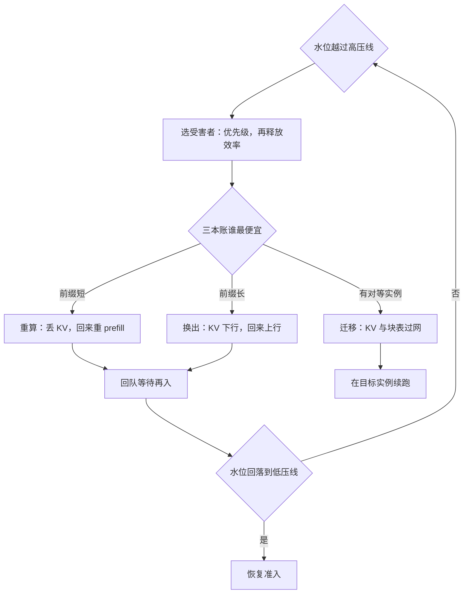
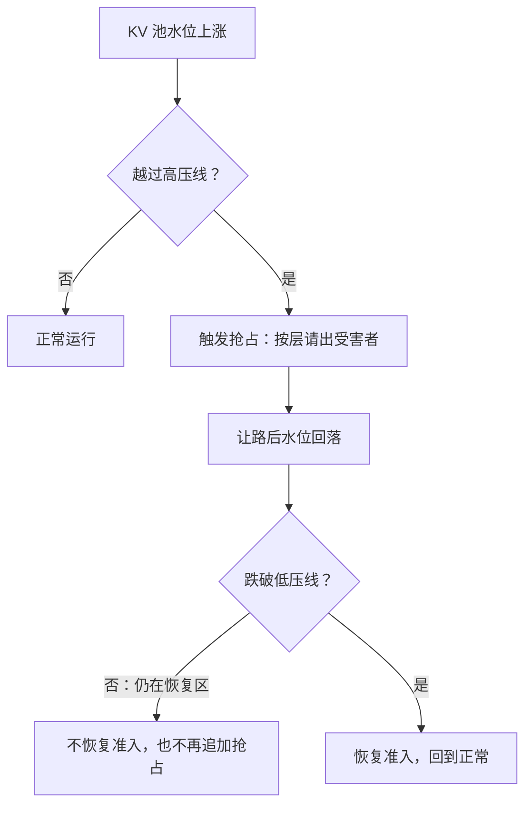

# 抢占与请求迁移

抢占的题目不是「能不能让路」，而是「让路的钱从哪本账出」：重算花算力，换出花带宽，迁移花网络——三条路各有定价。

<footer>—— 据 Kwon et al., SOSP 2023 的换出与重算口径，按站内 KV 成本核算整理</footer>

[上一课](/llm/sch-slo-tiers)把承诺分层；合同要有强制执行的手段，那个手段就是抢占：当 KV 池或预算见底时，谁让路、怎么让、代价几何。vLLM 调度器的抢占循环与「长前缀倾向换出、短请求倾向重算」的启发式主干已有（[vLLM 调度器](/llm/vllm-scheduler)、[抢占与公平性](/llm/preemption-fairness)）；本课把三条让路——重算、换出、迁移——写成一本代价账，并补上迁移这个未展开的选项：它把「让路」从损失变成搬运，是排干与伸缩的前置件。

## 问题

抢占触发于 decode 中途：池子见水，本步写不下新 KV。三条路的代价结构完全不同。**重算**丢弃 KV，回来时重做前缀 prefill：代价是算力，正比于前缀长度。**换出**把 KV 搬到主机再搬回来：代价是两次主机间搬运，正比于 KV 字节。**迁移**把 KV 与块表搬到另一实例：代价是网络搬运加目标端对齐。选错路的浪费是实打实的：短前缀的请求做了昂贵的换出，长前缀的请求重算了半分钟的前填。更糟的是抖动：水位无滞回时，换出回来立刻再换出，GPU 在搬字节不产 token——抢占风暴比抢占本身更伤。

### 代价模型与受害者选择

决策按账本走：重算代价 $t_{\mathrm{re}}\approx L_{\mathrm{prefix}}/r_{\mathrm{prefill}}$；换出代价 $t_{\mathrm{swap}}\approx 2B_{\mathrm{KV}}/b_{\mathrm{PCIe}}$（下行加回迁）；迁移代价 $t_{\mathrm{mig}}\approx B_{\mathrm{KV}}/b_{\mathrm{net}}$ 加对齐成本。三者谁便宜取决于前缀长度、KV 头数与链路带宽，没有普适答案，系数按部署实测。受害者选择按「优先级优先、同级看释放效率」：低级类先让；同级让「单位等待释放字节最多」的——通常是 KV 占用大、已完成生成短的请求。触发用水位加滞回：越过高水位线才抢占，回落到低水位线才恢复准入，中间是恢复区。术语翻译：滞回就是「开与关用两条不同的线」——空调制冷到 24 度才停、升到 26 度才重新开，而不是卡在 25 度反复启停。抢占里两条线之间的地带叫恢复区，专门用来防止「刚换出又立刻换出」的抖动。

## 方法

本课的方法是**把决策写成代价账本**：三条让路各配一条显式代价式——重算正比前缀长、换出正比 KV 字节、迁移正比网络字节加对齐——选路退化为三本账比价，系数按部署实测填，公式只钉方向。直觉类比：迁移像搬家时把家具原样运到新家，进门就能接着住；重算像把家具扔掉，到新家照着照片重新打一套。家越「大」（前缀越长、KV 越多），重打一遍就越贵——所以长前缀倾向搬（换出或迁移），短前缀干脆扔了重来。策略件只有两枚：受害者按「优先级优先、同级看释放效率」排序，触发用水位加滞回防抖。方法上的钉子：抢占不是单一动作，而是一个参数化决策，账本让「选错路」从事故变成可审的错误。

## 机制

抢占率本身是健康指标：常态非零说明水位定错或容量不足，持续攀升是过载的前兆，运维单元展开。常见误区：初学者容易以为抢占率越低越好、设成恒零最好。常态抢占率恒为零，往往说明水位留得太宽、卡在空转；健康的系统抢占率非零但小且平稳。它「持续非零或一路飙升」才是水位定错或容量不足的信号——看趋势，不看单点。它同时是策略的执行器：上一课的层在迭代边界如何「真的」优先？答案就是抢占序——高压线触发时按层从低到高请出，合同分级在此获得牙齿。迁移的机制约束在接收端：目标实例必须能接管块表与适配器、并行度兼容、版本兼容；decode 的每一步都要读家（[Decode 实例的亲和与缓存](/llm/decode-affinity)），搬家要连家一起搬。KV 课程已给过迁移的兜底定价原则——先路由后搬运，重算永远兜底（[KV 管理收束](/llm/kv-map)）；本课把它落到三条路的实测系数上。

滞回防抖的完整回路：

一条量级账：4k token、GQA 8 KV 头、128 维、32 层、fp16 的序列，KV 约 0.5 GB。PCIe 4.0 有效带宽按 20–30 GB/s 算，换出加回迁约 40–60 ms；同一前缀重算按单卡数千 token/s 的 prefill 是秒级。系数随硬件代际与精度变，方向（长前缀换出、短前缀重算）目前稳定。

## 边界

迁移不是免费容错：跨异构、跨并行度、跨版本通常只能退化为重算；它解决的是计划内的排干（升级、缩容），不是硬件故障的恢复——故障走重路由加重算。换出与重算在流式上都表现为 TBT 空洞，用户可感知，合同要为「被抢占类」预留更松的 TPOT 分位，而不是假装抢占不存在。抢占也受批语义限制：束搜索与并行采样的 fork 组要同进同出，拆散一组省下的块可能不够付对齐的复杂度。

## 小结

- 三条让路各有账本：重算花算力（正比前缀长）、换出花带宽（正比 KV 字节）、迁移花网络加对齐。
- 受害者按优先级优先、同级按释放效率；水位加滞回防抖。
- 抢占率是健康指标；常态非零是水位或容量错了。
- 迁移让排干可行：升级与缩容不丢在途请求，是弹性伸缩的前置件。
- 被抢占类的合同要预留更松的 TPOT 分位。
- 出处：Kwon et al., SOSP 2023（换出与重算的原文口径）；迁移代价按站内 KV 课程的核算口径整理。
