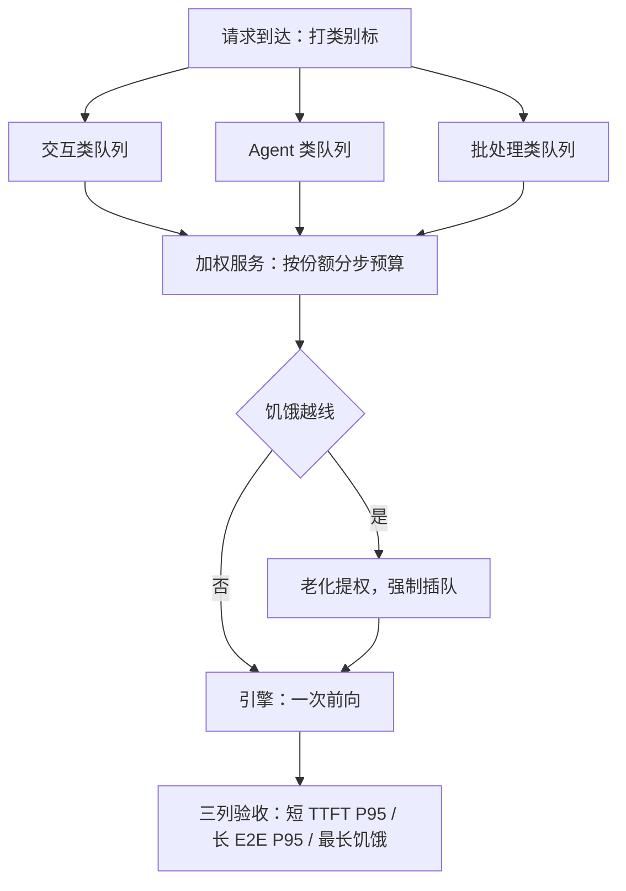

# 优先级与公平性

FCFS 公平的是到达顺序，产出的是不公平的服务量；优先级是合同的排序，公平衡量的是每类流量拿到的那一份。

<footer>—— 据 Ghodsi et al., NSDI 2011（DRF）与 Jain 公平指数（1984）整理</footer>

[上一课](/llm/sch-continuous-batching-deep)把每一步的预算与次序钉住，但预算默认所有请求无差别。真实流量有类别：付费交互、免费额度、内部批处理；FCFS 让短请求陪葬长 decode，纯优先级让低级类饿死。本课钉类别怎么定义、权重怎么服务、两种资源（步时延名额与 KV 字节）上的公平怎么量。抢占的单机机制主干已有（[抢占与公平性](/llm/preemption-fairness)），本课把公平写成可验收的调度策略，不重讲换出与重算。

## 问题

公平的第一陷阱是「一维化」。把公平定义为等待时间相等，产出的是工作量不等：短请求与 8k 上下文的 agent 拿到同样的等待，等于短请求补贴长请求。把公平定义为条数份额相等，在异质请求下同样失真：一条长 decode 占用的 KV 字节是短补全的百倍，「条数」对齐时字节严重不对齐。而这里确实是两种货币：每步的算力名额与 KV 池字节，不同负载下瓶颈位不同。第二个陷阱是纯优先级：只要高级别流量持续到达，低级类可以无限饥饿——这在产品上通常不可接受，哪怕低级类只是内部工具。

### 类别、权重与保底

工程解是三层结构：**类别**由合同定义（下一课的 SLO 分层）；类内 FCFS；类间加权服务。迭代级执行：每一步按权重在各类间分配 token 预算与准入名额，权重是「份额」不是「禁止」——低权类拿到小份额但必有进展。防饿死用老化：等待时长折算成权重增益，饿到阈值强制插队。KV 是第二种货币，用租约管理：单请求的 KV 占用超过其类份额（长上下文、并行采样）时，优先成为抢占候选——「占用多者先让」而不是「后来者永远让」（[抢占与公平性](/llm/preemption-fairness)）。

## 机制

多维公平的量化工具是主导资源思想（DRF，Ghodsi et al., NSDI 2011）：把每类在两种资源上的份额各自归一化，取其最大者作为该类的「主导份额」，公平方案让各主导份额尽量相等——没有谁在两个维度上同时被压。监测用 Jain 指数 $J=(\sum x_i)^2/(n\sum x_i^2)$：把各类实际服务量代入，$J=1$ 完全均等，越偏离越集中。指数只做体检不做目标：把 $J$ 写进优化目标会鼓励把高级流量拆碎凑均等。公平与效率是前沿：加权轮转打乱批的紧凑度，goodput 掉多少必须实测；份额切得越细，损失越大。优先级反转发生在一次前向内部：高级请求与低级的 prefill 块同批前进，类间权重管不到步内——唯一救法是把本步 token 预算也按类切，上一课的预算机制在此获得策略含义。

Jain 指数的小算例：两租户实际拿到 0.8 与 0.2 的 token 份额，$J=1/(2\times(0.64+0.04))\approx 0.74$；拿到 0.6 与 0.4 时 $J\approx 0.96$。指数对极端偏斜敏感、对温和偏斜宽容，正好用来盯饿死，而不是盯绝对均衡。

## 边界

软权重挡不住对抗：恶意租户可以靠多开请求放大自身份额，合同级的硬边界要配额与切片（[多租户隔离](/llm/multi-tenant-gpu) 的三层框架，本课程末课深化）。公平也不等于满足合同：每类「拿到了等比例服务」与「分位达标」是两回事，后者是下一课的主题。机群层面多作业的 gang 与多资源公平另有专门机制（[机群公平调度](/llm/cluster-fair-scheduling)），本课停在单引擎之内。

## 小结

- FCFS 公平的是到达序；公平必须定义在工作量与资源占用的份额上。
- 类间加权服务、类内 FCFS、老化保底，是迭代级调度的策略层。
- 两种货币（步时延名额与 KV 字节）分开记账，DRF 思想处理多维。
- 公平验收看三列：短请求 TTFT P95、长请求 E2E P95、最长饥饿时长。
- 步内反转用按类切预算解决；公平与效率是前沿，份额粒度是定价。
- 出处：Ghodsi et al., NSDI 2011（DRF）；Jain 公平指数（1984）；迭代级钩子见 Yu et al., OSDI 2022。
