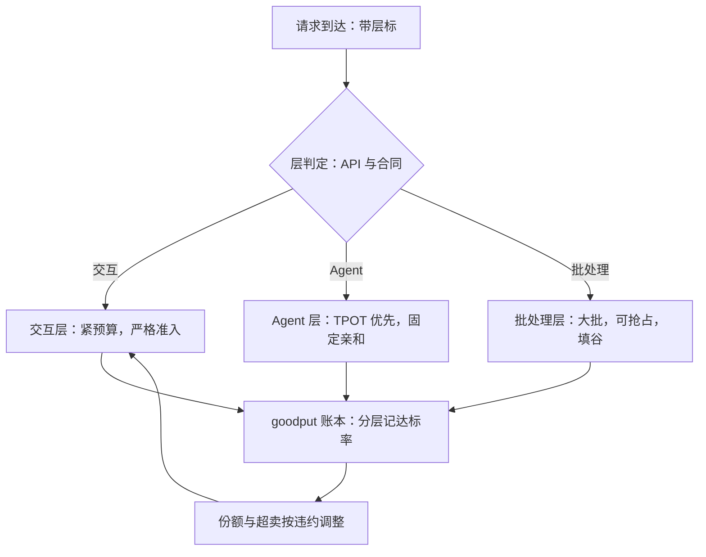

# SLO 分层与差异化

一刀切的 SLO 实际是最严那档的全员税；分层不是给流量贴标签，是把不可同时满足的承诺拆到各自可满足的池子里。

<footer>—— 据 Zhong et al., OSDI 2024（goodput 口径）与 Liu 与 Layland, 1973（截止期调度）整理</footer>

[上一课](/llm/sch-priority-fairness)给了类别与权重这套策略机制；本课把类别升格为合同：每层写明 TTFT 与 TPOT 的分位承诺、资源份额与超卖比例，并给每层配不同的调度机制。SLO 的写法与尾延迟的来源主干已有（[服务 SLO 与尾延迟](/llm/serving-slo)、[优先级与 SLA](/llm/priority-sla)），本课只写分层之后调度器具体做什么。

## 问题

全系统一个 SLO，等于用最严的档约束所有流量：交互聊天的 TTFT 承诺逼着离线摘要也走小批快步，批处理本可以填满的算力空隙被互动流的保护策略占着；反过来用最松的档，交互流的尾巴违约。根因是不同承诺在同一配置下本就不可同时满足。DistServe 的出发点正在于此：colocate 系统无法同时优化 TTFT 与 TPOT 两个 SLO，于是把目标改写成 goodput——满足双 SLO 的请求速率最大化（Zhong et al., OSDI 2024）。分层把这个思想从「两阶段」推广到「多类流量」：每一层是一组可满足的承诺，goodput 把各层合成一个总目标。

### 层的定义与机制匹配

每层三件套：**承诺**（P99 TTFT、P99 TPOT）、**份额**（token 预算与并发上限）、**超卖比例**（允许多少倍共用）。机制按承诺配：交互层预算紧、prefill 块小、准入严格；批处理层批大、可被抢占、填谷时跑；agent 层 TPOT 敏感、decode 亲和固定实例（[Decode 实例的亲和与缓存](/llm/decode-affinity)）。层内排序用截止期：按「承诺还剩多少时间」排而不是按到达排——EDF 在单机上的最优性是硬实时调度的老结论（Liu 与 Layland, 1973），搬到这里只取方向：LLM 的服务时间方差极大，截止期排序的预算仍要按分位留。准入按层独立：每层自己的令牌桶与运行上限，跨层不许透支——低层的满载不能吃掉高层的水位。

## 方法

本课的方法是**目标改写加分池**：先把「同时满足所有承诺」这个不可行目标改写成 goodput——各层承诺内速率之和，取 DistServe 的口径从两阶段推广到多类流量；再给每层配三件套（承诺、份额、超卖比例），机制按承诺逐层配，不共用一套旋钮。层内排序取 EDF 的方向，层间准入各自独立。选型理由就写在问题里：不可同时满足的约束，工程上只剩拆开分别满足一条路。

## 机制

分层为什么有效：它把混合的尾巴拆成可分别工程化的对象。交互层的违约原因几乎总是 prefill 插队与准入失控；批处理层的违约原因是被抢占过多；agent 层是亲和被打破。原因不同，药不同——混在一条队列里，三种原因互相掩盖。层的成本是预留：份额给出去就不能同时在别处兑现，超卖比例就是这层的定价；超卖依据是各类流量的峰值不同相（白天交互、夜里批处理），但相关性在事故里会变 1，预留要按最坏相关做测试。验收逐层做对抗：批处理层打满时，交互层的分位不动才算分层成功。

goodput 是分层的合成指标：各层各报一个「承诺内速率」，总 goodput 是它们之和。DistServe 用它证明分开优化值得：同等硬件下 goodput 提升约 7.4 倍，SLO 更紧时约 12.6 倍——数字随负载变，方向不变：不可同时满足的承诺，必须分池。

## 边界

层不是越多越好：每层要足够的流量才能验证分位数，五层以上多数服务养不起统计，方差小的层该并。层间迁移（用户升级套餐、重试换层）要显式定义，不能靠重试穿透配额。退款与赔付是商务条款，超出调度器管辖，但合同的数字必须来自调度器能测的那本账（[优先级与 SLA](/llm/priority-sla)）。分层也不替代容量：全部层同时超载时，剩下的是运维单元的过载与伸缩问题。

## 小结

- 一刀切 SLO 是最严档的全员税；分层把不可同时满足的承诺拆开。
- 层 = 承诺（双分位）+ 份额 + 超卖比例；机制按承诺配，不共用一套旋钮。
- 层内按截止期排序（取 EDF 方向），层间准入独立、不许透支。
- goodput 分层记账，是分层的合成目标函数。
- 层的定价是超卖比例；验收必须逐层做对抗测试。
- 出处：Zhong et al., OSDI 2024（goodput）；Liu 与 Layland, JACM 1973（EDF）；分位合同写法见站内 SLO 专文。
