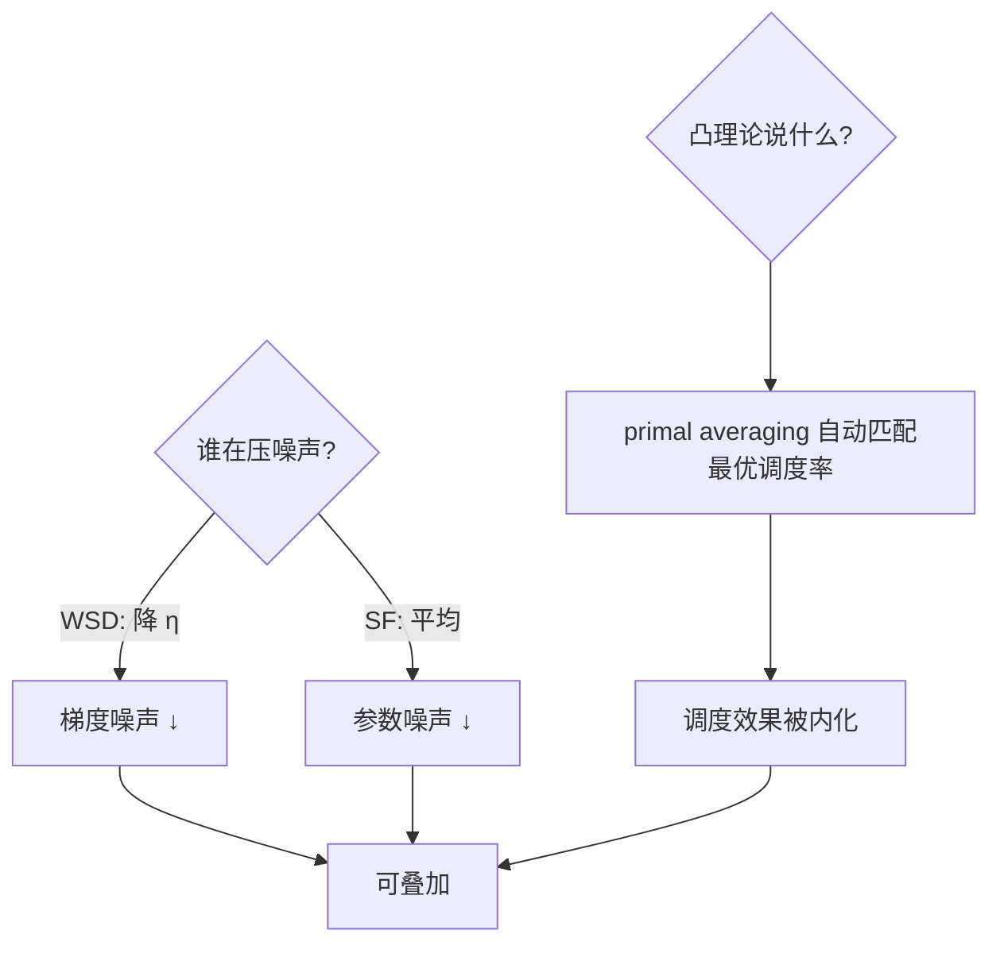

# Schedule-Free 优化

学习率调度的活儿交给优化器自己：平均点做评估、迭代点做探索，训练中途随时停、随时最优——日程表进了优化器内部。

<footer>—— 据 Defazio et al.「The Road Less Scheduled」(2024)；Primal Averaging 与 Polyak–Ruppert 平均</footer>

[WSD 调度](/llm/wsd-schedule)把退火长度压到 10%，但仍要人工选退火点。缺口是**Schedule-Free 优化器**：把「探索序列」与「收敛序列」拆成两个点的轨迹，评估用平均点、更新用插值点，学习率可以恒定不退——调度被内化成优化器的两点结构。本课不进加速理论的严格证明。

## 问题

经典真理：Polyak–Ruppert 平均对凸问题免费提收敛率，但平均点更新不了参数（平均点不是迭代点）。AdamW 一步到位、单点轨迹，于是必须用外挂调度把「探索」与「收敛」压进同一条线。缺口：能不能让迭代点保持 AdamW 的探索力、同时平均点保有退火后的收敛性——两个点各干各的。

术语翻译：Schedule-Free = Defazio et al. 2024 提出的优化器族，核心是 primal averaging 的变体：维护迭代序列 $z$（探索）与平均序列 $x$（评估），每步以动量权重 γ 在两点间插值；评估永远用 $x$，checkpoint 只存 $x, z, y$ 三组参数。

数字实例：同 10T token 预算，AdamW+cosine 需在开训前定 $T$；Schedule-Free 全程恒定 $\eta$，训练 5T 时停下评估——平均点已处「相当于退火完」的状态；想继续就接着跑，无需改任何超参。

## 方法

迭代三行代码：$y_t=\gamma z_t+(1-\gamma)x_t$（插值点，进梯度计算）；$z_{t+1}=z_t-\eta\nabla f(y_t)$（探索点，纯 SGD 步）；$x_{t+1}=(1-\frac1{t+1})x_t+\frac1{t+1}z_{t+1}$（平均点，评估用）。工程上与 AdamW 的加权版本组合（把 SGD 步换成 Adam 更新），momentum 参数由 γ 承担。超参面只剩 $\eta$ 与 γ（常用 0.9）——调度超参整族消失。

```mermaid
flowchart TD
  A["插值点 y = γz + (1-γ)x"] --> B["在 y 算梯度"]
  B --> C["z = z - η∇f(y)  探索"]
  C --> D["x = 加权平均 z  评估"]
  D --> A
  E{"何时停?"} -->|"随时"| F["x 已是收敛点"]
  F --> A
```

直觉类比：像探险队兵分两路——$z$ 是先锋（永远大步探路，不怕回头的代价），$x$ 是按所有足迹重心的「决策参谋」（位置平滑、随时可汇报）。调度型优化器只有一支队伍，探索时汇报不了、汇报时探不了路。

## 机制

收敛机制来自**在线学习与凸优化的等价性**：primal averaging 在凸光滑情形自动获得与「最好调度」匹配的收敛率——不是「调度效果差」，而是「平均轨迹把调度的效果免费实现」。与 WSD 的噪声视角对照：WSD 靠降 η 压梯度噪声，Schedule-Free 靠平均压参数噪声——两个噪声源各治其一，故实践中两者还可叠加（Schedule-Free + 平台末退火）再赚一点。LLM 训练的实证：MLP/Transformer 语言模型上与 cosine 持平或略优，且「中途最优」是 cosine 永远给不了的。

常见误区：拿 $z$（迭代点）去评测——迭代点带探索噪声，永远比 $x$ 差；另一误区是照搬 AdamW 的 β₁/β₂——Schedule-Free 的动量由 γ 承担，β₁ 常设 0.9 会出现双重动量，官方推荐 β₁=0.9 配 γ=0.9 或直接 β₁=0。

## 边界

成本：每步多存两组参数（显存 +2 倍参数量），7B 模型多 112 GB——用 ZeRO 分片摊薄，但推理侧无碍（部署 $x$）。非凸理论仍不完整，Transformer 上的实证优势在 0–2% 区间浮动，胜负取决于调参投入——cosine 生态成熟是它的真实护城河。与微调的适配：小步数下平均点尚「没攒够」，短程微调仍建议经典调度。与 [QK-Clip](/llm/qk-clip) 的分工：那是在注意力内部做稳定性手术，本课是全局节奏的重构——一层细节一层骨架，互不替代。

直觉类比：传统调度像做一桌菜必须按菜谱从头炖到尾，中途端上桌是半生不熟；Schedule-Free 像火锅——锅里的「平均态」随时可以夹出来吃，想继续煮就继续煮，火候由锅（优化器）自己管。

## 小结

- 两点结构：迭代点 $z$ 探索、平均点 $x$ 评估，调度内化为动量插值。
- 超参面缩小到 η 与 γ；中途任意点停都是收敛态。
- 显存 +2 参数组是真成本；短程任务收益有限。
- 出处：Defazio et al.「The Road Less Scheduled」2024；Polyak–Ruppert 平均；Meta 开源实现。
